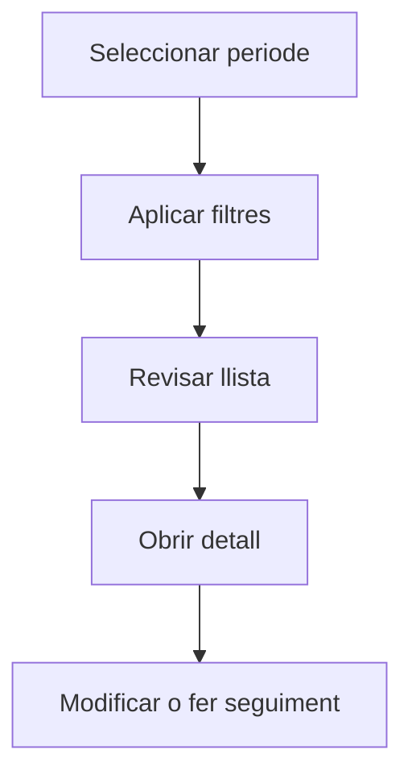

# Module Help Generator

Genera borradores de documentación contextual para un módulo del frontend desde análisis de código.

## Resultat

- Archivos `.md` en `frontend/src/help/ca/<module>/`
- helpKeys vinculadas en `routes.ts` del módulo
- Commit + push automatic

## Passos

### 1. Identificar el módulo

El módul debe existir en `frontend/src/modules/<module>/` i tenir:
- `views/` — components Vue
- `store/` — Pinia stores
- `services/` — serveis API
- `routes.ts` — rutes Vue

### 2. Executar el generador

```bash
cd ~/lilith
python3 << 'EOF'
import os, re
from pathlib import Path

MODULE = "<module>"  # ex: purchase, production, warehouse
BASE = Path(f"frontend/src/modules/{MODULE}")
OUT_BASE = Path(f"frontend/src/help/ca/{MODULE}")
OUT_BASE.mkdir(parents=True, exist_ok=True)

# --- Configuració ---
VIEWS_HELPKEY = {
    "Materials": "purchase/material/list",
    # ... completar segons el módulo
}

VIEW_STORE = {
    "Materials": "purchase",
    # ... completar segons el módulo
}

CATALAN_TITLES = {
    "Materials": "Materials",
    # ... completar segons el módulo
}

VIEW_TYPE = {
    "Materials": "list",
    # ... completar segons el módulo
}
# --- Fi configuració ---

def read(p): return Path(p).read_text(encoding="utf-8")

stores = {f.stem: read(f) for f in (BASE/"store").glob("*.ts")}

def get_actions(store_key):
    if store_key not in stores: return []
    c = stores[store_key]
    skip = {'if','for','while','switch','try','catch','finally','return','throw',
            'await','new','delete','typeof','void','in','of','get','set','state',
            'getters','actions','setup','constructor','prototype','hasOwnProperty',
            'toString','toJSON','then','catch','finally','map','filter','reduce',
            'forEach','some','every','find','findIndex','indexOf','includes','push',
            'pop','shift','unshift','slice','splice','concat','join','sort','reverse',
            'flat','flatMap','keys','values','entries','length','size','result','data',
            'error','loading','entities','entity','items','total','page','perPage',
            'pagination','totalPages','sortBy','sortOrder','filters','fetchAll',
            'fetchPagination','reset','setNew','init','hydrate','dehydrate','selected',
            'count','next','prev','first','last','isEmpty','isLoading','isError',
            'hasError','hasData','setError','clearError','setLoading','clearLoading',
            '__name','__ctx','_','$','ref','reactive','computed','watch','onMounted',
            'onUnmounted','onBeforeMount','onUpdated','onBeforeUpdate','onBeforeUnmount',
            'onErrorCaptured','onServerPrefetch','defineComponent','defineProps',
            'defineEmits','defineExpose','defineModel','defineStore','Date',
            'formatDateForQueryParameter','getNewUuid','setFullYear','getFullYear',
            'SupplierService','SupplierTypeService','PurchaseRateService',
            'TransportRateService','PurchaseRateService','InvoiceService',
            'ReceiptService','ExpenseService','OrderService','TransportRateService'}
    actions = re.findall(r'(?:async\s+)?(\w+)\s*\([^)]{0,100}\)', c)
    return sorted(set([a for a in actions if a not in skip and len(a)>2
                       and not a[0].isdigit() and not a.startswith('_')]))

# Generar docs (plantilla mínima)
TEMPLATE = """# {title}

## Per a que serveix aquesta pantalla

[DESCRIPCIO — inference desde store + vista]

## Accions disponibles

[EXTRAER des del store + interactuant con el usuari]

## Flux habitual

1. Selecciona el periode o exercici que vols consultar.
2. Aplica els filtres que necessitis.
3. Revisa la llista.
4. Accedeix al detall per fer modificacions.

## Aspectes importants

- Les accions depenen de l'estat del cicle de vida.
- Alguna accions poden estar blocades segons l'estat.

## Errors frequents

- Si no es mostren dades, comprova que el filtre estigui informat.
- Si l'operació falla, revisa que totes les dades obligatòries estiguin informades.

## Proces basic


"""

for view_name in sorted(VIEWS_HELPKEY.keys()):
    help_key = VIEWS_HELPKEY[view_name]
    vtype = VIEW_TYPE.get(view_name, "detail")
    title = CATALAN_TITLES.get(view_name, view_name)
    parts = help_key.split("/")
    subdir = OUT_BASE / parts[1]
    subdir.mkdir(parents=True, exist_ok=True)
    file_path = subdir / f"{parts[2]}.md"
    content = TEMPLATE.format(title=title)
    file_path.write_text(content, encoding="utf-8")
    print(f"Generated: {file_path}")

print("Done!")
EOF
```

### 3. Vincular helpKeys a routes.ts

Després de generar, edita `routes.ts` per afegir `meta: { helpKey: "..." }` a cada ruta:

```typescript
{
  path: "/material",
  name: "Materials",
  component: Materials,
  meta: { helpKey: "purchase/material/list" },
},
```

### 4. Validar en producció

1. Fer commit + push
2. Desplegar la branca
3. Obrir cada pantalla i prémer **Alt+H**
4. Revisar el contingut i corregir

### 5. Corregir un document especfic

```bash
nano ~/lilith/frontend/src/help/ca/{module}/{entity}/{view}.md
# Després: git add + commit + push
```

## Estructura resultant

```
frontend/src/help/ca/<module>/
  <entity>/list.md
  <entity>/detail.md
  <entity>/dashboard.md
  ...
```

## Categories de vistes

| Sufix | Tipo | helpKey |
|---|---|---|
| (nom) | list | `<module>/<entity>/list` |
| (nom) | detail | `<module>/<entity>/detail` |
| (nom) | dashboard | `<module>/<entity>/dashboard` |
| (nom) | by-period | `<module>/<entity>/by-period` |

## Errors comuns

- **Duplicate path**: el mòdul ja té helpKeys a `routes.ts` — verificar abans de generar
- **Idiomes**: només es genera `ca/` (català) — `es/` i `en/` no implementats encara
- **Borradors**: el contingut generat és inferència, NO validació real — cal iterar amb l'usuari
