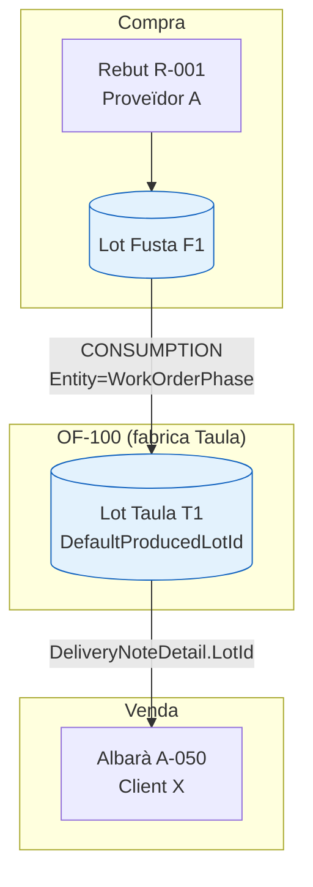

# Mòdul de traçabilitat de lots

Document tècnic que explica, fil per randa, com funciona la traçabilitat de lots a Lilith:
model de dades, com es generen els moviments, com es construeix el graf de traça
(backward, forward, recall), l'API, el frontend i els casos límit.

---

## 1. Objectiu

La traçabilitat permet respondre dues preguntes clau sobre un lot:

- **Cap enrere (backward):** donat un lot fabricat o venut, ¿de quins lots de compra prové?
- **Cap endavant (forward):** donat un lot comprat, ¿a quins productes fabricats i a quins
  clients ha acabat?

I com a derivat:

- **Informe de recall:** donat un lot, ¿quins clients i albarans quedarien afectats si s'ha de retirar?

El model és **lot-a-lot**: el graf connecta lots entre si a través dels moviments d'estoc que
els vinculen dins les ordres de fabricació (OF).

---

## 2. Model de dades

### 2.1 `Lot`

Fitxer: `backend/src/Domain/Entities/Warehouse/Lot.cs`

Un lot pertany a una referència (`ReferenceId`) i té un `Code`, `RemainingQuantity`,
`ClosedDate` (nul mentre està obert), `ExpirationDate` i `SupplierLotCode` opcionals.

- Un lot es **tanca** (`ClosedDate`) quan la quantitat restant arriba a 0; mai es reobre.
- Els lots es reutilitzen mentre estan oberts (mateixa referència + mateix codi).

### 2.2 `StockMovement`

Fitxer: `backend/src/Domain/Entities/Warehouse/StockMovements.cs`

Cada moviment d'estoc registra una entrada/sortida i és la peça central de la traça.
Camps rellevants:

| Camp | Descripció |
|------|------------|
| `ReferenceId` | Referència moguda |
| `LotId` (nullable) | Lot associat; **null** si la referència no és loteada |
| `LocationId` (nullable) | Ubicació del moviment |
| `MovementType` | Tipus (veure sota) |
| `Quantity` | Positiu (entrada) o negatiu (sortida) |
| `Entity` / `EntityId` | Enllaç a l'entitat d'origen (OF, fase, albarà, rebut) |
| `MovementDate`, `Description` | Data i descripció localitzada |

Tipus de moviment (`StockMovementType`):

```
INPUT        // entrada (recepció, aprovisionament a subministrament)
OUTPUT       // sortida (venda, aprovisionament des de l'origen)
SUPPLY       // definit però NO usat
CONSUMPTION  // consum de material dins una fase d'OF
PRODUCTION   // sortida de producte fabricat
```

Entitats d'origen (`StockMovementEntities`, `backend/src/Application.Contracts/Constants/StockMovementEntities.cs`):

```
WorkOrderPhase   // moviments de fase (aprovisionament, consum)
WorkOrder        // moviment de producció (sortida de fabricat)
Receipt          // recepció de compra
DeliveryNote     // sortida de venda
```

### 2.3 FKs cap a `Lot` (5)

| Taula/Entitat | Columna | Nullable |
|---------------|---------|----------|
| `Stock` | `LotId` | sí |
| `StockMovement` | `LotId` | sí |
| `ReceiptDetail` | `LotId` | sí |
| `DeliveryNoteDetail` | `LotId` | sí |
| `WorkOrder` | `DefaultProducedLotId` | sí |

Índexs rellevants: `idx_lotid` sobre `StockMovements.LotId` i
`idx_Location_Reference_Lot` sobre `Stock`.

### 2.4 `Reference.RequiresLot`

Fitxer: `backend/src/Domain/Entities/Shared/Reference.cs`

Flag booleà (default `false`) que indica si una referència es gestiona per lot. Governa
tota l'assignació de lots (veure secció 3). Les referències no loteades **no** tenen lot
i, per disseny, **no apareixen** al graf de traça.

---

## 3. Assignació de lots: model `RequiresLot` i `NULL`

Regla general segons el flag de la referència:

- `RequiresLot == false` → `LotId = NULL` sempre (s'ignora qualsevol input de lot).
- `RequiresLot == true` → s'assigna lot: explícit si s'informa, o resolt/creat pel codi.

Per què `NULL` i no un "lot buit": un lot compartit amb codi buit per referència es
convertiria en un **node hub** que connecta artificialment compres i fabricacions no
relacionades, col·lapsant la traça i provocant explosió combinatòria a les consultes
recursives. `NULL` modela la realitat ("no es tracça per lot") i manté el graf net.

Punts d'assignació:

- **Recepció de compra** — `ReceiptService.ResolveDetailLot`
  (`backend/src/Application/Services/Purchase/ReceiptService.cs`):
  lot explícit validat contra la referència; si no, i `RequiresLot==false` → null; si
  `RequiresLot==true` → `LotService.ResolveOrCreateLot` pel codi.

- **Sortida de venda** — `DeliveryNoteService.ResolveOutputLotId`
  (`backend/src/Application/Services/Sales/DeliveryNoteService.cs`):
  retorna `Guid?`. Ordre de resolució: lot explícit del detall → `DefaultProducedLotId`
  de l'OF que va produir el producte → (si loteada) lot resolt/creat → si no, null.

- **Producció (creació d'OF)** — `WorkOrderService.CreateFromWorkMaster`
  (`backend/src/Application/Services/Production/WorkOrderService.cs`):
  - `RequiresLot==false` → `DefaultProducedLotId = null`.
  - `RequiresLot==true` + paràmetre `Production.AutoBatch` **on** → codi = codi de l'OF.
  - `RequiresLot==true` + `AutoBatch` **off** → exigeix `LotCode` no buit (error
    `WorkOrderLotCodeRequired` si falta).

- **Moviment de producció (fallback)** — `WorkOrderStockService.CreateProductionMovement`
  només resol un lot per a OF antigues si la referència és loteada.

- **Resolució/creació** — `LotService.ResolveOrCreateLot`
  (`backend/src/Application/Services/Warehouse/LotService.cs`):
  reutilitza un lot obert amb el mateix codi o en crea un de nou.

---

## 4. Com es generen els moviments

Fitxer principal: `backend/src/Application/Services/Production/WorkOrderStockService.cs`.

1. **Recepció de compra** → `INPUT` amb `Entity=Receipt`, `LotId` del detall.
2. **Aprovisionament a la ubicació de subministrament** (`MoveToWorkcenterSupply`):
   crea un parell `OUTPUT` (a l'origen) + `INPUT` (a subministrament), tots dos amb
   `Entity=WorkOrderPhase` i el mateix `LotId`. Descripció "Aprovisionament…".
3. **Consum en producció** (`ConsumePhaseStock`): `CONSUMPTION` amb `Quantity < 0`,
   `Entity=WorkOrderPhase`, `LotId` del material consumit. **Aquest és l'enllaç que
   alimenta la traça.**
4. **Sortida de producte fabricat** (`CreateProductionMovement`): `PRODUCTION` amb
   `Entity=WorkOrder`, `LotId = WorkOrder.DefaultProducedLotId`.
5. **Venda** (`DeliveryNoteService`): `OUTPUT` amb `LotId` resolt (secció 3).

---

## 5. El graf de traça (model conceptual)

L'aresta fonamental connecta:

```
WorkOrder.DefaultProducedLotId  (lot produït)
        ↕  via moviments CONSUMPTION amb Entity=WorkOrderPhase
StockMovement.LotId             (lot consumit)
```

És a dir: el lot que una OF **produeix** està connectat amb els lots que les seves fases
han **consumit**. Recorrent aquesta relació recursivament s'obté tota la cadena.

- Un lot amb `ReceiptDetail` propi és un **origen de compra** (cas base backward).
- Un lot venut via `DeliveryNoteDetail.LotId` és un **destí de venda** (fulla forward).

### 5.0 Flux complet (exemple)



- **Backward** des de `T1`: `T1 → F1 → Rebut R-001 (Proveïdor A)`.
- **Forward** des de `F1`: `F1 → T1 → Albarà A-050 (Client X)`.
- **Recall** de `F1`: Client X, albarà A-050.

Implementació SQL: `backend/src/Infrastructure/Persistance/Repositories/Warehouse/LotRepository.cs`
(CTE recursives amb salvaguarda `MAX_DEPTH = 10` contra cicles).

### 5.1 Backward (`GetBackwardTraceabilityEdges`)

CTE `backward_edges`: per cada OF amb `DefaultProducedLotId`, agrupa els seus moviments
`CONSUMPTION` (`Quantity < 0`, `LotId` no nul) per fase → parells `(produced_lot, consumed_lot, quantitat)`.

CTE recursiva `chain`: ancora al lot arrel (`Depth=0`) i descendeix seguint
`produced_lot → consumed_lot`. S'atura quan:
- el lot té `ReceiptDetail` (origen de compra), o
- s'assoleix `MAX_DEPTH`.

El `SELECT` final enriqueix cada fila amb dades de referència, rebut i proveïdor.

### 5.2 Forward (`GetForwardTraceabilityEdges`)

Simètric: CTE `forward_edges` connecta `consumed_lot → produced_lot`. La cadena parteix
del lot comprat i puja cap als productes fabricats. Les fulles (nodes sense fills) són
els productes finals, als quals després s'hi enganxen els destins de venda.

---

## 6. La capa de servei

Fitxer: `backend/src/Application/Services/Warehouse/LotTraceabilityService.cs`
(interfície `ILotTraceabilityService`).

### 6.1 `GetBackwardTraceability(lotId)`

1. Obté les arestes via `GetBackwardTraceabilityEdges`.
2. Si no hi ha cap fila arrel → `null` (el lot no existeix).
3. `BuildBackwardNode` construeix l'arbre recursivament; un node amb `ReceiptId`
   afegeix un `PurchaseOriginDto` i no descendeix més.
4. `AttachMovements` enganxa a cada node els seus moviments d'estoc (secció 7).

### 6.2 `GetForwardTraceability(lotId)`

1. Obté arestes forward i construeix l'arbre amb `BuildForwardNode`.
2. Recull els lots fulla i, via `GetSalesDestinationsByLot`, hi adjunta els
   `SalesDestinationDto` (client, albarà, quantitat) llegits de `DeliveryNoteDetail`.
3. `AttachMovements` enganxa els moviments.

> Els albarans de venda s'enllacen **directament** per `DeliveryNoteDetail.LotId` perquè
> els moviments `OUTPUT` de venda no porten `Entity`/`EntityId`.

### 6.3 `GetRecallReport(lotId)`

Deriva del forward: recull tots els `SalesDestinationDto`, els agrupa per client i
albarà i calcula totals (albarans i quantitat afectats).

---

## 7. Moviments per node (detall de traça)

Cada node de l'arbre porta, a més dels seus fills i orígens/destins, la llista de
**moviments d'estoc** que involucren aquell lot (aprovisionament, consum, producció, etc.),
tal com es veuen a l'endpoint `StockMovement`.

- DTO: `LotStockMovementDto` (dins `LotTraceabilityDto.cs`): tipus, quantitat, data,
  descripció, ubicació, entitat/entitatId.
- Repositori: `IStockMovementRepository.GetByLotIds` retorna els moviments (amb `Location`)
  dels lots demanats, ordenats per data.
- Servei: `AttachMovements` recull tots els lots de l'arbre, fa **una** consulta i
  reparteix els moviments per node (`AttachMovementsToNodes`).

Els moviments amb `LotId == null` **no** hi apareixen (la traça és per lot); això és
correcte per a ítems no loteats.

---

## 8. Contractes (DTOs)

Fitxer: `backend/src/Application.Contracts/Contracts/Warehouse/LotTraceabilityDto.cs`

- `LotTraceabilityNode` — node recursiu: `LotId`, `LotCode`, referència, `Quantity`,
  `Children`, `PurchaseOrigins`, `SalesDestinations`, `Movements`.
- `PurchaseOriginDto` — origen de compra (proveïdor, rebut, data).
- `SalesDestinationDto` — destí de venda (client, albarà, data).
- `LotStockMovementDto` — línia de moviment.
- `LotBackwardTraceabilityDto` / `LotForwardTraceabilityDto` — arrel + metadades del lot.
- `LotRecallReportDto` + `RecallCustomerDto` + `RecallDeliveryNoteDto`.

---

## 9. API

Controlador: `backend/src/Api/Controllers/Warehouse/LotTraceabilityController.cs`

| Mètode | Ruta | Resposta |
|--------|------|----------|
| GET | `/api/LotTraceability/Backward/{lotId}` | `LotBackwardTraceabilityDto` |
| GET | `/api/LotTraceability/Forward/{lotId}` | `LotForwardTraceabilityDto` |
| GET | `/api/LotTraceability/Recall/{lotId}` | `LotRecallReportDto` |

Retorna `404` si el lot no existeix.

### 9.1 Exemple — Backward

`GET /api/LotTraceability/Backward/{lotTaulaT1}`

```json
{
  "lotId": "b1f0...T1",
  "lotCode": "OF-100",
  "referenceId": "aa11...",
  "referenceCode": "TAULA-01",
  "referenceDescription": "Taula de fusta",
  "root": {
    "lotId": "b1f0...T1",
    "lotCode": "OF-100",
    "referenceId": "aa11...",
    "referenceCode": "TAULA-01",
    "referenceDescription": "Taula de fusta",
    "quantity": 10,
    "children": [
      {
        "lotId": "c2a1...F1",
        "lotCode": "F1",
        "referenceId": "bb22...",
        "referenceCode": "FUSTA-ROURE",
        "referenceDescription": "Fusta de roure",
        "quantity": 25,
        "children": [],
        "purchaseOrigins": [
          {
            "lotId": "c2a1...F1",
            "lotCode": "F1",
            "referenceId": "bb22...",
            "referenceCode": "FUSTA-ROURE",
            "referenceDescription": "Fusta de roure",
            "quantity": 25,
            "supplierId": "dd44...",
            "supplierName": "Fustes Vallès SL",
            "receiptId": "ee55...",
            "receiptNumber": "R-001",
            "receiptDate": "2026-08-01T00:00:00"
          }
        ],
        "salesDestinations": [],
        "movements": [
          {
            "movementId": "f6a7...",
            "movementType": "INPUT",
            "quantity": 25,
            "movementDate": "2026-08-01T09:12:00",
            "description": "Recepció R-001",
            "locationId": "0aa0...",
            "locationName": "Magatzem principal",
            "entity": "Receipt",
            "entityId": "ee55..."
          },
          {
            "movementId": "f6a8...",
            "movementType": "CONSUMPTION",
            "quantity": -25,
            "movementDate": "2026-08-05T11:30:00",
            "description": "Consum OF OF-100",
            "locationId": "0bb0...",
            "locationName": "Subministrament CT-1",
            "entity": "WorkOrderPhase",
            "entityId": "af01..."
          }
        ]
      }
    ],
    "purchaseOrigins": [],
    "salesDestinations": [],
    "movements": [
      {
        "movementId": "f6b0...",
        "movementType": "PRODUCTION",
        "quantity": 10,
        "movementDate": "2026-08-05T15:00:00",
        "description": "Producció OF-100",
        "locationId": "0aa0...",
        "locationName": "Magatzem principal",
        "entity": "WorkOrder",
        "entityId": "1100..."
      }
    ]
  }
}
```

### 9.2 Exemple — Forward

`GET /api/LotTraceability/Forward/{lotFustaF1}`

```json
{
  "lotId": "c2a1...F1",
  "lotCode": "F1",
  "referenceId": "bb22...",
  "referenceCode": "FUSTA-ROURE",
  "referenceDescription": "Fusta de roure",
  "root": {
    "lotId": "c2a1...F1",
    "lotCode": "F1",
    "referenceCode": "FUSTA-ROURE",
    "quantity": 25,
    "children": [
      {
        "lotId": "b1f0...T1",
        "lotCode": "OF-100",
        "referenceCode": "TAULA-01",
        "quantity": 10,
        "children": [],
        "purchaseOrigins": [],
        "salesDestinations": [
          {
            "lotId": "b1f0...T1",
            "lotCode": "OF-100",
            "referenceCode": "TAULA-01",
            "referenceDescription": "Taula de fusta",
            "quantity": 4,
            "customerId": "cc33...",
            "customerName": "Mobles Girona SA",
            "deliveryNoteId": "9911...",
            "deliveryNoteNumber": "A-050",
            "deliveryDate": "2026-08-10T00:00:00"
          }
        ],
        "movements": []
      }
    ],
    "purchaseOrigins": [],
    "salesDestinations": [],
    "movements": []
  }
}
```

### 9.3 Exemple — Recall

`GET /api/LotTraceability/Recall/{lotFustaF1}`

```json
{
  "lotId": "c2a1...F1",
  "lotCode": "F1",
  "referenceCode": "FUSTA-ROURE",
  "referenceDescription": "Fusta de roure",
  "totalAffectedDeliveryNotes": 1,
  "totalAffectedQuantity": 4,
  "affectedCustomers": [
    {
      "customerId": "cc33...",
      "customerName": "Mobles Girona SA",
      "deliveryNotes": [
        {
          "deliveryNoteId": "9911...",
          "deliveryNoteNumber": "A-050",
          "deliveryDate": "2026-08-10T00:00:00",
          "lotId": "b1f0...T1",
          "lotCode": "OF-100",
          "referenceCode": "TAULA-01",
          "referenceDescription": "Taula de fusta",
          "quantity": 4
        }
      ]
    }
  ]
}
```

> Els GUID estan abreujats per llegibilitat; a la resposta real són GUID complets.

---

## 10. Frontend

Vista principal: `frontend/src/modules/warehouse/views/LotTraceability.vue`

- Filtre per referència (`DropdownReference`) + selector de lot; botó d'informe de recall.
- Dues pestanyes (`Tabs`) amb `TreeTable`: backward i forward.
- Transformació API→arbre: `toBackwardTreeNode` / `toForwardTreeNode` converteixen cada
  `LotTraceabilityNode` en files amb `kind`:
  - `"node"` — el lot en si.
  - `"purchase"` — origen de compra (proveïdor · rebut · data).
  - `"sale"` — destí de venda (client · albarà · data).
  - `"movement"` — línia de moviment, amb un `Tag` de color segons el tipus
    (Entrada/Producció = verd, Sortida/Consum = vermell, Subministrament = blau) + ubicació · data · descripció.
- Panell de recall amb clients afectats i albarans.

Servei/tipus:
- `frontend/src/modules/warehouse/services/lotTraceability.service.ts`
- `frontend/src/modules/warehouse/types/index.ts` (`LotTraceabilityNode`, `LotStockMovement`, etc.)

Gestió del flag `RequiresLot` al frontend:
- Formulari de referència (`ReferenceManagement.vue`): checkbox "Requereix lot".
- Recepció (`FormReceiptDetail.vue`, `SelectorOrdersDetailsToReceipt.vue`): amaguen el
  selector de lot si la referència no és loteada.
- Creació d'OF (`FormCreateWorkorder.vue`): mostra el camp de codi de lot quan la
  referència requereix lot.

---

## 11. Casos límit i limitacions

- **Ítems no loteats** (`RequiresLot=false`): `LotId=null`; no apareixen a la traça per
  lot. És el comportament correcte (material no traçable).
- **Moviments de venda `OUTPUT`**: no porten `Entity`/`EntityId`; els destins de venda
  s'obtenen directament de `DeliveryNoteDetail.LotId`.
- **`SUPPLY`**: tipus definit però no usat; l'aprovisionament es fa amb `INPUT`/`OUTPUT`.
- **Cicles / dades corruptes**: la recursió es limita amb `MAX_DEPTH = 10`.
- **Node hub**: evitat gràcies al model `NULL` (no hi ha lot buit compartit per referència).
- **OF antigues sense lot real**: després de la migració, les OF amb lot de codi buit
  van perdre `DefaultProducedLotId` i queden no-traçables (coherent amb el model).

---

## 12. Mapa de fitxers

| Component | Fitxer |
|-----------|--------|
| Servei de traça | `backend/src/Application/Services/Warehouse/LotTraceabilityService.cs` |
| Interfície | `backend/src/Application.Contracts/Services/Warehouse/ILotTraceabilityService.cs` |
| Consultes recursives | `backend/src/Infrastructure/Persistance/Repositories/Warehouse/LotRepository.cs` |
| DTOs | `backend/src/Application.Contracts/Contracts/Warehouse/LotTraceabilityDto.cs` |
| Controlador | `backend/src/Api/Controllers/Warehouse/LotTraceabilityController.cs` |
| Moviments per lot | `backend/src/Infrastructure/Persistance/Repositories/Warehouse/StockMovementRepository.cs` |
| Generació de moviments | `backend/src/Application/Services/Production/WorkOrderStockService.cs` |
| Assignació de lot (compra) | `backend/src/Application/Services/Purchase/ReceiptService.cs` |
| Assignació de lot (venda) | `backend/src/Application/Services/Sales/DeliveryNoteService.cs` |
| Assignació de lot (producció) | `backend/src/Application/Services/Production/WorkOrderService.cs` |
| Resolució de lots | `backend/src/Application/Services/Warehouse/LotService.cs` |
| Flag referència | `backend/src/Domain/Entities/Shared/Reference.cs` |
| Vista frontend | `frontend/src/modules/warehouse/views/LotTraceability.vue` |
