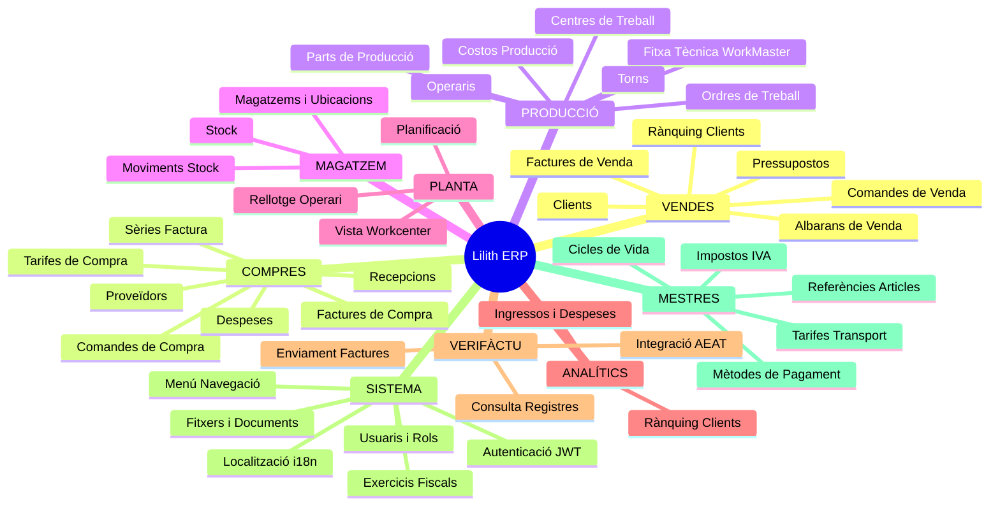
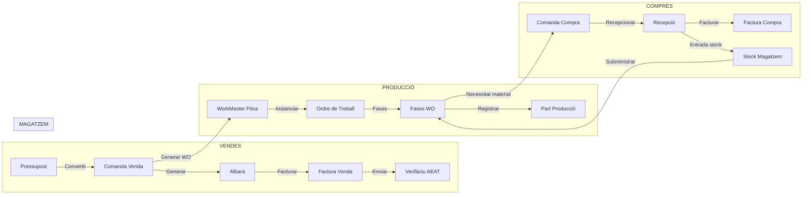

# 🗺️ Mapa Funcional — Lilith ERP

## Arquitectura global dels mòduls



---

## Flux principal del negoci



---

## Detall funcional per mòdul

### 1. VENDES

| Funcionalitat | Descripció | Input | Output |
|---|---|---|---|
| **Llistar pressupostos** | Consulta filtrada per dates i client | `startTime`, `endTime`, `customerId?` | `Budget[]` ordenats per número desc |
| **Crear pressupost** | Nou pressupost amb capçalera | `CreateHeaderRequest` (customerId, dates, etc.) | `GenericResponse` amb Budget creat |
| **Obtenir pressupost** | Detall complet amb línies, transport, serveis externs | `id: Guid` | `Budget` complet |
| **Actualitzar pressupost** | Modifica dades capçalera | `Budget` complet | `200 OK` o errors |
| **Eliminar pressupost** | Baixa lògica | `id: Guid` | `GenericResponse` |
| **Afegir línia pressupost** | Nova línia de producte/servei | `BudgetDetail` (referenceId, qty, price...) | `200 OK` |
| **Afegir transport pressupost** | Associar cost transport | `BudgetTransport` | `200 OK` |
| **Informe pressupost** | DTO preparat per impressió/PDF | `id: Guid` | `BudgetReportDto` |
| **Crear comanda des de pressupost** | Convertir pressupost acceptat en comanda | `Budget` complet | `GenericResponse` amb nova SalesOrder |
| **Llistar comandes venda** | Filtrades per dates/client | `startTime`, `endTime`, `customerId?` | `SalesOrderHeader[]` |
| **Comandes per albaranar** | Pendents d'entrega d'un client | `customerId` | `SalesOrderHeader[]` |
| **Crear albarà des de comanda** | Genera albarà a partir d'una comanda | `SalesOrderHeader` | `GenericResponse` amb DeliveryNote |
| **Albarans facturables** | Pendents de facturar d'un client | `customerId` | `DeliveryNote[]` |
| **Crear factura venda** | Factura manual o des d'albarans | `CreateHeaderRequest` | `GenericResponse` |
| **Factura rectificativa** | Nota de crèdit/abonament | `CreateRectificativeInvoiceRequest` | `GenericResponse` |
| **Actualitzar dades fiscals client a factura** | Correcció NIF/adreça + propagació a factures germanes | `id`, `SalesInvoiceCustomerDataUpdateDto` | `GenericResponse` |
| **Canvi d'estat factures (lot)** | Marcar com a pagades, enviades, etc. | `ChangeStatusOfInvoicesRequest` (llista ids + nou estat) | `GenericResponse` |
| **Rànquing clients anual** | Top clients per volum de vendes | `year: int` | `CustomerSalesRanking[]` |
| **Ingressos consolidats** | Resum ingressos per període | `startTime`, `endTime` | Dades consolidades agrupades |

---

### 2. COMPRES

| Funcionalitat | Descripció | Input | Output |
|---|---|---|---|
| **Llistar comandes compra** | Filtrades per dates/proveïdor/estat | `startTime`, `endTime`, `supplierId?`, `statusId?` | `PurchaseOrder[]` |
| **Crear comanda compra** | Nova comanda a proveïdor | `CreatePurchaseDocumentRequest` | `GenericResponse` |
| **Crear comanda des de WO** | Genera compres des de necessitats d'una fase WO | `PurchaseOrderFromWO[]` (fases + materials) | `GenericResponse` |
| **Recepcionar material** | Marca recepció i mou a magatzem automàticament | `Receipt` (amb canvi d'estat a "Recepcionat") | `GenericResponse` + moviment stock + canvi estat WO |
| **Recepcions facturables** | Albarans recepció pendents de factura | `supplierId` | `Receipt[]` |
| **Crear factura compra** | Registrar factura de proveïdor | `PurchaseInvoice` complet | `GenericResponse` |
| **Calcular venciments** | Càlcul automàtic de venciments per mètode de pagament | `PurchaseInvoice` (date + amount + paymentMethodId) | `PurchaseInvoiceDueDate[]` |
| **Recrear venciments** | Recalcular venciments d'una factura existent | `PurchaseInvoice` | `GenericResponse` |
| **Canvi estat factures compra (lot)** | Marcar com a pagades, etc. | `ChangeStatusOfInvoicesRequest` | `GenericResponse` |
| **Registrar despesa** | Despesa recurrent o puntual (lloguer, servei...) | `Expenses` (description, amount, recurring, frequency, expenseTypeId...) | `GenericResponse` |
| **Despeses consolidades** | Agrupació per tipus i tipologia | `startTime`, `endTime`, `type?`, `typeDetail?` | Dades consolidades |
| **Tarifes de compra** | Preus acordats per proveïdor + article amb vigència | `PurchaseRate` (supplierId, referenceId, price, validFrom, validTo) | `PurchaseRate` creat |
| **Duplicar tarifa compra** | Còpia d'una tarifa amb noves dates | `id`, `name`, `validFrom`, `validTo` | Nova `PurchaseRate` |

---

### 3. PRODUCCIÓ

| Funcionalitat | Descripció | Input | Output |
|---|---|---|---|
| **Crear Fitxa Tècnica (WorkMaster)** | Definir procés de fabricació d'una referència: fases, temps, BOM | `WorkMaster` (referenceId, fases amb operaris/màquines/materials) | `WorkMaster` creat |
| **Copiar Fitxa Tècnica** | Duplicar fitxa per nova referència | `WorkMasterCopy` (sourceId, targetReferenceId) | Nova `WorkMaster` |
| **Calcular cost fitxa** | Cost teòric de fabricar N unitats | `id`, `quantity?` | `WorkmasterMetrics` (cost material, mà d'obra, màquina) |
| **Crear Ordre de Treball** | Instanciar fitxa tècnica per fabricar | `CreateWorkOrderDto` (workMasterId, qty, salesOrderId?) | `WorkOrder` creat |
| **Llistar OTs** | Filtrades per dates/estat/referència/client/codi | `startTime`, `endTime`, `statusId?`, `referenceId?`, `customerId?`, `code?` | `WorkOrder[]` |
| **OTs per planificar** | Ordres planificables (no acabades) | — | `WorkOrder[]` |
| **Càrrega workcenters** | Hores planificades per tipus de centre i dates | `startDate`, `endDate` | Mapa càrrega per `WorkcenterType` |
| **Dashboard producció** | KPIs resum producció activa | — | Dades dashboard |
| **Mètriques de fase** | Temps estimat vs. real d'una fase | `phaseId`, `machineStatusId` | `PhaseTimeMetricsDto` |
| **Validar quantitat fase anterior** | Comprova que la fase prèvia té sortida suficient | `ValidatePreviousPhaseQuantityRequest` | Resposta validació |
| **Part de producció** | Registre d'unitats produïdes per operari/centre en una fase | `ProductionPart` (workOrderPhaseId, operatorId, workcenterId, qty, time) | `ProductionPart` creat |
| **Moure stock a subministrament** | Transferir material de magatzem a zona d'alimentació del WC | `MoveStockToWorkcenterSupplyRequest` | `GenericResponse` + moviments stock |
| **Retornar stock de subministrament** | Devolver sobrant de zona alimentació | `ReturnStockFromSupplyRequest` | `GenericResponse` + moviments stock |
| **Consumir stock de fase** | Registrar consum real de materials d'una fase | `ConsumePhaseStockRequest` | `GenericResponse` + moviments stock |
| **Costos producció consolidats** | Agrupats per mes + tipus WC / WC / operari | `startTime`, `endTime` | Dades per gràfics de costos |
| **Gestió torns (Shifts)** | Definir torns de treball amb intervals horaris | `Shift` + `ShiftDetail[]` | `Shift` complet |
| **Gestió centres de treball** | Definir WC amb capacitat, tipus, ubicació, costos | `Workcenter` | `Workcenter` creat |
| **Status de màquina** | Definir estats (Funcionant, Aturat, Manteniment...) amb raons | `MachineStatus` + `MachineStatusReason[]` | `MachineStatus` complet |
| **Saturació / Planificació** | Vista càrrega de WCs per dates | dates | Dades càrrega per WC |

---

### 4. MAGATZEM

| Funcionalitat | Descripció | Input | Output |
|---|---|---|---|
| **Consultar stock** | Stock per ubicació i/o referència | `locationId?`, `referenceId?` | `Stock[]` (ref, ubicació, qty) |
| **Stock per BOM** | Stock disponible per una línia de llista de materials | `workOrderPhaseBillOfMaterialsId` | `Stock` |
| **Actualitzar stock** | Ajust manual d'inventari | `Stock` (locationId, referenceId, quantity) | `GenericResponse` |
| **Registrar moviment stock** | Alta manual d'un moviment | `StockMovement` (origen, destí, qty, motiu) | `GenericResponse` |
| **Moviments per període** | Historial de moviments filtrats | `startTime`, `endTime`, `locationId?` | `StockMovement[]` |
| **Moviments per OT** | Tots els moviments associats a una OT | `workOrderId` | `StockMovement[]` |
| **Inventari (frontend)** | Vista consolidada d'estocs per magatzem | — | Taula stock actual |

---

### 5. PLANTA (Mòdul Taller)

| Funcionalitat | Descripció | Input | Output |
|---|---|---|---|
| **Vista principal planta** | Panell de control de tots els centres de treball visibles | — | Estat actual WCs (ocupat, lliure, aturada) |
| **Fitxar operari** | Clock-in/out d'un operari a una fase WO | `operatorId`, `workOrderPhaseId`, `machineStatusId` | Registre temps + canvi estat fase |
| **Vista centre de treball** | Detall d'una màquina: WO activa, fases, parts | `workcenterId` | Dades WC en temps real |
| **Àrees del site** | Distribució geogràfica dels WCs per site/àrea | `siteId` | Mapa àrees amb WCs |

---

### 6. ANALÍTICS

| Funcionalitat | Descripció | Input | Output |
|---|---|---|---|
| **Dashboard Ingressos vs Despeses** | Comparatiu mensual ingressos (factures venda) vs despeses (factures compra + despeses) | `startTime`, `endTime` | Sèries temporals agrupades per mes |
| **Rànquing anual de clients** | Clients ordenats per volum facturat en un exercici | `year` | `CustomerSalesRanking[]` amb nom, total, % sobre total |

---

### 7. VERIFÀCTU (Integració AEAT)

| Funcionalitat | Descripció | Input | Output |
|---|---|---|---|
| **Factures pendents d'integrar** | Factures venda en estat inicial Verifàctu | `toDate?` | `SalesInvoice[]` pendents |
| **Integracions per dates** | Historial d'enviaments a AEAT | `fromDate`, `toDate` | `VerifactuRequest[]` amb estats |
| **Peticions d'una factura** | Historial peticions XML d'una factura concreta | `invoiceId` | `VerifactuRequest[]` |
| **Consultar a AEAT** | Cercar factures registrades per mes/any | `Month: 1-12`, `Year: 2024+` | Resposta registres AEAT |
| **Enviar factura a AEAT** | Signa i envia XML Verifàctu de la factura | `invoiceId` | `GenericResponse` + actualitza estat Verifàctu |
| **Cancel·lar factura a AEAT** | Envia registre de cancel·lació | `invoiceId` | `GenericResponse` |

---

### 8. SISTEMA

| Funcionalitat | Descripció | Input | Output |
|---|---|---|---|
| **Registre usuari** | Crear compte nou | `UserRegisterRequest` (email, password, name) | `AuthResponse` amb JWT |
| **Login** | Autenticació | `UserLoginRequest` (email, password) | `AuthResponse` (accessToken + refreshToken) |
| **Refresh Token** | Renovar JWT expirat | `TokenRequest` (refreshToken) | Nou `AuthResponse` |
| **Logout** | Invalidar sessió | JWT del request (userId del claim) | `GenericResponse` |
| **Canviar contrasenya** | Usuari autenticat | `ChangePasswordRequest` (oldPwd, newPwd) | `GenericResponse` |
| **Crear usuari gestionat** | Admin crea usuari sense auto-registre | `CreateManagedUserRequest` | `User` creat |
| **Gestió de menú** | CRUD ítems de menú lateral amb jerarquia | `MenuItem` (label, icon, route, parentId, roles) | Arbre navegació |
| **Gestió fitxers** | Upload/download de documents i imatges associats a qualsevol entitat | `entity: string`, `entityId: Guid` | `File[]` o stream del fitxer |
| **API Keys** | Gestió claus API per integracions externes | — | `ApiKey[]` |
| **Perfils i rols** | Assignació de permisos per perfil | `Role`, `Profile` | Control d'accés |
| **Localització** | Textos multiidioma (ca/es/en) per missatges d'error | `key: string`, `culture?` | Text localitzat |
| **Exercicis fiscals** | Gestió dels anys comptables | `Exercise` (year, startDate, endDate) | `Exercise` creat |

---

### 9. MESTRES (Dades compartides)

| Funcionalitat | Descripció | Input | Output |
|---|---|---|---|
| **Referències (articles)** | Catàleg de productes i serveis amb categories (vendes/compres/producció) | `Reference` (name, code, type, customerId?, dimensions...) | `Reference` creat |
| **Preus de referència** | Preu per proveïdor d'una referència / tarifa activa | `referenceId`, `supplierId` | `decimal` preu |
| **Clients** | Fitxa client amb contactes, adreces, dades fiscals | `Customer` (name, nif, address, paymentMethod, type...) | `Customer` + `CustomerContact[]` + `CustomerAddress[]` |
| **Proveïdors** | Fitxa proveïdor amb contactes | `Supplier` (name, nif, accountNumber...) | `Supplier` + `SupplierContact[]` |
| **Mètodes de pagament** | Definir terminis, fraccionament, periodicitat | `PaymentMethod` (name, daysToFirstPayment, installments...) | `PaymentMethod` |
| **Impostos** | Tipus IVA/IRPF configurables | `Tax` (name, rate) | `Tax` |
| **Cicles de vida** | Màquines d'estat configurables per cada document | `Lifecycle` (name, statuses[], transitions[]) | Workflow d'estats |
| **Sèries de factura** | Numeració per any/serie (A-2024, B-2025...) | `InvoiceSerie` (prefix, year, counter) | `InvoiceSerie` |
| **Tarifes de transport** | Preus transport per pes/distància per proveïdor logístic | `TransportRate` (supplierId, weightBands[], distanceBands[]) | `TransportRate` |
| **Tarifes de compra** | Preus pactats referència×proveïdor amb vigència | `PurchaseRate` + `PurchaseRateDetail[]` | `PurchaseRate` complet |

---

## Cicles de vida documentals (Lifecycles)

Cada document té un **lifecycle configurable** amb estats i transicions:

```
Pressupost:     Esborrany → Pendent acceptació → Acceptat → Convertit / Rebutjat
Comanda Venda:  Oberta → Parcialment entregada → Entregada → Tancada
Albarà:         Pendent → Entregat → Facturat
Factura Venda:  Pendent → Enviada → Pagada → Error
Verifàctu:      Pendent → Registrada → Rebutjada
C. Compra:      Esborrany → Enviada → Parcialment recepcionada → Recepcionada
Recepció:       Pendent → Recepcionat → Facturat
F. Compra:      Pendent → Pagada
Ordre Treball:  Pendent → En curs → Acabada → Tancada
Fase WO:        Pendent → En curs → Acabada
```

---

## Resum de volum

| Mòdul | Controllers | Entitats Domini | Vistes Frontend |
|---|---|---|---|
| Vendes | 8 | 20 | 14 |
| Compres | 9 | 16 | 19 |
| Producció | 20 | 23 | 32 |
| Magatzem | 3 | 5 | 5 |
| Planta | — | — | 4 |
| Analítics | 2 | — | 2 |
| Verifàctu | 1 | 2 | 4 |
| Sistema | 10 | 6 | 9 |
| **TOTAL** | **~53** | **~72** | **~89** |
