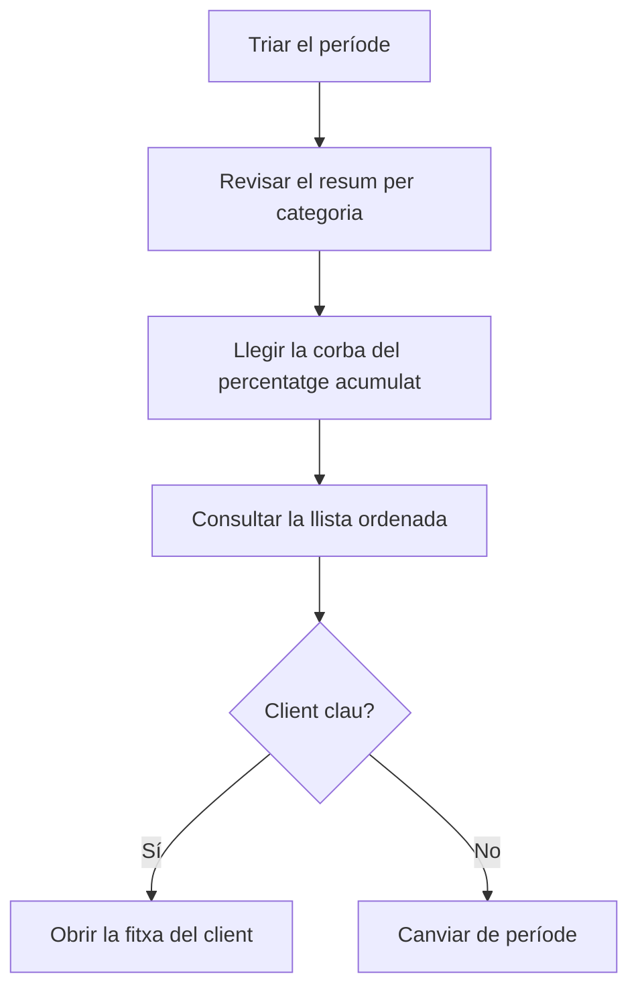

# ABC per client

## Per a que serveix aquesta pantalla

Classifica els clients en tres categories segons el pes de la seva facturació en un període, amb el criteri de Pareto: pocs clients solen concentrar la major part de les vendes. Serveix per decidir on posar l'esforç comercial i de servei. Es basa en les factures de venda del període.

## Accions disponibles

- Triar el «Període» amb el selector de dates. Filtra per la data de la factura.
- Aplicar el filtre amb «Filtrar». Canviar el període també recarrega les dades.
- Tornar a l'any en curs amb «Netejar».
- Veure la corba ABC a la pestanya «Gràfic».
- Consultar la classificació a la pestanya «Dades» i ordenar-la per client, valor o categoria.
- Obrir la fitxa d'un client fent clic al seu nom subratllat.

## Flux habitual

1. Obre la pantalla: analitza l'any en curs.
2. A «Gràfic», llegeix el resum de sobre: quants clients hi ha a cada categoria i quina part del valor suposen.
3. Mira on la línia de «% acumulat» arriba al 80 % i al 95 %: marca on acaben els clients A i B.
4. Obre «Dades» per veure la llista ordenada i la categoria de cada client.
5. Fes clic en un client per obrir-ne la fitxa si vols revisar-lo.

## Aspectes importants

- **«Valor»**: suma del total de les factures de venda del client amb data dins del període, amb impostos i transport. Les factures desactivades no compten i les rectificatives resten.
- Els clients amb valor zero o negatiu al període no surten a l'anàlisi.
- **«Posició»**: ordre del client de més a menys valor.
- **«% valor»**: pes del client sobre el total de tots els clients de l'anàlisi.
- **«% acumulat»**: suma del «% valor» d'aquest client i de tots els que té per sobre.
- **«Categoria»**, segons el «% acumulat» de la fila:
  - **A** (vermell): fins al 80 %. Són els clients principals.
  - **B** (taronja): de més del 80 % fins al 95 %.
  - **C** (verd): la resta, per sobre del 95 %.
- El % acumulat inclou el propi client. Per això, si un sol client supera el 80 % del total, queda classificat com a B, no com a A.
- **Resum del gràfic**: per a cada categoria mostra el nombre de clients i el seu percentatge sobre el total de clients, i el valor i el seu percentatge sobre el valor total.
- **Gràfic**: les barres són el «Valor» de cada client, amb el color de la seva categoria, i es llegeixen a l'eix esquerre. La línia blava és el «% acumulat», a l'eix dret de 0 a 100. Amb més de 40 clients s'amaguen els noms de l'eix horitzontal; passa el ratolí per sobre d'una barra per veure'ls.
- El «Codi» i el nom surten de les dades del client que consten a les factures.
- La pantalla només consulta: no canvia cap dada del client.
- Per als proveïdors hi ha l'anàlisi equivalent, «ABC per proveïdor».

## Errors frequents

- Si un client no surt, comprova que tingui factures de venda no desactivades dins del període i que el seu total no sigui zero o negatiu.
- Si el gràfic mostra «No hi ha dades per mostrar», el període no té cap factura de venda.
- Si les dades no canvien després de triar una data, comprova que el període tingui també la data final.
- Si el valor d'un client és més baix del que esperaves, revisa si té factures rectificatives en el període.

## Proces basic

