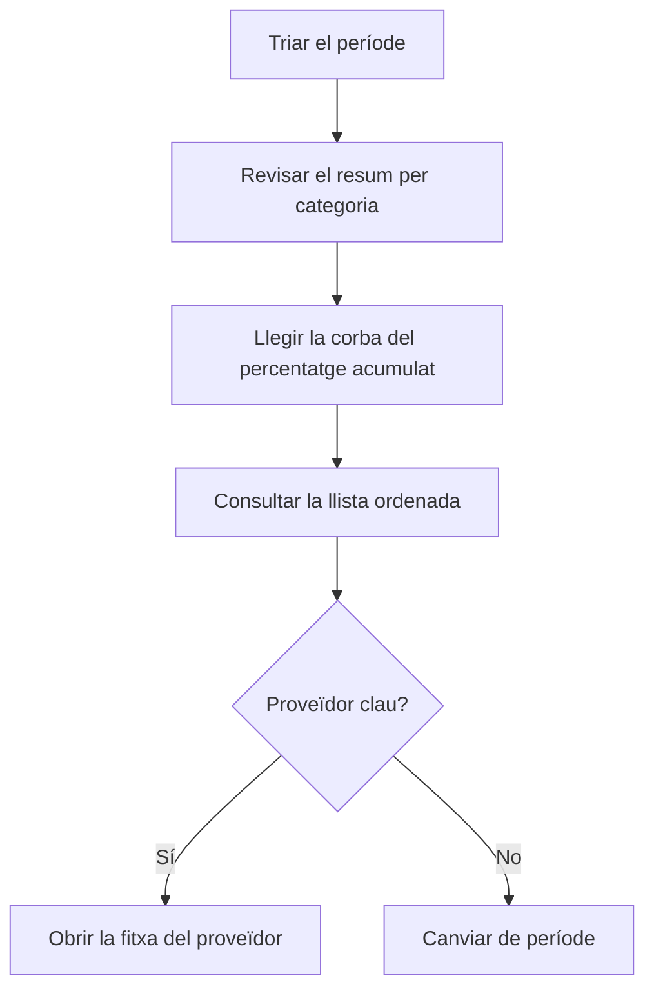

# ABC per proveïdor

## Per a que serveix aquesta pantalla

Classifica els proveïdors en tres categories segons el pes de les compres que se'ls han fet en un període, amb el criteri de Pareto: pocs proveïdors solen concentrar la major part de la despesa de compra. Serveix per decidir amb quins proveïdors negociar condicions o vigilar la dependència. Es basa en les factures de compra del període.

## Accions disponibles

- Triar el «Període» amb el selector de dates. Filtra per la data de la factura de compra.
- Aplicar el filtre amb «Filtrar». Canviar el període també recarrega les dades.
- Tornar a l'any en curs amb «Netejar».
- Veure la corba ABC a la pestanya «Gràfic».
- Consultar la classificació a la pestanya «Dades» i ordenar-la per proveïdor, valor o categoria.
- Obrir la fitxa d'un proveïdor fent clic al seu nom subratllat.

## Flux habitual

1. Obre la pantalla: analitza l'any en curs.
2. A «Gràfic», llegeix el resum de sobre: quants proveïdors hi ha a cada categoria i quina part del valor suposen.
3. Mira on la línia de «% acumulat» arriba al 80 % i al 95 %: marca on acaben els proveïdors A i B.
4. Obre «Dades» per veure la llista ordenada i la categoria de cada proveïdor.
5. Fes clic en un proveïdor per obrir-ne la fitxa si vols revisar-lo.

## Aspectes importants

- **«Valor»**: suma del total de les factures de compra del proveïdor amb data de factura dins del període, amb impostos i amb els descomptes aplicats. Les factures desactivades no compten.
- Només compten les factures de compra: les despeses de «Gestió de despeses» no hi surten.
- Els proveïdors amb valor zero o negatiu al període no surten a l'anàlisi.
- **«Posició»**: ordre del proveïdor de més a menys valor.
- **«% valor»**: pes del proveïdor sobre el total de tots els proveïdors de l'anàlisi.
- **«% acumulat»**: suma del «% valor» d'aquest proveïdor i de tots els que té per sobre.
- **«Categoria»**, segons el «% acumulat» de la fila:
  - **A** (vermell): fins al 80 %. Són els proveïdors principals.
  - **B** (taronja): de més del 80 % fins al 95 %.
  - **C** (verd): la resta, per sobre del 95 %.
- El % acumulat inclou el propi proveïdor. Per això, si un sol proveïdor supera el 80 % del total, queda classificat com a B, no com a A.
- **Resum del gràfic**: per a cada categoria mostra el nombre de proveïdors i el seu percentatge sobre el total de proveïdors, i el valor i el seu percentatge sobre el valor total.
- **Gràfic**: les barres són el «Valor» de cada proveïdor, amb el color de la seva categoria, i es llegeixen a l'eix esquerre. La línia blava és el «% acumulat», a l'eix dret de 0 a 100. Amb més de 40 proveïdors s'amaguen els noms de l'eix horitzontal; passa el ratolí per sobre d'una barra per veure'ls.
- El nom és el nom comercial de la fitxa del proveïdor. La columna «Codi» mostra el número de factura del proveïdor d'una de les seves factures del període, no un codi de proveïdor.
- La pantalla només consulta: no canvia cap dada del proveïdor.
- Per als clients hi ha l'anàlisi equivalent, «ABC per client».

## Errors frequents

- Si un proveïdor no surt, comprova que tingui factures de compra no desactivades dins del període i que el seu total no sigui zero o negatiu.
- Si una compra no hi suma, revisa la data de la factura de compra: el període filtra per aquesta data, no per la de l'albarà ni la del venciment.
- Si el gràfic mostra «No hi ha dades per mostrar», el període no té cap factura de compra.
- Si les dades no canvien després de triar una data, comprova que el període tingui també la data final.

## Proces basic

