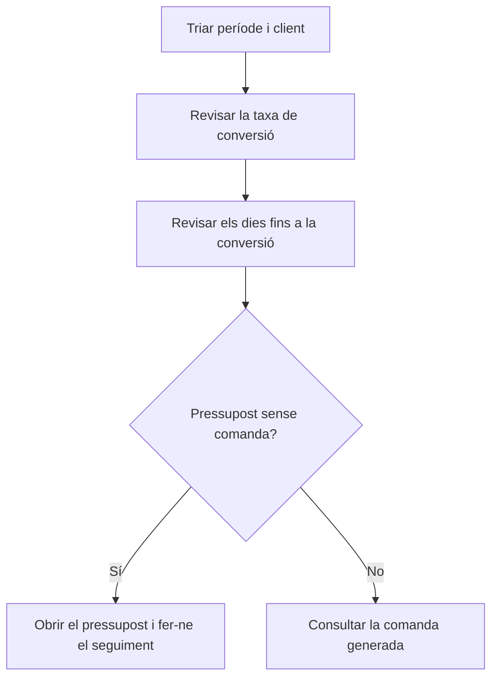

# Conversió de pressupostos

## Per a que serveix aquesta pantalla

Mesura quants pressupostos d'un període han acabat en comanda, quant temps ha passat entre el pressupost i la comanda i quin import s'ha convertit. Se situa a l'inici del circuit de venda, `pressupost -> comanda -> albarà -> factura`: serveix per seguir l'eficàcia comercial en general o per a un client concret.

## Accions disponibles

- Triar el «Període» amb el selector de dates. Filtra per la data del pressupost.
- Triar un «Client» per limitar l'anàlisi als seus pressupostos.
- Aplicar el filtre amb «Filtrar». Canviar el període o el client també recarrega les dades.
- Tornar a l'any en curs i a tots els clients amb «Netejar».
- Obrir la fitxa del client, el pressupost o la comanda fent clic al nom o al codi subratllat de la fila.
- Ordenar la taula pel client, el codi del pressupost, l'estat o el codi de la comanda.

## Flux habitual

1. Obre la pantalla: mostra els pressupostos de l'any en curs de tots els clients.
2. Revisa les targetes, sobretot «Taxa de conversió» i «Temps mig acceptació (dies)».
3. Tria un «Client» si vols analitzar-ne només un.
4. A la taula, busca els pressupostos sense «Codi comanda» per fer-ne el seguiment.
5. Fes clic al «Codi pressupost» per obrir el pressupost i actuar-hi, o al «Codi comanda» per veure la comanda generada.

## Aspectes importants

- Entren els pressupostos no desactivats amb data dins del període i, si l'has triat, del client indicat.
- **Un pressupost és convertit quan té una comanda creada des del pressupost** amb «Crear comanda» i la comanda no està desactivada. L'estat del pressupost no hi intervé: un pressupost amb comanda compta com a convertit sigui quin sigui el seu estat, i un de marcat com a acceptat però sense comanda no compta.
- Si un pressupost té més d'una comanda, només es té en compte la primera per data.
- **«Pressupostos»**: nombre de pressupostos del període. **«Comandes»**: quants d'aquests tenen comanda.
- **«Taxa de conversió»**: «Comandes» dividit per «Pressupostos», en percentatge.
- **«Temps mig acceptació (dies)»**: mitjana de «Dies fins conversió» dels pressupostos convertits. Els no convertits no compten.
- **«Dies fins conversió»**: dies naturals entre la data del pressupost i la data de la comanda.
- **«Import pressupostat»**: suma de les línies de tots els pressupostos del període, sense impostos.
- **«Import convertit»**: suma de les línies actuals de les comandes generades, sense impostos. Si després de crear la comanda se n'han canviat les línies, aquest import ja reflecteix els canvis i pot ser diferent del pressupostat.
- La columna «Import» de la taula és l'import del pressupost.
- La columna «Estat» mostra l'estat del pressupost segons el seu cicle de vida.
- La pantalla només consulta: no modifica cap pressupost ni comanda.

## Errors frequents

- Si un pressupost acceptat no surt com a convertit, comprova que s'hagi creat la comanda des del pressupost amb «Crear comanda». Una comanda creada a mà no hi queda vinculada.
- Si un pressupost no apareix, revisa'n la data: el període filtra per la data del pressupost, no per la de la comanda.
- Si «Import convertit» supera o no arriba a «Import pressupostat», revisa si les línies de la comanda s'han modificat després de crear-la.
- Si la taula queda buida, comprova el client triat i que el període tingui la data final.

## Proces basic

