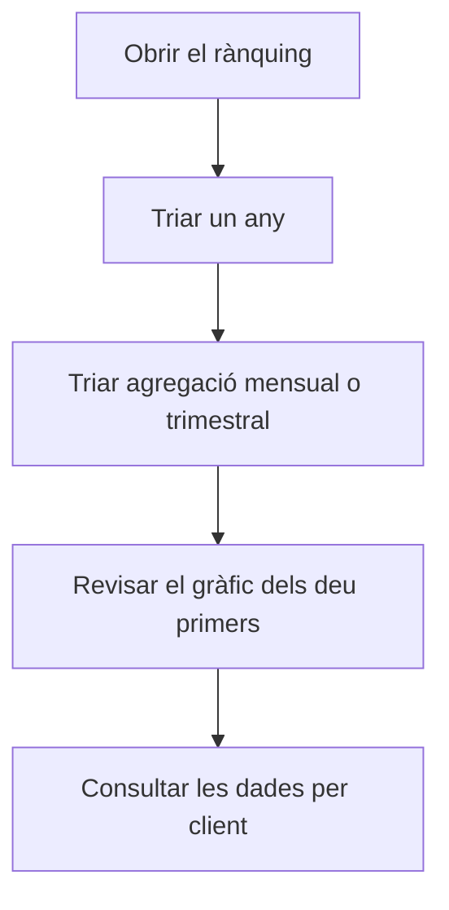

# Rànquing de clients

## Per a que serveix aquesta pantalla

Mostra quant ha facturat cada client durant un any natural, ordenat de més a menys, i com es reparteix aquesta facturació per mesos o trimestres. Es basa en les factures de venda: serveix per identificar els clients principals i veure en quina època de l'any concentren les compres.

## Accions disponibles

- Triar l'«Any» a la llista: surten l'any en curs i els deu anteriors. En canviar-lo, les dades es tornen a carregar.
- Triar l'«Agregació»: «Mensual» mostra una columna per mes i «Trimestral», una per trimestre.
- Netejar el filtre amb el botó de netejar filtres: torna a l'any en curs i a l'agregació «Mensual».
- Veure el pes de cada client a la pestanya «Gràfic».
- Consultar les xifres per client i període a la pestanya «Dades». Totes les columnes es poden ordenar.

## Flux habitual

1. Obre la pantalla: mostra l'any en curs agrupat per mesos.
2. Revisa les targetes «Total Factures» i «Total Vendes».
3. A «Gràfic», mira quina part de la facturació concentren els deu primers clients.
4. Obre «Dades» per veure la facturació de cada client mes a mes.
5. Canvia a «Trimestral» per comparar trimestres, o tria un altre «Any» per comparar-lo amb l'any anterior.

## Aspectes importants

- Es compten les factures de venda no desactivades amb data de factura dins de l'any triat, de l'1 de gener al 31 de desembre. Compta la data de la factura, no la del venciment ni la de l'albarà.
- L'import de cada factura és el seu total amb impostos i transport. Per això «Total Vendes» no coincideix amb la «Facturació (acumulat any)» del «Dashboard de gerència», que compta la base sense impostos.
- Les factures rectificatives resten del client i compten com una factura més a «Total Factures».
- **«Total Factures»**: nombre de factures de l'any. **«Total Vendes»**: suma dels seus imports.
- **Gràfic**: pastís amb els deu clients que més han facturat. La resta s'agrupa en una sola porció, «Altres». Passa el ratolí per sobre d'una porció per veure'n l'import.
- **Dades**: una fila per client, ordenada per «Total» de més a menys. Un guió vol dir que el client no té facturació en aquell mes o trimestre.
- El nom del client és el nom comercial que consta a la factura.
- L'agregació només canvia com es presenten les dades: no torna a consultar el servidor.
- La pantalla només consulta: no modifica cap factura.

## Errors frequents

- Si un client no surt, comprova que tingui factures amb data dins de l'any triat i que no estiguin desactivades.
- Si l'import d'un client és inferior al que esperaves, revisa si té factures rectificatives en aquell any.
- Si el gràfic mostra «No hi ha dades per mostrar», l'any triat no té cap factura de venda.
- Si surt «Error carregant el rànquing de clients», torna a triar l'any. Si persisteix, avisa l'administrador.

## Proces basic

