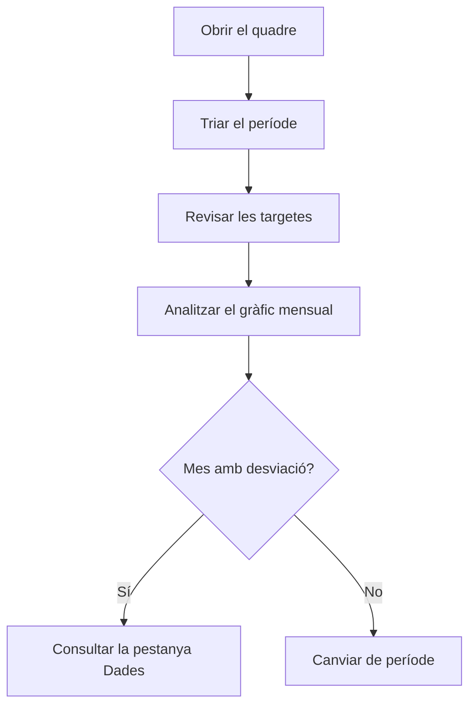

# Quadre de comandament comparatiu del flux de caixa

## Per a que serveix aquesta pantalla

Compara, mes a mes, els cobraments previstos de les factures de venda amb els pagaments previstos de les factures de compra i de les despeses. No és una vista de facturació: cada import compta al mes del seu venciment o de la data de pagament, no al mes de la factura. Serveix per veure en quins mesos entra o surt més diners i com evoluciona el saldo dins del període triat.

## Accions disponibles

- Triar el «Període» amb el selector de dates. Quan hi ha data d'inici i de final, el quadre es recalcula sol.
- Netejar el filtre amb el botó de netejar filtres: torna a l'any en curs, de l'1 de gener al 31 de desembre.
- Veure l'evolució a la pestanya «Gràfics».
- Consultar cada moviment a la pestanya «Dades», ordenable per «Data».

## Flux habitual

1. Obre la pantalla: mostra l'any en curs.
2. Revisa les quatre targetes: «Ingressos», «Despeses», «Net» i «Mitjana mensual neta».
3. A «Gràfics», busca els mesos on la línia de despeses supera la d'ingressos i on el «Saldo acumulat» baixa.
4. Canvia el «Període» per centrar-te en uns mesos concrets o en un altre any.
5. Obre «Dades» per veure quins venciments o despeses expliquen un mes concret.

## Aspectes importants

- **«Ingressos»**: suma dels venciments de les factures de venda amb data de venciment dins del període. L'import és el total de la factura amb impostos, repartit segons la forma de pagament. Les factures rectificatives resten.
- **«Despeses»**: suma de dues fonts dins del període:
  - els venciments de les factures de compra (total amb impostos), per data de venciment;
  - les despeses registrades a «Gestió de despeses», per data de pagament. Les despeses recurrents hi surten una vegada per cada pagament generat.
- **«Net»** és «Ingressos» menys «Despeses». Surt en verd si és positiu i en vermell si és negatiu.
- **«Mitjana mensual neta»** és la suma del net de cada mes dividida pel nombre de mesos que tenen algun moviment. Els mesos sense cap venciment ni despesa no compten.
- Al gràfic, «Ingressos» i «Despeses» són el total de cada mes. El «Saldo acumulat» (àrea gris) suma el net mes a mes des del primer mes amb moviments. Comença a zero: no és el saldo del banc ni inclou el que hi havia abans del període.
- A «Dades», cada fila és un venciment o una despesa. L'import surt en verd si és un ingrés i en vermell si és un pagament. Els textos de «Tipus», «Detall» i «Descripció» es generen automàticament i no es tradueixen:
  - venda: tipus «Venta», detall «Factura», descripció amb el número de factura i la data de venciment;
  - compra: tipus «Compra», detall amb el nom fiscal del proveïdor, descripció amb el número de factura del proveïdor i la data de la factura;
  - despesa: tipus «Despesa», detall amb el tipus de despesa i la descripció de la despesa.
- Es compten totes les factures, sigui quin sigui el seu estat. Un venciment ja cobrat o pagat hi continua sortint.
- La pantalla només consulta: no modifica cap factura ni despesa.

## Errors frequents

- Si una factura de venda no apareix al mes esperat, revisa'n els venciments: compta la data de venciment, no la data de factura.
- Si el quadre no canvia després de triar una data, comprova que hagis triat també la data final del període.
- Si falta una factura de compra, comprova que tingui venciments. Una factura de compra sense venciments no suma cap despesa.
- Si surt el missatge «Error carregant dades del quadre de comandament», torna a triar el període. Si persisteix, avisa l'administrador.

## Proces basic

