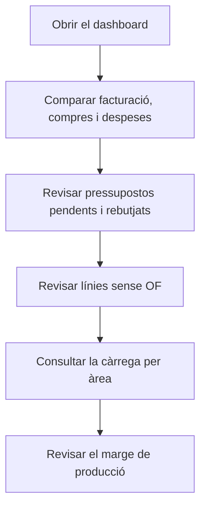

# Dashboard de gerència

## Per a que serveix aquesta pantalla

Resumeix en una sola pantalla l'estat del negoci: facturació, compres i despeses de l'exercici comparades amb l'any anterior, pressupostos pendents i rebutjats, comandes sense ordre de fabricació, evolució de clients, càrrega prevista de les màquines i marge de producció. Està pensada per a una revisió ràpida de la direcció; per analitzar un indicador a fons, fes servir el quadre específic (per exemple, «Conversió de pressupostos» o «Rànquing de clients»).

## Accions disponibles

- Consultar les targetes d'indicadors. La pantalla no té filtres: tot es calcula sobre l'exercici en curs, el que inclou la data d'avui.
- Passar el ratolí pel gràfic «Hores màquina previstes per àrea» per veure les hores de cada àrea i setmana.
- Amagar o mostrar una àrea del gràfic fent clic al seu nom a la llegenda.
- Tornar a obrir la pantalla per recalcular les dades.

## Flux habitual

1. Obre la pantalla a l'inici de la setmana o del mes.
2. Compara «Facturació (acumulat any)», «Compres» i «Despeses» amb l'any passat.
3. Revisa «Pressupostos pendents» i «Pressupostos rebutjats» per fer el seguiment comercial.
4. Mira «Línies de comanda sense OF» per detectar comandes que encara no s'han llançat a producció.
5. Consulta el gràfic d'hores per veure quines àrees van carregades les properes setmanes.
6. Revisa el «Marge cost producció vs facturat» per vigilar la rendibilitat.

## Aspectes importants

- **Exercici en curs**: si cap exercici de «Exercicis» no inclou la data d'avui, totes les targetes surten a zero.
- **«Facturació (acumulat any)»**: suma de la base sense impostos de les factures de venda no desactivades, des de l'inici de l'exercici fins avui. «Mateix període any passat» és la mateixa finestra de dates un any enrere. El percentatge és la variació: verd si creix, vermell si baixa.
- **«Compres»**: base sense impostos de les factures de compra no desactivades, per data de factura, amb la mateixa finestra i la mateixa comparació.
- **«Despeses»**: import de les despeses de «Gestió de despeses» amb data de pagament dins de la mateixa finestra. A compres i despeses, el percentatge surt en verd si baixa i en vermell si puja.
- **«Pressupostos pendents»**: tots els pressupostos no desactivats en estat «Pendent d'acceptar», de qualsevol data. «Import pendent» és la suma de les seves línies sense impostos.
- **«Pressupostos rebutjats»**: pressupostos en estat «Rebutjat» amb data dins de l'exercici en curs.
- **«Línies de comanda sense OF»**: línies de comanda no servides i sense ordre de fabricació vinculada, de comandes que no estan en estat «Comanda Servida» ni «Comanda Facturada». Compta totes les línies, també les de referències que no es fabriquen.
- **«Clients nous»**: clients actius donats d'alta els últims 30 dies.
- **«Clients perduts»**: clients que tenen factures a l'exercici anterior, sencer, i cap des de l'inici de l'exercici en curs fins avui.
- **«Hores màquina previstes per àrea»**: hores estimades de les ordres de fabricació obertes, és a dir, no tancades ni cancel·lades, repartides per setmana de data planificada durant les sis setmanes a partir de l'actual:
  - l'eix horitzontal mostra el número de setmana (S seguit del número);
  - les ordres amb data planificada ja passada se sumen a la setmana actual;
  - es compta el temps estimat de totes les fases no externes, sense descomptar la feina ja feta; el temps de cicle es multiplica per la quantitat planificada;
  - cada fase s'assigna a l'àrea de la seva «Màquina preferida» o, si no en té, a la d'una màquina del seu tipus;
  - només surten les àrees actives marcades com a «Visible a planta». El número entre parèntesis de la llegenda és el nombre de màquines actives de l'àrea.
- **«Marge cost producció vs facturat»**: per a les ordres de fabricació tancades de l'exercici en curs que ja s'han facturat, el percentatge és (facturat − cost) / facturat:
  - el cost és el cost de màquina, d'operari i de material acumulat a cada ordre;
  - el facturat és l'import sense impostos de les línies de factura que vénen de la comanda de l'ordre, a través de l'albarà;
  - la primera línia inferior indica quantes ordres s'han analitzat i el cost total dividit pel facturat total.
- **«WIP»**: el mateix càlcul per a les ordres de l'exercici encara no tancades ni cancel·lades, comparant el cost acumulat fins ara amb l'import de les línies de comanda vinculades. Una ordre sense línia de comanda hi suma cost però no ingrés, i fa baixar el marge.
- La pantalla només consulta: no modifica cap dada.

## Errors frequents

- Si tot surt a zero, comprova a «Exercicis» que hi hagi un exercici que inclogui la data d'avui.
- Si «Pressupostos pendents» o «Pressupostos rebutjats» surten a zero i n'hi hauria d'haver, revisa que els estats del cicle de vida de pressupostos es diguin exactament «Pendent d'acceptar» i «Rebutjat».
- Si una àrea no surt al gràfic d'hores, activa-hi «Visible a planta» a «Àrees».
- Si una ordre no apareix a les hores de cap àrea, revisa que les seves fases tinguin «Màquina preferida» o un tipus de màquina amb màquines en àrees visibles.
- Si una ordre tancada no entra al marge, comprova que la línia de comanda tingui l'ordre vinculada i que s'hagi servit amb albarà i facturat.

## Proces basic

