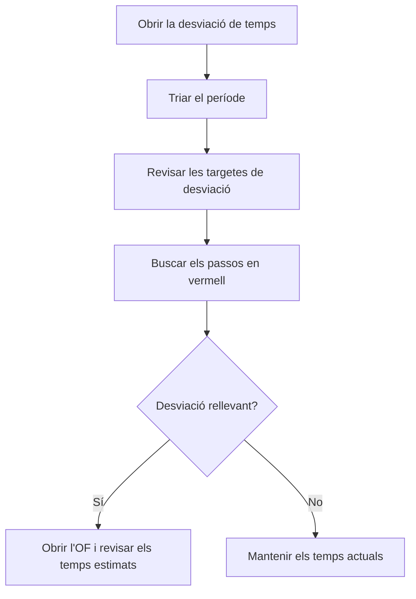

# Desviació de temps

## Per a que serveix aquesta pantalla

Compara el temps real de màquina i d'operari amb el temps teòric de les rutes de fabricació, pas a pas. Les dades surten dels tiquets de producció del període: per a cada pas d'una fase (per exemple, preparació o producció) mostra quant s'havia previst, quant s'ha trigat i la diferència. Serveix per detectar les fases i les ordres de fabricació (OF) on els temps estimats no s'ajusten a la realitat.

## Accions disponibles

- Triar el «Període». Les dades es tornen a carregar soles en canviar-lo; el botó «Filtrar» també les recarrega.
- Prémer «Netejar» per tornar al període per defecte, l'any en curs sencer.
- Ordenar la taula per «Ordre de treball», «Fase» o «Estat».
- Obrir una OF fent clic al seu codi a la columna «Ordre de treball».

## Flux habitual

1. Obre la pantalla: es carrega l'any en curs.
2. Mira les targetes de dalt: «Desviació màquina» i «Desviació operari» donen la desviació global en percentatge.
3. Acota el «Període» al mes o la setmana que vols analitzar.
4. Busca a la taula les files amb la desviació en vermell, que són els passos que han trigat més del previst.
5. Fes clic a l'OF per revisar-ne la fase i els temps estimats dels passos.

## Aspectes importants

- **D'on surten les dades**: dels tiquets de producció amb data dins del període. Els tiquets es generen sols quan es finalitza una fase a la màquina de planta, o es creen a mà a «Tiquets de producció». Cada fila agrupa tots els tiquets del període d'un mateix pas.
- **«Estat»**: l'estat de màquina del pas (per exemple, preparació o producció).
- **«Quantitat»**: peces declarades als tiquets del pas. Als tiquets automàtics són les peces bones.
- **«Teòric màq. (min)»**: temps estimat del pas. Si el pas és per temps de cicle, es multiplica per la «Quantitat»; si no, compta una sola vegada.
- **«Real màq. (min)»**: temps de màquina sumat dels tiquets.
- **«Teòric op. (min)»** i **«Real op. (min)»**: el mateix amb el temps estimat d'operari del pas i el temps d'operari dels tiquets.
- **«Desv. màq. (min)»** i **«Desv. op. (min)»**: real menys teòric. En vermell si és positiu (s'ha trigat més del previst) i en verd si és zero o negatiu.
- **Targetes**: «Teòric màquina», «Real màquina», «Teòric operari» i «Real operari» sumen els minuts de totes les files. «Desviació màquina» i «Desviació operari» són la diferència entre real i teòric en percentatge sobre el teòric.
- El temps fet en estats de màquina que no són cap pas de la fase no genera tiquets i no surt aquí.
- La pantalla només consulta: no modifica cap tiquet ni cap ruta.

## Errors frequents

- Si la taula surt buida, no hi ha tiquets de producció dins del període: comprova que les fases s'hagin finalitzat a la màquina.
- Si falten els tiquets de l'últim dia del període, és perquè el dia final no s'inclou: tria com a data final el dia següent.
- Si un pas per temps de cicle surt amb «Quantitat» 0 i tot el temps real com a desviació, no s'hi van declarar peces bones: el temps teòric queda a 0.
- Si «Teòric op. (min)» surt a 0, el pas no té temps estimat d'operari a l'OF.
- Si un pas amb temps fix, com una preparació, té tiquets en dos períodes, el temps teòric sencer surt a cada període: amplia el període per comparar-lo bé.
- Si la desviació global surt a 0 %, pot ser que el temps teòric total sigui 0: revisa que els passos tinguin temps estimat.

## Proces basic

