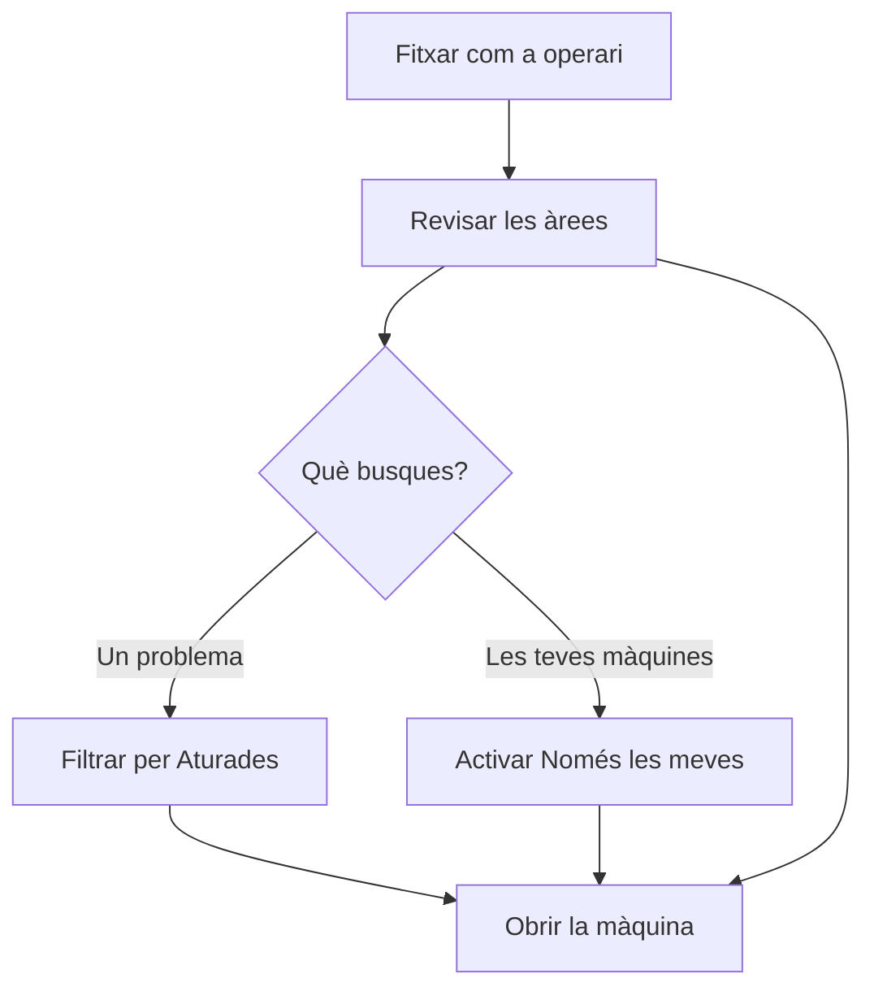

# Àrees de planta

## Per a que serveix aquesta pantalla

Mostra l'estat de totes les màquines de la planta, agrupades per àrea. D'un cop d'ull es veu quines màquines estan en marxa, quines estan aturades i quines no envien dades, quant de temps fa que són en aquest estat i quina ordre de fabricació tenen carregada. Des d'aquí s'entra al detall de cada màquina per treballar-hi.

## Accions disponibles

- Filtrar les màquines per estat: Totes, En marxa, Aturades o Sense dades. Cada filtre indica quantes màquines hi ha.
- Activar «Només les meves» per veure només les màquines on estàs fitxat.
- Plegar o desplegar una àrea tocant-ne la capçalera.
- Obrir el detall d'una màquina tocant-ne la fitxa (a la tauleta) o la fila (al mòbil).
- Obrir el menú de l'operari (a dalt a la dreta) per sortir de la planta.

## Flux habitual

1. Fitxa amb el teu codi d'operari per entrar a la planta.
2. Revisa l'estat de les àrees: cada capçalera té una tira de quadrets amb el color de l'estat de cada màquina.
3. Si busques un problema, filtra per «Aturades»; si vols anar a les teves màquines, activa «Només les meves».
4. Toca la màquina on has de treballar per obrir-ne el detall.

## Aspectes importants

- El color de cada màquina és el color del seu estat, definit al catàleg d'estats de màquina. La franja ratllada en gris vol dir que la màquina no envia dades.
- El temps és el que fa que la màquina és en l'estat actual: «38 min», «4 h 20 min» o «46 d 8 h». Avança sol, sense recarregar la pantalla. Una màquina sense dades mostra «—».
- «En marxa» i «Aturades» depenen de com està configurat cada estat (aturada o tancada). Un estat que no existeix al catàleg compta com «Sense dades».
- Les màquines sense ordre carregada només mostren el nom, l'estat i el temps. Les que en tenen una afegeixen l'ordre i la fase, la referència, les peces previstes i les inicials dels operaris.
- Quan apliques un filtre d'estat, s'obren totes les àrees que tenen alguna màquina en aquell estat.
- Les àrees plegades i el filtre «Només les meves» es recorden en aquest dispositiu.

## Errors frequents

- Si una màquina surt com «Sense dades» i hauria de funcionar, comprova que el terminal o el connector de la màquina està engegat i connectat.
- Si «Només les meves» no mostra cap màquina, és que no estàs fitxat a cap màquina: entra al detall de la màquina i toca «Entra a la màquina».
- Si una àrea no apareix, pot ser que el filtre actiu no tingui cap màquina en aquella àrea: torna a «Totes».

## Proces basic

