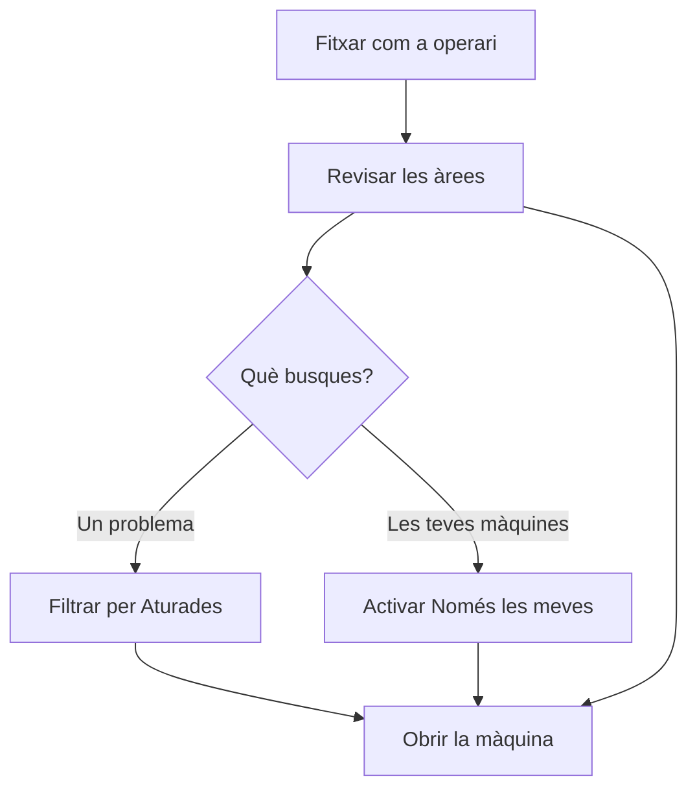

# Àrees de planta

## Per a que serveix aquesta pantalla

Mostra l'estat de totes les màquines de la planta, agrupades per àrea. D'un cop d'ull es veu quines màquines estan en marxa, quines estan aturades i quines no tenen dades, quant de temps fa que són en aquest estat i quina ordre de fabricació tenen carregada. Des d'aquí obres la màquina on has de treballar: `fitxatge -> àrees de planta -> màquina -> fase -> declaració de peces`.

## Accions disponibles

- Filtrar les màquines per estat: «Totes», «En marxa», «Aturades» o «Sense dades». Cada filtre indica quantes màquines hi ha.
- Activar «Només les meves» per veure només les màquines on has entrat.
- Plegar o desplegar una àrea tocant-ne la capçalera.
- Obrir una màquina tocant-ne la fitxa (a la tauleta) o la fila (al mòbil).
- Tocar el teu nom o les teves inicials, a dalt a la dreta, i després «Sortir» per deixar la tauleta lliure.

## Flux habitual

1. Fitxa amb el teu codi a «Fitxatge Operador».
2. Revisa les àrees: cada capçalera té una tira de quadrets amb el color de l'estat de cada màquina.
3. Si busques un problema, toca «Aturades»; si vols anar a les teves màquines, activa «Només les meves».
4. Toca la màquina on has de treballar per obrir-la.
5. Quan acabis, surt de les màquines i toca «Sortir».

## Aspectes importants

- Només surten les àrees marcades com a «Visible a planta» a «Gestió d'àrees», i només les màquines actives. Una àrea sense cap màquina que compleixi el filtre no surt.
- El color de cada màquina és el color del seu estat, definit a «Gestió d'estats de màquina». La franja ratllada en gris vol dir que la màquina no té dades.
- El temps és el que fa que la màquina és en l'estat actual: «38 min», «4 h 20 min» o «46 d 8 h». Avança sol, sense recarregar la pantalla. Una màquina sense dades mostra «—».
- «En marxa» i «Aturades» depenen de com està configurat cada estat (aturada o tancada). Una màquina sense estat, o amb un estat que no és al catàleg, compta com «Sense dades».
- Les màquines sense ordre carregada mostren el nom, l'estat, el temps i, si n'hi ha, les inicials dels operaris. Les que en tenen una afegeixen l'ordre i la fase, la referència i les peces previstes.
- Quan tries un filtre d'estat, s'obren totes les àrees que tenen alguna màquina en aquell estat.
- Les àrees plegades i «Només les meves» es recorden en aquest dispositiu.
- A dalt es veuen el torn actual amb l'horari (no al mòbil), l'hora i el teu nom.
- «Sortir» no et treu de les màquines: abans, toca «Surt de la màquina» a cada màquina on hagis entrat.

## Errors frequents

- Si una màquina surt com «Sense dades», encara no té cap estat o el seu estat no és al catàleg: obre-la i tria un estat.
- Si totes les màquines surten com «Sense dades», pot ser que s'hagi perdut la connexió: recarrega la pantalla.
- Si «Només les meves» no mostra cap màquina, és que no has entrat a cap: obre la màquina i toca «Entra a la màquina».
- Si surt «Cap centre en aquest estat.», cap màquina compleix el filtre: torna a «Totes» o desactiva «Només les meves».
- Si una àrea no surt mai, demana al responsable que revisi «Visible a planta» a «Gestió d'àrees».

## Proces basic

```mermaid
flowchart TD
    A[Fitxar com a operari] --> B[Revisar les àrees]
    B --> C{Què busques?}
    C -->|Un problema| D[Filtrar per Aturades]
    C -->|Les teves màquines| E[Activar Només les meves]
    D --> F[Obrir la màquina]
    E --> F
    B --> F
```
