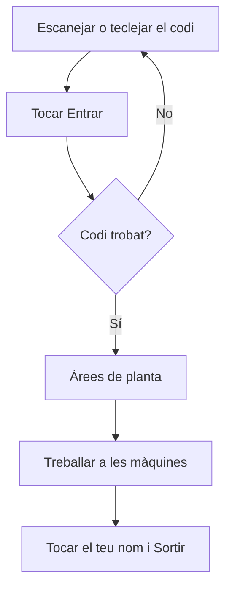

# Fitxatge Operador

## Per a que serveix aquesta pantalla

És l'entrada a la planta. Aquí t'identifiques com a operari amb el teu codi abans de treballar. Després passes a les àrees de planta i hi tries la màquina: `fitxatge -> àrees de planta -> màquina -> fase -> declaració de peces`.

Un operari no és un usuari de l'aplicació. La tauleta ja té la sessió iniciada amb un usuari; cada operari només hi entra el seu codi.

## Accions disponibles

- Escanejar el teu codi amb el lector.
- Teclejar el codi amb el teclat numèric de la pantalla.
- Tocar «ABC» per escriure lletres amb el teclat del dispositiu, i «123» per tornar als números.
- Esborrar l'últim caràcter amb la tecla d'esborrar, a baix a la dreta del teclat.
- Tocar «Entrar» per accedir a la planta.

## Flux habitual

1. Escaneja el teu codi o tecleja'l al camp «Codi d'operari».
2. Toca «Entrar».
3. S'obren les àrees de planta, amb el teu nom a dalt a la dreta.
4. Treballa a les màquines que calgui.
5. Quan acabis, toca el teu nom o les teves inicials, a dalt a la dreta, i després «Sortir». La tauleta torna a aquesta pantalla.

## Aspectes importants

- El codi es mostra com a punts perquè ningú el vegi.
- El codi és el que té l'operari a «Gestió d'operaris». Ha de ser exactament igual, també les majúscules i les minúscules.
- «Entrar» està desactivat mentre el camp és buit.
- La tauleta et recorda: si es tanca o es recarrega, continues identificat. El següent operari no pot fitxar fins que tu toquis «Sortir».
- Fitxar aquí no t'entra a cap màquina: només diu qui fa servir la tauleta. Per treballar en una màquina, obre-la i toca «Entra a la màquina».
- «Sortir» tampoc et treu de les màquines. Abans de sortir, toca «Surt de la màquina» a cada màquina on hagis entrat.
- En pantalles amples, al costat del teclat es veuen l'hora, la data i el nom de l'empresa.

## Errors frequents

- Si surt «No hi ha cap operari amb aquest codi. Torna-ho a provar.», revisa el codi (també les majúscules) i torna'l a escanejar. El camp s'esborra sol.
- Si el codi és correcte i no el troba, pot ser que l'operari s'hagi donat d'alta fa poc: recarrega la pantalla. Si continua, demana al responsable que revisi el codi a «Gestió d'operaris».
- Si la pantalla passa directament a les àrees, és que ja hi ha un operari fitxat a la tauleta. Mira el nom de dalt a la dreta; si no ets tu, toca'l i toca «Sortir».
- Si no pots escriure lletres, toca «ABC».

## Proces basic

