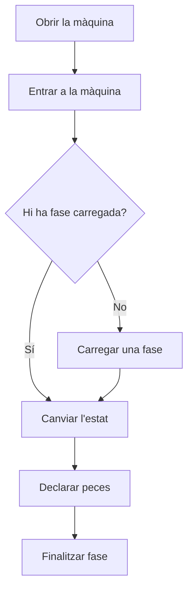

# Màquina de planta

## Per a que serveix aquesta pantalla

És la pantalla de treball al costat de la màquina. Mostra l'estat de la màquina i el temps que fa que hi és, l'ordre de fabricació i la fase carregades, les peces declarades i els operaris que hi treballen. Des d'aquí es carrega una fase, es canvia l'estat de la màquina, es declaren peces i es finalitza la fase.

## Accions disponibles

- Entrar o sortir de la màquina com a operari (botó de la placa, a dalt).
- Carregar una fase des de la pestanya «Fases disponibles».
- Crear una fase nova des d'una plantilla, dins del diàleg de càrrega.
- Canviar l'estat de la màquina amb els botons d'estat de la barra inferior, o triar-ne un altre a «Altres estats».
- Declarar peces bones i dolentes amb «Declarar peces».
- Finalitzar la fase amb «Finalitzar fase».
- Consultar el temps de la fase, la documentació, els comentaris i els materials a les pestanyes.

## Flux habitual

1. Obre la màquina des de les àrees de planta.
2. Toca «Entra a la màquina» a la placa per fitxar-t'hi.
3. Si no hi ha cap fase carregada, obre «Fases disponibles», toca «Carrega» a l'ordre que toca, tria la fase i l'activitat, i toca «Carrega l'activitat».
4. Canvia l'estat de la màquina segons el que facis (per exemple, preparació i després producció).
5. Declara les peces a mesura que les fas amb «Declarar peces».
6. Quan acabis, toca «Finalitzar fase», revisa les peces i confirma.

## Aspectes importants

- La placa, a dalt, sempre mostra l'estat actual amb el seu color, el temps en aquest estat i des de quina hora. També al mòbil.
- El botó de l'estat actual surt ple del seu color i no es pot tornar a prémer. Els botons d'estat són les activitats de la fase carregada i la parada.
- «Declarar peces» i «Finalitzar fase» només apareixen quan hi ha una fase carregada.
- Només pots entrar o sortir de la màquina si l'estat actual ho permet; si no, el botó surt desactivat.
- Al diàleg de càrrega, les fases d'un altre tipus de màquina surten bloquejades: no es poden carregar en aquesta màquina.
- No es pot carregar una ordre nova mentre hi hagi una fase en procés a la màquina: primer cal finalitzar-la.
- En declarar peces, el botó diu exactament què es declararà, per exemple «Declarar 8 bones i 1 dolenta». Els motius de les peces dolentes són opcionals i es poden repartir entre diversos motius.
- La pestanya «Fase actual» compara el temps real de màquina i d'operari amb l'estimat, i avisa quan se'n passa.
- Al mòbil, els botons «Estat» i «Més» obren un full amb les opcions.

## Errors frequents

- Si «Entra a la màquina» surt desactivat, canvia primer a un estat que permeti operaris (per exemple, preparació o producció).
- Si no pots carregar una ordre, comprova que no hi hagi una fase en procés a la màquina i que la fase sigui per a aquest tipus de màquina.
- Si en declarar peces surt un avís de quantitat, revisa que la quantitat no superi la que ha arribat de la fase anterior.
- Si el repartiment dels motius de les peces dolentes no quadra, la suma dels motius ha de coincidir amb les peces dolentes declarades.

## Proces basic

