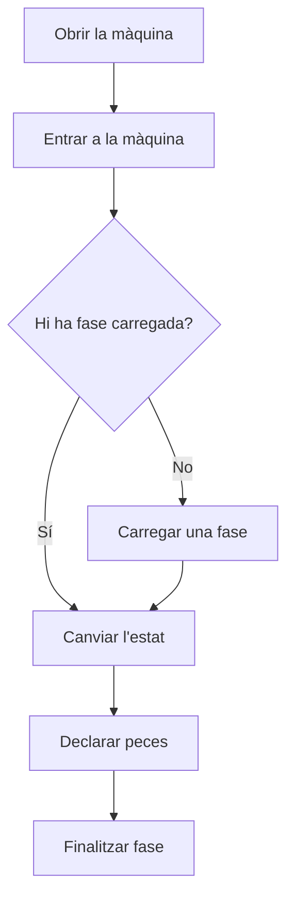

# Màquina de planta

## Per a que serveix aquesta pantalla

És la pantalla de treball al costat de la màquina. Mostra l'estat de la màquina i el temps que fa que hi és, l'ordre de fabricació i la fase carregades, les peces declarades i els operaris que hi treballen. Des d'aquí es carrega una fase, es canvia l'estat de la màquina, es declaren peces i es finalitza la fase.

## Accions disponibles

- Entrar o sortir de la màquina com a operari (botó de la placa, a dalt).
- Carregar una fase des de la pestanya «Fases disponibles».
- Crear una fase nova des d'una plantilla, dins del diàleg de càrrega.
- Canviar l'estat de la màquina amb els botons d'estat de la barra inferior, o triar-ne un altre a «Altres estats».
- Declarar peces bones i dolentes amb «Declarar peces».
- Treure la fase de la màquina amb «Finalitzar fase»: «Pausar» la deixa a mitges i «Finalitzar» la dona per acabada.
- Consultar el temps de la fase, la documentació, els comentaris i els materials a les pestanyes.
- Editar el comentari de la fase a «Comentaris» amb «Editar».
- Moure material a la ubicació d'aprovisionament de la màquina des de la pestanya «Materials», amb el botó de la columna «Estoc».

## Flux habitual

1. Obre la màquina des de les àrees de planta.
2. Toca «Entra a la màquina» a la placa per registrar-hi la teva entrada.
3. Si no hi ha cap fase carregada, obre «Fases disponibles», toca «Carrega» a l'ordre que toca, tria la fase i l'activitat, i toca «Carrega l'activitat».
4. Canvia l'estat de la màquina segons el que facis (per exemple, preparació i després producció).
5. Declara les peces a mesura que les fas amb «Declarar peces».
6. Quan acabis, toca «Finalitzar fase», revisa les peces i toca «Finalitzar».

## Aspectes importants

- La placa, a dalt, sempre mostra l'estat actual amb el seu color, el temps en aquest estat i des de quina hora. També al mòbil.
- El botó de l'estat actual surt ple del seu color i no es pot tornar a prémer. Els botons d'estat són les activitats de la fase carregada i l'estat de màquina tancada. Si toques l'estat de màquina tancada amb una fase carregada, primer s'obre «Finalitzar Fase».
- «Declarar peces» i «Finalitzar fase» només apareixen quan hi ha una fase carregada.
- Només pots entrar o sortir de la màquina si l'estat actual ho permet; si no, el botó surt desactivat.
- Al diàleg de càrrega, les fases d'un altre tipus de màquina surten bloquejades: no es poden carregar en aquesta màquina.
- No es pot carregar una ordre nova mentre hi hagi una fase en procés a la màquina: primer cal finalitzar-la.
- En declarar peces, el botó diu exactament què es declararà, per exemple «Declarar 8 bones i 1 dolenta». Els motius de les peces dolentes són opcionals i es poden repartir entre diversos motius.
- La pestanya «Fase actual» compara el temps real de màquina i d'operari amb l'estimat, i avisa quan se'n passa.
- Al mòbil, els botons «Estat» i «Més» obren un full amb les opcions.
- Al diàleg «Finalitzar Fase» indiques les peces i els motius de rebuig. «Pausar» treu la fase de la màquina sense acabar-la, i la pots tornar a carregar més tard. «Finalitzar» la dona per acabada.
- A «Opcions» pots marcar que es carregui la fase següent de la mateixa ordre per a aquest tipus de màquina, i triar-ne l'activitat. Només surt si hi ha aquesta fase, i no surt quan el diàleg s'obre des de l'estat de màquina tancada.
- En treure la fase, la màquina passa a l'estat marcat com a aturada. Si el diàleg s'ha obert des de l'estat de màquina tancada, passa a aquest estat. Si carregues la fase següent, passa a l'activitat que has triat.
- Si la fase té materials, «Finalitzar» exigeix que tots estiguin aprovisionats a la màquina i obre «Consum de materials». Per defecte es consumeix tot el material aprovisionat; si en sobra, declara-ho amb «Afegir peça» i toca «Confirmar consum». La fase no es finalitza fins que confirmes el consum. «Pausar» no consumeix material.
- A «Comentaris» es veuen els comentaris de l'ordre, de la fase i de les activitats. Només el de la fase es pot editar.

## Errors frequents

- Si «Entra a la màquina» surt desactivat, canvia primer a un estat que permeti operaris. Quins estats ho permeten es configura a «Gestió d'estats de màquina».
- Si no pots carregar una ordre, comprova que no hi hagi una fase en procés a la màquina i que la fase sigui per a aquest tipus de màquina.
- Si en declarar peces surt un avís de quantitat, revisa que la quantitat no superi la que ha arribat de la fase anterior.
- Si el repartiment dels motius de les peces dolentes no quadra, la suma dels motius ha de coincidir amb les peces dolentes declarades.
- Si surt «Materials no aprovisionats», mou el material que falta a la ubicació d'aprovisionament des de la pestanya «Materials» i torna a finalitzar.
- Si surt «Activitat requerida», tria l'activitat de la fase següent o desmarca l'opció de carregar-la.
- Si surt «No s'ha pogut determinar l'estat de sortida de la fase», el cicle de vida de les fases no permet pausar o tancar la fase des del seu estat actual: avisa el responsable perquè ho revisi a «Gestió de cicles de vida».

## Proces basic

```mermaid
flowchart TD
    A[Obrir la màquina] --> B[Entrar a la màquina]
    B --> C{Hi ha fase carregada?}
    C -->|No| D[Carregar una fase]
    C -->|Sí| E[Canviar l'estat]
    D --> E
    E --> F[Declarar peces]
    F --> G[Finalitzar fase]
```
