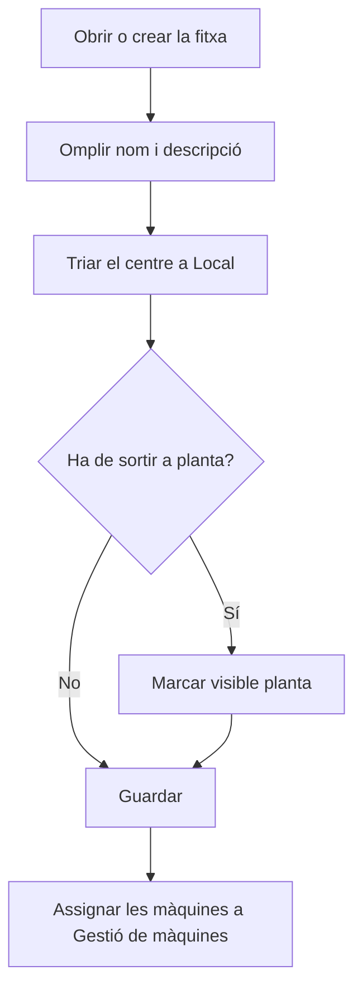

# Àrea

## Per a que serveix aquesta pantalla

És la fitxa d'una àrea: el nom, la descripció, el centre al qual pertany i si surt a planta. L'àrea és el tercer nivell de l'estructura de planta (empresa -> centre -> àrea -> màquina) i serveix per agrupar les màquines a la pantalla d'àrees de planta que fan servir els operaris.

## Accions disponibles

- Omplir el «Nom» i la «Descripció».
- Triar a «Local» el centre al qual pertany l'àrea.
- Marcar o desmarcar «Visible planta».
- Marcar o desmarcar «Desactivat».
- Desar amb «Guardar», a la capçalera. Després de desar, l'aplicació torna a la pantalla anterior.

## Flux habitual

1. Des de «Gestió d'àrees», toca «+» o fes clic en una àrea.
2. Omple el nom i la descripció.
3. Tria el centre a «Local».
4. Deixa marcat «Visible planta» si els operaris han de veure l'àrea a planta.
5. Desa amb «Guardar».
6. Assigna les màquines a l'àrea des de la fitxa de cada màquina, a «Gestió de màquines».

## Aspectes importants

- Són obligatoris el «Nom», la «Descripció» i el «Local». El «Local» és el centre de l'àrea; les opcions són els centres de «Gestió de centres».
- El «Nom» admet fins a 50 caràcters, i no es pot crear una àrea amb el nom d'una altra que ja existeix.
- Una àrea nova surt amb «Visible planta» marcat.
- Si l'àrea té «Visible planta» i no està desactivada, surt a la pantalla d'àrees de planta amb les seves màquines actives. Aquesta pantalla mostra les àrees visibles de tots els centres.
- Desmarcar «Visible planta» o marcar «Desactivat» amaga l'àrea i les seves màquines de la pantalla de planta, però les màquines continuen existint i es gestionen a «Gestió de màquines».
- Les màquines no s'afegeixen des d'aquí: cada màquina tria la seva àrea a la seva pròpia fitxa.
- Per eliminar una àrea, fes-ho des de la llista; consulta'n l'ajuda abans, perquè l'eliminació és definitiva i pot esborrar les màquines de l'àrea.

## Errors frequents

- Si surt «El nom és obligatori» o «La descripció és obligatòria», omple el camp marcat.
- Si surt «El local és obligatori», tria un centre a «Local»; si la llista és buida, crea primer el centre a «Gestió de centres».
- Si en crear l'àrea surt que ja existeix, ja n'hi ha una amb aquest nom: tria'n un altre.
- Si en desar surt un error i el nom és llarg, escurça'l a 50 caràcters o menys.
- Si els operaris no veuen l'àrea a planta, comprova que «Visible planta» estigui marcat i «Desactivat» no.

## Proces basic

