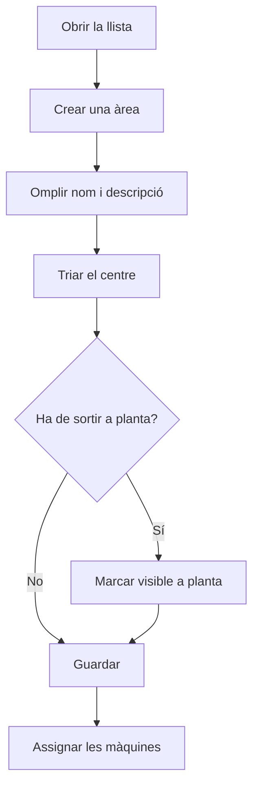

# Gestió d'àrees

## Per a que serveix aquesta pantalla

Aquí es gestionen les àrees, el tercer nivell de l'estructura de planta: empresa -> centre -> àrea -> màquina. Una àrea agrupa màquines d'un centre, per exemple una secció del taller. Cada màquina pertany a una àrea, i la pantalla d'àrees de planta que fan servir els operaris mostra les màquines agrupades per les àrees visibles a planta.

## Accions disponibles

- Crear una àrea amb el botó «+» («Crear nou») de la capçalera de la llista.
- Obrir una àrea fent clic a la fila (al mòbil, tocant-ne la targeta) per modificar-la.
- Eliminar una àrea amb la icona de la paperera («Eliminar») de la fila, després de confirmar-ho.
- Consultar a les columnes el «Nom», la «Descripció», si és «Visible a planta» i si està «Desactivat».

## Flux habitual

1. Comprova a «Gestió de centres» que el centre ja existeix.
2. Obre «Gestió d'àrees» i toca «+».
3. Omple el nom i la descripció i tria el centre.
4. Decideix si l'àrea ha de sortir a planta i desa.
5. A «Gestió de màquines», assigna les màquines a l'àrea des de la fitxa de cada màquina.

## Aspectes importants

- La llista no té filtres: mostra totes les àrees, també les desactivades, ordenades per nom.
- A la pantalla d'àrees de planta només surten les àrees amb «Visible a planta» que no estan desactivades, amb les seves màquines actives.
- Els camps de la fitxa s'expliquen a l'ajuda de la fitxa de l'àrea.
- Eliminar una àrea és definitiu i també pot esborrar les màquines que hi pertanyen. Si l'àrea o les seves màquines ja tenen dades vinculades, per exemple materials amb aquesta «Àrea de producció», l'eliminació pot fallar. Si ja no la fas servir, marca-la com a «Desactivat» o treu-la de planta en lloc d'eliminar-la.

## Errors frequents

- Si en eliminar una àrea surt un error, l'àrea ja està en ús: desactiva-la en lloc d'eliminar-la.
- Si una àrea no surt a la pantalla de planta, comprova que tingui «Visible a planta» i que no estigui «Desactivat».
- Si una màquina surt en una àrea equivocada, corregeix-ho a la fitxa de la màquina, a «Gestió de màquines».

## Proces basic

