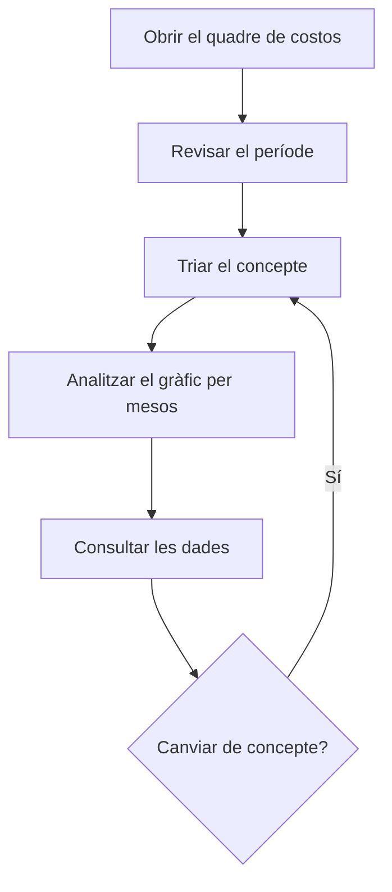

# Quadre de comandament de costos de producció

## Per a que serveix aquesta pantalla

Mostra el cost de producció de cada mes repartit per operaris, per tipus de centre de treball o per centre de treball. Les dades surten dels tiquets de producció, que recullen el temps treballat a cada fase i el cost horari de l'operari i de la màquina. Serveix per veure on s'acumula el cost de mà d'obra i de màquina i com evoluciona mes a mes.

## Accions disponibles

- Triar el «Període» al filtre. Per defecte va del primer dia del mes de fa sis mesos fins avui.
- Triar el «Concepte»: «Operaris», «Tipus de centre de treball» o «Centre de treball». Les dades es carreguen soles en canviar el període o el concepte; no cal cap botó de filtrar.
- Netejar el filtre amb el botó de netejar filtres: buida el període i el concepte.
- Veure el gràfic de barres a la pestanya «Gràfics».
- Consultar les xifres mes a mes a la pestanya «Dades».

## Flux habitual

1. Obre el quadre: el període ja ve posat, però no es mostra res fins que tries un concepte.
2. Tria el «Concepte», per exemple «Tipus de centre de treball».
3. A «Gràfics», compara l'alçada de les barres de cada mes i passa el ratolí per sobre per veure l'import de cada element i el total del mes.
4. Obre «Dades» per veure les hores i el cost exactes de cada mes.
5. Canvia a «Operaris» per veure el mateix període des del punt de vista de la mà d'obra.

## Aspectes importants

- **D'on surten les dades**: dels tiquets de producció amb data dins del període. Els tiquets es generen sols quan es finalitza una fase a la màquina de planta, o es creen a mà a «Tiquets de producció». Cada tiquet compta al mes de la seva data.
- **Operaris**: suma el temps d'operari dels tiquets i el seu cost (temps pel cost horari d'operari guardat al tiquet), agrupat per operari i mes.
- **Tipus de centre de treball** i **Centre de treball**: sumen el temps de màquina i el seu cost (temps pel cost horari de màquina guardat al tiquet), agrupats per tipus o per centre i mes. No inclouen el cost d'operari.
- El cost es calcula amb el cost horari que tenia cada tiquet quan es va crear. Canviar després els costos de l'operari o de la màquina no recalcula els tiquets antics.
- Només compten els tiquets que tenen un operari assignat. El temps que una màquina ha treballat sense cap operari fitxat no surt en aquest quadre, tampoc a «Centre de treball».
- **Gràfics**: barres apilades, una columna per mes i un color per operari, tipus o centre. Passant el ratolí per sobre surt l'import de cada element i el «Total» del mes.
- **Dades**: una fila per element i mes amb «Any», «Mes» (en número), «Temps mensual» en hores i «Cost mensual» en euros. Segons el concepte, només s'omplen les columnes «Operari», «Tipus de centre» o «Centre de treball» que li corresponen.
- La pantalla només consulta: no modifica cap tiquet.

## Errors frequents

- Si el gràfic mostra «Selecciona un interval de dates i un concepte per visualitzar les dades», tria un concepte i comprova que el període tingui data d'inici i de fi.
- Si falten els tiquets de l'últim dia del període, és perquè el dia final no s'inclou: tria com a data final el dia següent.
- Si un mes surt buit o més baix del previst, comprova que les fases s'hagin finalitzat a la màquina: fins aleshores no hi ha tiquets.
- Si una màquina no surt o surt amb menys hores de les treballades, revisa si hi havia operaris fitxats: els tiquets sense operari no es compten.
- Si surten hores però el cost és 0, el tiquet es va crear sense cost horari. Revisa els costos configurats de l'operari o de la màquina per als tiquets nous.

## Proces basic

