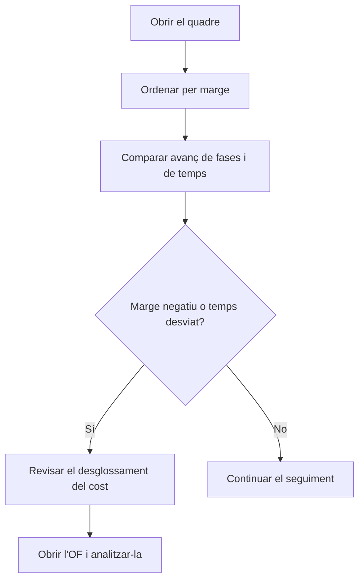

# Quadre de comandament de producció

## Per a que serveix aquesta pantalla

Fa el seguiment de les ordres de fabricació (OF) que ara mateix estan en producció: quant han avançat en fases i en temps, quant han costat fins ara i quin marge els queda respecte al preu. Serveix per detectar a temps les OF que es desvien del temps previst o que ja han consumit més cost del que es cobrarà.

## Accions disponibles

- Cercar per codi d'OF, codi de referència o descripció de la referència al camp «Cercar». La llista es filtra mentre escrius.
- Ordenar per qualsevol columna fent clic a la capçalera.
- Passar el ratolí per sobre del percentatge d'«Avanç de temps» per veure el temps real i el teòric en minuts.
- Passar el ratolí per sobre del «Cost acumulat» per veure'n el desglossament: material, màquina, operari i serveis externs.
- Obrir una OF fent clic a la seva fila.

## Flux habitual

1. Obre el quadre: surten totes les OF en estat «Producció», ordenades per codi.
2. Ordena per «Marge» per veure primer les OF amb marge negatiu (en vermell).
3. Compara «Avanç de fases» amb «Avanç de temps»: si el temps avança molt més que les fases, l'OF va més lenta del previst.
4. Passa el ratolí per sobre del «Cost acumulat» per veure quin concepte pesa més.
5. Fes clic a l'OF per revisar-ne les fases, els tiquets i el material.

## Aspectes importants

- **Quines OF surten**: només les que tenen l'estat «Producció». No hi ha filtre de dates: el quadre sempre mostra la situació actual.
- **«Quantitat»**: la quantitat planificada de l'OF.
- **«Avanç de fases»**: percentatge de fases de l'OF que estan en estat «Tancada» sobre el total de fases.
- **«Avanç de temps»**: temps real de màquina dels tiquets de producció de l'OF dividit pel temps teòric de totes les fases. El temps teòric suma els temps estimats dels passos; els passos per temps de cicle es multipliquen per la quantitat planificada. Per sobre del 100 % la barra es posa vermella.
- **«Preu de comanda»**: preu unitari de la fitxa de la referència multiplicat per la quantitat planificada. No és el preu de la línia de la comanda de venda.
- **«Cost teòric»**: cost teòric de fabricació de la fitxa de la referència multiplicat per la quantitat planificada. És informatiu: no entra al càlcul del marge.
- **«Cost acumulat»**: suma d'operari, màquina, material i serveis externs:
  - Operari i màquina: temps de cada tiquet de producció de l'OF pel cost horari guardat al mateix tiquet.
  - Material: moviments de consum de magatzem vinculats a les fases de l'OF, valorats amb el darrer cost de la referència consumida. Els retorns resten.
  - Serveis externs: cost del servei i del transport de les fases externes que ja estan en estat «Tancada».
- **«Marge»**: «Preu de comanda» menys «Cost acumulat». Vermell si és negatiu, taronja si és zero i verd si és positiu. Mentre l'OF avança el marge baixa, perquè el preu és el total i el cost només el que s'ha fet fins ara.
- Els tiquets de producció es generen sols quan es finalitza una fase a la màquina de planta, o es creen a mà a «Tiquets de producció». El temps d'una fase que encara s'està fent no compta fins que es finalitza.
- La pantalla només consulta: no modifica res.

## Errors frequents

- Si surt «Sense ordres de fabricació en producció.», cap OF té l'estat «Producció». Les OF en altres estats (per exemple, llançades o en pausa) no surten.
- Si una OF té «Avanç de temps» a 0 %, encara no té tiquets de producció: cap fase s'ha finalitzat a la màquina.
- Si el «Preu de comanda» o el «Cost teòric» surten a 0, revisa el preu unitari i el cost teòric de fabricació a la fitxa de la referència.
- Si el material del «Cost acumulat» surt a 0, no hi ha consums de magatzem vinculats a les fases de l'OF.
- Si els serveis externs no hi són, comprova que la fase externa estigui en estat «Tancada».
- Si surt «Error en carregar el quadre de comandament de producció», torna a obrir la pantalla. Si persisteix, avisa l'administrador.

## Proces basic

