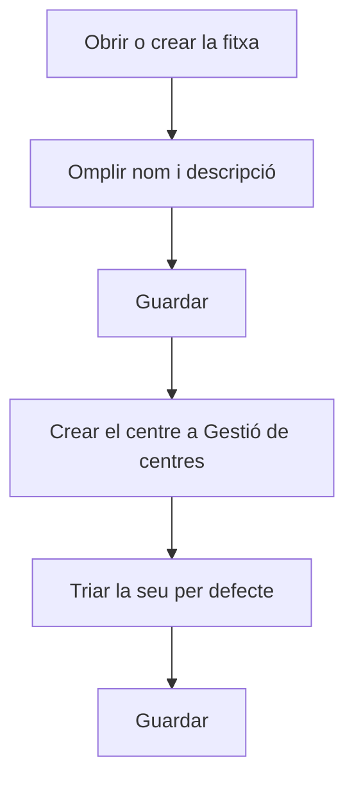

# Empresa

## Per a que serveix aquesta pantalla

És la fitxa d'una empresa: el nom, la descripció, el centre per defecte i si està activa. L'empresa és el primer nivell de l'estructura de planta (empresa -> centre -> àrea -> màquina). El «Nom» surt com a nom de l'empresa a la capçalera dels documents impresos, i la «Seu per defecte» és el centre que s'assigna a les comandes, albarans i factures de venda noves.

## Accions disponibles

- Omplir el «Nom» i la «Descripció».
- Triar el centre a «Seu per defecte».
- Marcar o desmarcar «Desactivat».
- Desar amb «Guardar», a la capçalera. Després de desar, l'aplicació torna a la pantalla anterior.
- Sortir sense desar amb el botó de tornar enrere de la capçalera.

## Flux habitual

1. Des de «Gestió d'empreses», toca «+» per crear una empresa nova o fes clic en una fila per obrir-ne una.
2. Omple el «Nom» (curt, fins a 10 caràcters) i la «Descripció».
3. Desa amb «Guardar».
4. A «Gestió de centres», crea el centre de l'empresa i tria aquesta empresa al camp «Empresa».
5. Torna a obrir l'empresa, tria el centre a «Seu per defecte» i desa.

## Aspectes importants

- «Nom» i «Descripció» són obligatoris. El nom admet com a màxim 10 caràcters, encara que el camp en deixi escriure més.
- No es pot crear una empresa amb el nom d'una altra que ja existeix.
- «Seu per defecte» només mostra els centres que pertanyen a aquesta empresa. En una empresa nova la llista surt buida fins que no li crees un centre.
- Si «Seu per defecte» queda buida, no es poden crear comandes, albarans ni factures de venda.
- Només hi pot haver una empresa activa. Si desmarques «Desactivat» mentre n'hi ha una altra d'activa, el desat falla.
- Si desactives l'única empresa activa, tampoc no es poden crear comandes, albarans ni factures de venda.
- El logotip, el color i el nom comercial es configuren a la pantalla «Branding». Desar aquesta fitxa no els modifica.
- Si s'elimina el centre triat com a «Seu per defecte», el camp queda buit i cal triar-ne un altre.
- Per eliminar una empresa, fes-ho des de la llista; consulta'n l'ajuda abans, perquè l'eliminació és definitiva.

## Errors frequents

- Si surt «El nom és obligatori» o «La descripció és obligatòria», omple el camp marcat.
- Si en desar surt un error i el nom és llarg, escurça'l a 10 caràcters o menys.
- Si en crear l'empresa surt que ja existeix, ja n'hi ha una amb aquest nom: tria'n un altre.
- Si en desar una empresa sense «Desactivat» surt un error, comprova a «Gestió d'empreses» que no n'hi hagi una altra d'activa.
- Si «Seu per defecte» no mostra cap opció, crea primer un centre d'aquesta empresa a «Gestió de centres».

## Proces basic

