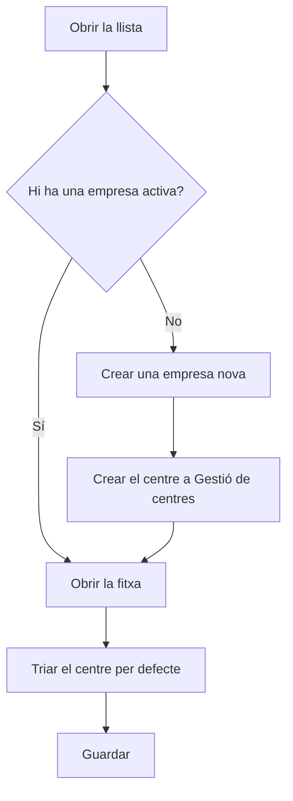

# Gestió d'empreses

## Per a que serveix aquesta pantalla

Aquí es dona d'alta l'empresa que treballa amb l'ERP. És el primer nivell de l'estructura de planta: empresa -> centre -> àrea -> màquina. L'empresa activa i el seu centre per defecte són els que l'aplicació fa servir en crear comandes, albarans i factures de venda, i el nom de l'empresa surt a la capçalera dels documents impresos. Normalment només n'hi ha una.

## Accions disponibles

- Crear una empresa amb el botó «+» («Crear nou») de la capçalera de la llista.
- Obrir una empresa fent clic a la fila (al mòbil, tocant-ne la targeta) per modificar-la.
- Eliminar una empresa amb la icona de la paperera («Eliminar») de la fila, després de confirmar-ho.
- Consultar a les columnes el «Nom», la «Descripció», el «Centre per defecte» i si està «Desactivat».

## Flux habitual

1. Obre «Gestió d'empreses» i comprova si ja hi ha una empresa activa, és a dir, sense «Desactivat».
2. Si no n'hi ha cap, toca «+», omple el nom i la descripció i desa.
3. Ves a «Gestió de centres» i crea el centre de l'empresa amb l'adreça i les dades fiscals.
4. Torna aquí, obre l'empresa i tria aquest centre a «Seu per defecte».
5. Configura el logotip i els colors de l'empresa a la pantalla «Branding».

## Aspectes importants

- Només hi pot haver una empresa activa alhora. Per activar-ne una altra, primer cal marcar l'actual com a «Desactivat».
- Si no hi ha cap empresa activa, o l'empresa activa no té centre per defecte, no es poden crear comandes, albarans ni factures de venda.
- La llista no té filtres: mostra totes les empreses, també les desactivades, ordenades per nom.
- El detall de cada camp s'explica a l'ajuda de la fitxa de l'empresa.
- Eliminar una empresa és definitiu i també esborra els seus logotips de «Branding». No es pot eliminar una empresa que tingui centres. Si ja no la fas servir, marca-la com a «Desactivat» en lloc d'eliminar-la.

## Errors frequents

- Si surt «No s'ha pogut eliminar l'empresa ...», l'empresa té centres: desactiva-la en lloc d'eliminar-la.
- Si en crear una comanda, un albarà o una factura de venda surt que la seu no existeix, comprova aquí que hi hagi exactament una empresa activa i que tingui «Centre per defecte».
- Si la columna «Centre per defecte» surt buida, obre l'empresa i tria el centre a «Seu per defecte».

## Proces basic

