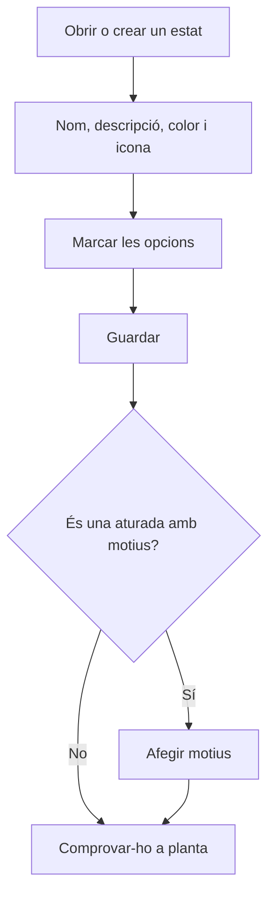

# Estat de màquina

## Per a que serveix aquesta pantalla

És la fitxa d'un estat de màquina. Aquí es decideix com es veu l'estat a planta (nom, color i icona), com es comporta (si és una aturada, si hi poden entrar operaris, si tanca la màquina) i quins motius pot triar l'operari quan hi posa la màquina.

## Accions disponibles

- Omplir el «Nom», la «Descripció», el «Color» i la «Icona» («Selecciona una icona»).
- Marcar les opcions «Aturada», «Operaris», «Tancada», «Preferida», «Permet OF» i «Desactivat».
- Desar amb «Guardar», a la capçalera. En desar, tornes a la llista.
- A la taula «Motius», afegir un motiu amb «Afegir motiu», editar-lo amb la icona del llapis o eliminar-lo amb la paperera. La taula només surt quan l'estat ja està desat.

## Flux habitual

1. Des de «Estats de màquina», toca «+» o obre un estat.
2. Omple el nom, la descripció i el color, i tria una icona.
3. Marca les opcions segons com s'ha de comportar a planta.
4. Toca «Guardar».
5. Si és una aturada, torna a obrir l'estat i afegeix els motius amb «Afegir motiu».
6. Obre una màquina a planta i comprova que l'estat surt com esperaves.

## Aspectes importants

- El «Nom», la «Descripció» i el «Color» són obligatoris. El color pinta els botons d'estat i la placa de la màquina a planta; la icona surt a les targetes d'«Altres estats».
- «Aturada»: l'estat compta com una aturada. Si té motius, quan l'operari el tria a «Altres estats» ha d'escollir també un motiu, que després surt a la placa de la màquina com a «Motiu: ...». En finalitzar una fase sense carregar-ne una altra, la màquina passa a un estat marcat com a «Aturada».
- «Operaris»: només mentre la màquina és en un estat amb aquesta opció l'operari pot entrar o sortir de la màquina. Un estat nou la porta marcada.
- «Tancada»: és l'estat del botó per aturar la màquina a la barra d'estats de planta. Si hi ha una fase carregada, aquest botó obre primer la finalització de la fase.
- «Preferida»: l'estat surt primer a la llista d'«Altres estats».
- «Desactivat»: l'estat deixa de sortir a planta i al desplegable d'estats de les plantilles de fase.
- Els motius es desen en acceptar el seu diàleg, sense tocar «Guardar» de l'estat. Cada motiu necessita un «Codi» únic dins de l'estat (màxim 20 caràcters), un «Nom» (màxim 100) i un «Color»; la «Descripció» i la «Icona» són opcionals.
- Eliminar un motiu és immediat i definitiu: no demana confirmació.
- Els canvis es veuen a planta el pròxim cop que s'obre la pantalla de la màquina.

## Errors frequents

- Si no pots desar, revisa els avisos «El nom és obligatori», «La descripció és obligatòria» i «El color és obligatori».
- Si en crear surt «L'entitat ja existeix», ja hi ha un estat amb aquest nom.
- Si en desar un estat amb un nom llarg surt un error, escurça'l: el nom s'ha de mantenir en 50 caràcters o menys.
- Si surt «Ja existeix un motiu amb aquest codi per aquest estat de màquina», tria un altre codi per al motiu.
- Si a planta no es demana cap motiu en triar l'estat, comprova que estigui marcat com a «Aturada» i que tingui motius.
- Si l'operari no pot entrar a la màquina, l'estat actual no té marcada l'opció «Operaris».

## Proces basic

