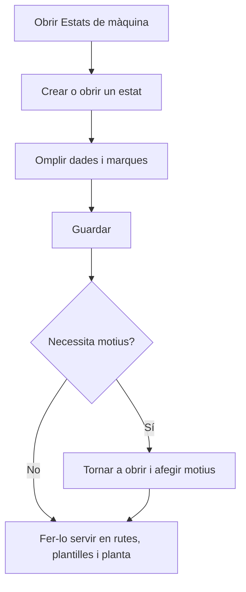

# Gestió d'estats de màquina

## Per a que serveix aquesta pantalla

Aquí es defineixen els estats en què pot estar una màquina a planta, com ara preparació, producció, pausa o aturada. Cada pas d'una ruta de fabricació, cada activitat d'una fase d'ordre de fabricació i cada detall d'una plantilla de fase indica un estat de màquina. A planta, aquests estats són els botons amb què l'operari canvia l'estat de la màquina. També es fan servir a «Costos per màquina».

## Accions disponibles

- Crear un estat nou amb el botó «+» («Crear nou») de la capçalera de la taula.
- Obrir un estat fent clic a la fila per modificar-ne les dades i els motius.
- Eliminar un estat amb la icona de la paperera de la fila, després de confirmar-ho.
- Revisar d'un cop d'ull el «Color», la «Icona» i les marques «Aturada», «Operaris», «Tancada», «Preferit», «Permet OF» i «Desactivat» de cada estat.

## Flux habitual

1. Obre «Estats de màquina». La llista surt ordenada per nom.
2. Toca «+» per crear un estat, o fes clic a una fila per modificar-lo.
3. Omple el nom, la descripció i el color, i marca les opcions que calguin.
4. Toca «Guardar». Tornes a la llista.
5. Si l'estat necessita motius, per exemple una aturada, torna a obrir-lo i afegeix-los a «Motius».

## Aspectes importants

- La llista mostra tots els estats, també els desactivats. No té filtres.
- Els estats desactivats no surten a planta ni al desplegable d'estats de les plantilles de fase.
- A planta, els estats es tornen a llegir cada vegada que s'obre la pantalla d'una màquina.
- L'estat marcat com a «Tancada» és el botó per aturar la màquina a la barra d'estats de planta. Marca'n només un.
- En finalitzar una fase a planta sense carregar-ne una altra, la màquina passa a l'estat marcat com a «Aturada».
- A les àrees de planta, les màquines en un estat «Aturada» o «Tancada» compten com a «Aturades».
- L'eliminació és definitiva i pot esborrar també dades que en depenen: els motius de l'estat, els detalls de plantilles de fase, els pasos de rutes de fabricació, els costos per màquina i l'historial de torns que el fan servir. Si l'estat ja s'ha fet servir, marca'l «Desactivat» en lloc d'eliminar-lo.
- El significat de cada marca s'explica a l'ajuda de «Estat de màquina».

## Errors frequents

- Si en crear un estat surt «L'entitat ja existeix», ja hi ha un estat amb aquest nom.
- Si no es pot eliminar un estat, marca'l «Desactivat»: deixarà de sortir a planta.
- Si a planta falta el botó per aturar la màquina o surt «No s'ha trobat l'estat de màquina tancada», marca un estat actiu com a «Tancada».

## Proces basic

