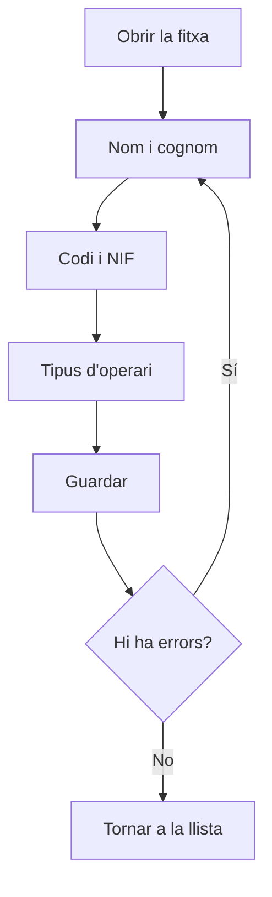

# Operari

## Per a que serveix aquesta pantalla

És la fitxa d'un operari. Aquí es dona d'alta un operari nou («Alta d'operari») o es modifiquen les dades d'un d'existent («Operari: nom»). Les dades que més importen són el codi, que l'operari escriu per fitxar a la planta, i el tipus d'operari, que fixa el cost/hora que s'imputa quan treballa a una màquina.

## Accions disponibles

- Omplir o modificar «Nom», «Cognom», «Codi» i «NIF».
- Triar el «Tipus d'operari».
- Marcar o desmarcar «Desactivat».
- Desar amb «Guardar», a la capçalera de la pantalla.
- Tornar a la llista amb el botó de tornar enrere, sense desar.

## Flux habitual

1. Des de «Gestió d'operaris», toca «Nou» o obre un operari.
2. Escriu el nom i el cognom.
3. Assigna-li un codi curt que no tingui cap altre operari.
4. Escriu el NIF.
5. Tria el tipus d'operari.
6. Toca «Guardar». Surt «Operari creat correctament» o «Operari actualitzat correctament» i tornes a la llista.

## Aspectes importants

- Tots els camps de text i el tipus d'operari són obligatoris. El codi admet com a màxim 10 caràcters, el NIF 20 i el nom i el cognom 250.
- El codi és el que l'operari escriu a «Codi d'operari» a la pantalla «Fitxatge Operador». Ha de coincidir exactament, majúscules i minúscules incloses.
- El sistema comprova que el codi no es repeteixi quan crees un operari, però no quan en modifiques un. No canviïs el codi d'un operari per un que ja fa servir un altre.
- El tipus d'operari dona el cost/hora de l'operari. Quan l'operari fitxa a una màquina, es guarda el cost/hora que té el seu tipus en aquell moment. Canviar-li el tipus després no modifica els costos ja registrats; només afecta els fitxatges nous.
- El selector «Tipus d'operari» també mostra els tipus desactivats: tria'n un d'actiu.
- Si l'operari ja té activitat registrada, no es pot eliminar: marca «Desactivat» per donar-lo de baixa i conservar-ne l'històric.

## Errors frequents

- Si «Guardar» no desa, revisa els missatges sota els camps: falta un camp obligatori o se supera la llargada màxima, per exemple «El codi no pot superar els 10 caràcters».
- Si surt «Operari ... existent», el codi ja està assignat a un altre operari: canvia'l.
- Si el selector «Tipus d'operari» surt buit, crea primer els tipus a «Gestió de tipus d'operari».

## Proces basic

