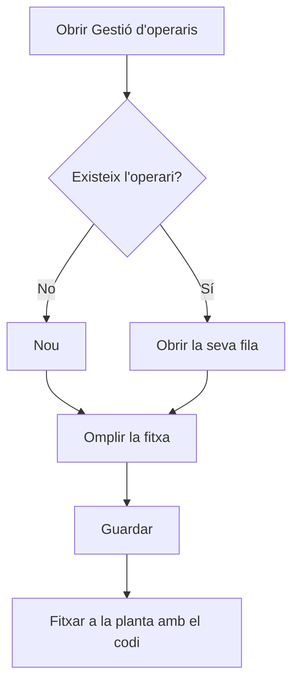

# Gestió d'operaris

## Per a que serveix aquesta pantalla

Llista tots els operaris amb el codi, el nom complet, el NIF, el tipus d'operari i si estan desactivats. Des d'aquí es donen d'alta operaris nous, s'obre la fitxa d'un operari per modificar-lo i s'eliminen els que s'han creat per error. El codi de l'operari és el que escriu per fitxar a la planta, a la pantalla «Fitxatge Operador», i el seu tipus d'operari fixa el cost/hora que s'imputa quan treballa a una màquina.

## Accions disponibles

- Crear un operari amb el botó «Nou»: s'obre la fitxa «Alta d'operari».
- Obrir la fitxa d'un operari fent clic a la seva fila, per modificar-ne les dades.
- Eliminar un operari amb la icona de la paperera de la seva fila, després de confirmar-ho.
- Consultar a la columna «Tipus» el tipus d'operari assignat i a «Desactivat» si està desactivat.

## Flux habitual

1. Comprova a «Gestió de tipus d'operari» que ja existeix el tipus que tindrà l'operari.
2. Toca «Nou».
3. Omple el nom, el cognom, el codi, el NIF i el tipus d'operari.
4. Desa amb «Guardar»: tornes a la llista i l'operari ja hi apareix.
5. Comunica el codi a l'operari perquè pugui fitxar a la planta.

## Aspectes importants

- La llista està ordenada pel nom de l'operari i no té filtres.
- El codi identifica l'operari quan fitxa a la planta: l'ha d'escriure exactament igual, respectant majúscules i minúscules.
- En crear un operari, el sistema no deixa repetir un codi que ja existeix.
- L'eliminació és definitiva. Només es pot eliminar un operari que encara no té activitat registrada, com ara fitxatges a màquines o peces declarades. Si ja en té, obre la seva fitxa i marca «Desactivat» per conservar-ne l'històric.
- Els camps de la fitxa i les seves regles s'expliquen a l'ajuda de la pantalla «Operari».

## Errors frequents

- Si en desar un operari nou surt el missatge «Operari ... existent», el codi ja el fa servir un altre operari: tria'n un altre.
- Si en eliminar surt «Conflicte amb l'estat actual del recurs», l'operari ja té activitat registrada i no es pot esborrar: desactiva'l.
- Si un operari no pot entrar a la planta, comprova a la columna «Codi» que el codi és exactament el que escriu.

## Proces basic

