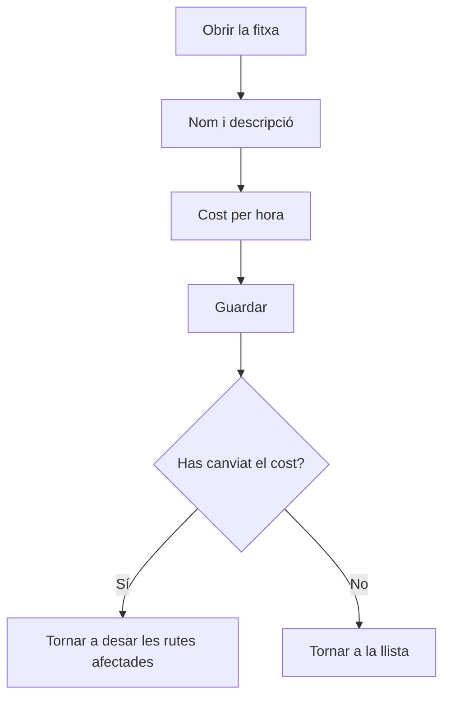

# Tipus d'operari

## Per a que serveix aquesta pantalla

És la fitxa d'un tipus d'operari. Aquí es dona d'alta un tipus nou («Alta de tipus d'operari») o es modifica un d'existent («Tipus d'operari: nom»). La dada clau és el «Cost/hora», que el sistema aplica al temps de treball dels operaris d'aquest tipus per calcular el cost de mà d'obra de les rutes i de les ordres de fabricació.

## Accions disponibles

- Omplir o modificar «Nom» i «Descripció».
- Indicar el «Cost/hora» en euros.
- Marcar o desmarcar «Desactivat».
- Desar amb «Guardar», a la capçalera de la pantalla.
- Tornar a la llista amb el botó de tornar enrere, sense desar.

## Flux habitual

1. Des de «Gestió de tipus d'operari», toca «Nou» o obre un tipus.
2. Escriu un nom curt i una descripció.
3. Indica el cost/hora.
4. Toca «Guardar». Surt «Tipus d'operari creat correctament» o «Tipus d'operari actualitzat correctament» i tornes a la llista.
5. Si has canviat el cost, torna a desar les rutes de fabricació que el fan servir perquè se'n recalculi el cost estimat.

## Aspectes importants

- «Nom», «Descripció» i «Cost/hora» són obligatoris. El nom i la descripció admeten com a màxim 250 caràcters, i el cost no pot ser negatiu.
- El nom ha de ser únic: el sistema ho comprova en crear el tipus.
- Cost estimat: a cada fase d'una ruta de fabricació es tria un tipus d'operari. El cost d'operari de la ruta és el temps d'operari de la fase multiplicat pel cost/hora del tipus, i es recalcula cada vegada que es desa la ruta.
- Cost real: quan un operari fitxa a una màquina, es guarda el cost/hora del seu tipus en aquell moment. Amb aquest valor es calculen el «Cost operari» de l'«Històric» i el cost d'operari de les ordres de fabricació.
- Canviar el cost/hora no modifica els fitxatges ja fets: només afecta els fitxatges nous i les rutes quan es tornen a desar.
- Un tipus desactivat deixa de sortir al selector «Tipus d'operari» de les fases de rutes i d'ordres de fabricació.

## Errors frequents

- Si surt «Tipus d'operari ... existent», ja hi ha un tipus amb aquest nom: canvia'l.
- Si surt «El cost és obligatori» o «El cost no pot ser negatiu», escriu un cost igual o superior a zero.
- Si el cost d'operari d'una ruta surt a zero, comprova que les seves fases tenen un tipus d'operari triat i que aquest tipus té cost/hora.

## Proces basic

