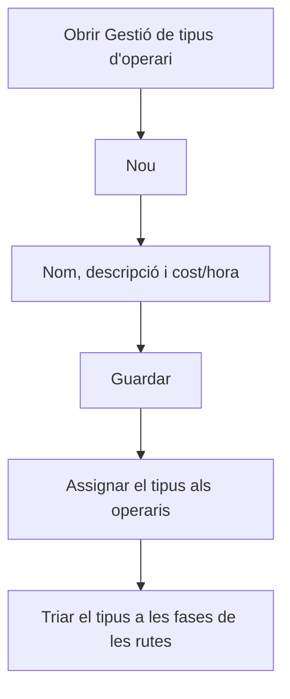

# Gestió de tipus d'operari

## Per a que serveix aquesta pantalla

Llista els tipus d'operari. Cada tipus té un cost/hora que el sistema fa servir per calcular el cost de mà d'obra: el cost estimat de les rutes de fabricació, segons el tipus d'operari de cada fase, i el cost real quan els operaris fitxen a les màquines. Cada operari té un tipus assignat a «Gestió d'operaris».

## Accions disponibles

- Crear un tipus d'operari amb el botó «Nou»: s'obre la fitxa «Alta de tipus d'operari».
- Obrir la fitxa d'un tipus fent clic a la seva fila, per canviar-ne el nom, la descripció o el cost/hora.
- Eliminar un tipus amb la icona de la paperera de la seva fila, després de confirmar-ho.
- Consultar a la columna «Desactivat» quins tipus estan desactivats.

## Flux habitual

1. Toca «Nou».
2. Omple el nom, la descripció i el cost/hora.
3. Desa amb «Guardar».
4. Assigna el tipus als operaris a «Gestió d'operaris».
5. Tria'l a les fases de les rutes de fabricació perquè el cost estimat inclogui la mà d'obra.

## Aspectes importants

- La llista està ordenada per la descripció i no té filtres.
- En eliminar un tipus d'operari, també s'eliminen els operaris que el tenen assignat. Revisa'ls abans a «Gestió d'operaris».
- No es pot eliminar un tipus que es fa servir a les fases de rutes o d'ordres de fabricació, ni si algun dels seus operaris ja té activitat registrada. En aquests casos, marca'l com a «Desactivat».
- Un tipus desactivat deixa de sortir al selector «Tipus d'operari» de les fases de rutes i d'ordres de fabricació.
- Els camps de la fitxa i com s'aplica el cost/hora s'expliquen a l'ajuda de la pantalla «Tipus d'operari».

## Errors frequents

- Si en desar un tipus nou surt «Tipus d'operari ... existent», ja hi ha un tipus amb aquest nom.
- Si en eliminar surt «Conflicte amb l'estat actual del recurs», el tipus es fa servir en alguna fase o algun dels seus operaris ja té activitat: desactiva'l en lloc d'eliminar-lo.

## Proces basic

