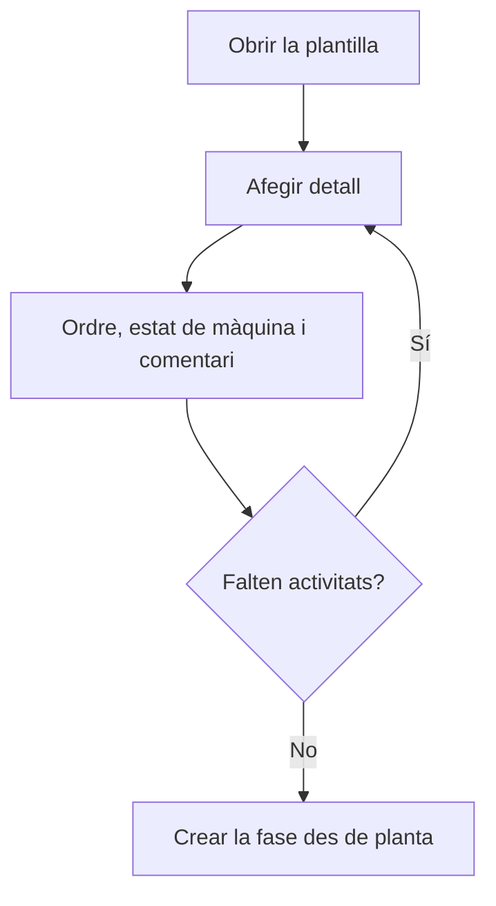

# Plantilla de fase

## Per a que serveix aquesta pantalla

És la fitxa d'una plantilla de fase. A dalt hi ha el nom i la descripció; a sota, la taula «Detalls de la plantilla» amb les activitats. Cada detall és un estat de màquina amb un ordre i un comentari. Quan a planta es crea una fase des d'aquesta plantilla, cada detall es converteix en una activitat de la fase, és a dir, en un botó d'estat de la màquina.

## Accions disponibles

- Modificar el «Nom», la «Descripció» i «Desactivada», i desar-ho amb «Guardar», a la capçalera.
- Afegir un detall amb el botó «+» («Afegir detall») de «Detalls de la plantilla». S'obre el diàleg «Crear detall» amb «Ordre», «Estat de màquina» i «Comentari».
- Editar un detall fent clic a la fila (diàleg «Editar detall»).
- Eliminar un detall amb la creu de la fila, després de confirmar-ho.

## Flux habitual

1. Des de «Plantilles de fase», crea una plantilla o obre'n una.
2. Toca «+» a «Detalls de la plantilla».
3. Revisa l'ordre proposat, tria l'«Estat de màquina» i, si cal, escriu un comentari per a l'operari.
4. Toca «Guardar» al diàleg i repeteix-ho per a cada activitat.
5. Comprova a la taula que les activitats surten en l'ordre correcte.
6. Si has canviat el nom, la descripció o «Desactivada», toca «Guardar» a la capçalera.

## Aspectes importants

- Els detalls es desen en acceptar el seu diàleg. El «Guardar» de la capçalera només desa el nom, la descripció i «Desactivada», i et deixa a la mateixa pantalla.
- L'ordre d'un detall nou es proposa en múltiples de 10 segons els detalls que ja hi ha (10, 20, 30...). Ha de ser positiu. La taula i els botons d'activitat de planta segueixen aquest ordre.
- El desplegable «Estat de màquina» només mostra els estats actius, i els mostra per la seva descripció; la taula mostra el nom de l'estat.
- «Desactivada» amaga la plantilla del diàleg de planta.
- Per crear la fase a planta cal triar la plantilla, escriure el «Codi de la fase» (només números) i la «Descripció de la fase», revisar el «Centre de treball» i tocar «Crear fase».
- La fase creada copia les activitats amb l'ordre i el comentari, però sense temps estimats. Els canvis posteriors a la plantilla no afecten les fases ja creades.
- Una plantilla sense detalls crea una fase sense activitats.

## Errors frequents

- Si el diàleg no es desa, revisa «L'ordre és obligatori», «L'ordre ha de ser positiu» i «L'estat de màquina és obligatori».
- Si en desar la capçalera surt «El nom és obligatori», omple el «Nom».
- Si un detall surt a la taula sense estat de màquina, l'estat que tenia està desactivat: edita el detall i tria un estat actiu.
- Si no trobes un estat al desplegable, comprova a «Estats de màquina» que no estigui desactivat.
- Si a planta surt «El codi de la fase ha de ser numèric», escriu el codi només amb xifres.

## Proces basic

