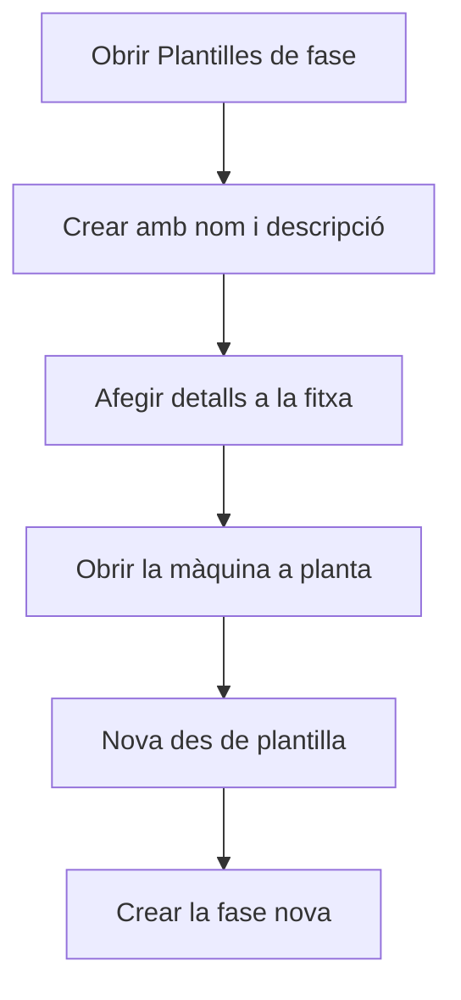

# Plantilles de fase

## Per a que serveix aquesta pantalla

Una plantilla de fase és una llista ordenada d'activitats, cadascuna amb un estat de màquina i un comentari. Serveix per crear una fase nova d'una ordre de fabricació directament a planta, des del diàleg «Carregar una fase», pestanya «Nova des de plantilla», sense haver de definir les activitats a mà. Aquesta pantalla llista les plantilles i permet crear-ne, obrir-ne i eliminar-ne.

## Accions disponibles

- Crear una plantilla amb el botó «+» («Crear nou»): s'obre el diàleg «Crear plantilla de fase» amb el «Nom» i la «Descripció».
- Obrir una plantilla fent clic a la fila per editar-la i afegir-hi detalls.
- Eliminar una plantilla amb la icona de la paperera de la fila, després de confirmar-ho.

## Flux habitual

1. Obre «Plantilles de fase». La llista surt ordenada per nom.
2. Toca «+», escriu el nom i, si cal, la descripció.
3. Toca «Guardar». S'obre directament la fitxa de la plantilla nova.
4. A la fitxa, afegeix els detalls: l'ordre, l'estat de màquina i el comentari de cada activitat.
5. A planta, obre la màquina, obre el diàleg de càrrega, ves a «Nova des de plantilla», tria la plantilla i crea la fase.

## Aspectes importants

- La llista mostra totes les plantilles, també les desactivades. No té filtres.
- A planta només surten les plantilles que no estan desactivades.
- Una plantilla nova no té detalls: afegeix-los a la fitxa abans de fer-la servir, o la fase que se'n creï no tindrà activitats.
- L'eliminació és definitiva i esborra també els detalls de la plantilla.
- Les fases ja creades des d'una plantilla no canvien si després es modifica o s'elimina la plantilla: en crear la fase, se'n copien les activitats.

## Errors frequents

- Si en crear surt «El nom és obligatori», omple el «Nom» abans de desar.
- Si una plantilla no surt a planta, comprova que no estigui marcada com a «Desactivada».
- Si a planta surt «No s'han trobat plantilles de fase actives», no hi ha cap plantilla o totes estan desactivades.

## Proces basic

