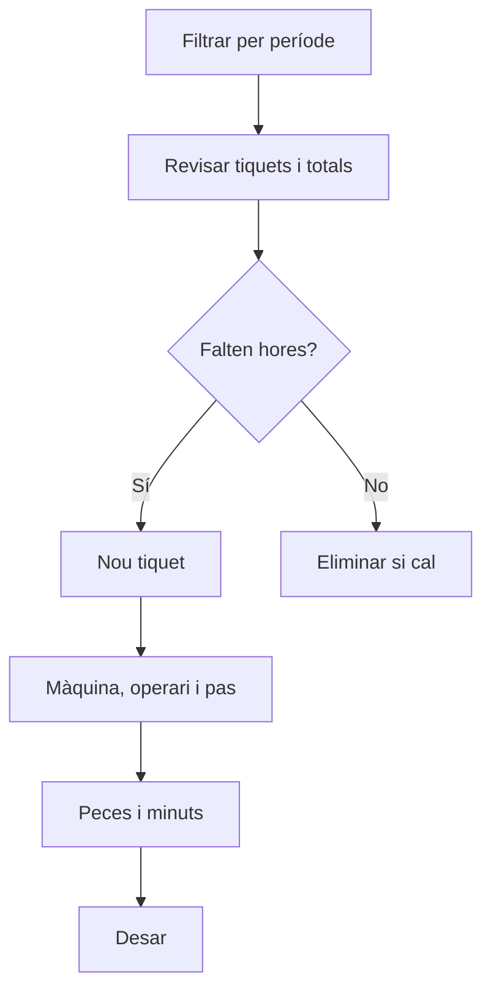

# Tiquets de producció

## Per a que serveix aquesta pantalla

Recull tots els tiquets de producció: cada tiquet declara, per a una màquina, un operari i un pas d'una fase d'una ordre de fabricació (OF), les peces fetes i els minuts de màquina i d'operari. Serveix per revisar i corregir les hores imputades i el seu cost en un període. Els tiquets alimenten les hores, les quantitats i els costos de cada OF.

## Accions disponibles

- Filtrar amb «Filtres» per «Període», «Màquina», «Operari» i «OF», i aplicar amb «Filtrar».
- Buidar els filtres amb «Netejar».
- Crear un tiquet manual amb «Nou», que obre «Crear tiquet de producció».
- Eliminar un tiquet amb la creu de la fila, després de confirmar-ho.
- Consultar a peu de taula els totals de «Quantitat», «Temps màquina», «Temps operari», «Cost operari» i «Cost màquina».

## Flux habitual

1. Revisa el «Període»: per defecte és l'exercici de l'any en curs.
2. Filtra per «Màquina», «Operari» o «OF» si cal, i prem «Filtrar».
3. Revisa els tiquets i els totals del peu de taula.
4. Per imputar hores que no s'han declarat a planta, prem «Nou».
5. Tria la «Màquina», l'«Operari» i la «Data Tíquet»; després, a «Ordre Fabricació | Fase | Activitat», tria l'OF, la fase i el pas.
6. Informa la «Quantitat», el «Temps centre de treball (minuts)» i el «Temps operari (minuts)», i desa.

## Aspectes importants

- El «Període» és obligatori i filtra per la data del tiquet. La llista d'OF del filtre inclou les OF amb data prevista dins del mateix període.
- Els filtres es guarden per usuari quan surts de la pantalla.
- La columna «OF» mostra el codi de l'OF, la fase i l'estat de màquina del pas.
- Al diàleg de creació, la llista «Ordre Fabricació | Fase | Activitat» depèn de la màquina triada: només surten les fases del seu tipus de màquina. Si canvies la màquina, la selecció es buida.
- En desar, el sistema posa el cost per hora: el de l'operari surt del seu tipus d'operari i el de la màquina, de «Costos per màquina» per a l'estat de màquina del pas.
- Cost operari = temps d'operari × cost per hora / 60; cost màquina = temps de màquina × cost per hora / 60. El total de «Cost màquina» també mostra la suma dels dos costos.
- Cada tiquet suma a l'OF les seves peces («Quantitat total»), els temps i els costos d'operari i de màquina. Eliminar-lo els descompta.
- Els tiquets no canvien les peces bones i dolentes de les fases ni generen moviments d'estoc.
- En finalitzar una fase a la màquina de planta, es generen tiquets automàticament a partir del temps registrat. Si la fase es torna a finalitzar, aquests tiquets automàtics es tornen a calcular; els manuals es mantenen.
- L'eliminació d'un tiquet és definitiva.

## Errors frequents

- Si surt «Filtre invàlid», selecciona un període complet.
- Si no pots desar, revisa «Escull una màquina», «Escull un operari» i «Escull una ordre de fabricació».
- Si la llista d'OF, fase i activitat és buida, comprova que hagis triat la màquina i que hi hagi OF amb fases d'aquest tipus de màquina.
- Si surt «Has d'introduir una quantitat entera (pot ser 0)» o «Has d'introduir el temps i ha de ser major que 0», escriu les peces i els minuts sense decimals.
- Si el cost de màquina surt a 0, comprova a «Costos per màquina» que la màquina tingui cost per a l'estat de màquina del pas.
- Si un tiquet no apareix, revisa que la seva data estigui dins del «Període» filtrat.

## Proces basic

