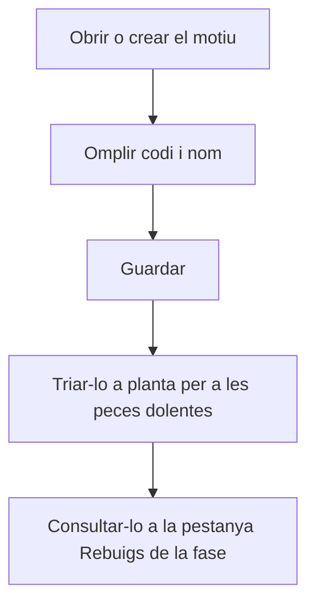

# Motiu de rebuig

## Per a que serveix aquesta pantalla

És la fitxa d'un motiu de rebuig: el codi i el nom amb què l'operari identifica per què una peça ha sortit dolenta. A planta, el motiu es tria a la secció «Motius de rebuig» de «Declarar peces» i de «Finalitzar fase». Els rebuigs registrats es consulten després a la fase de l'ordre de fabricació, a la pestanya «Rebuigs».

## Accions disponibles

- Omplir el «Codi», el «Nom», la «Descripció» i el «Color».
- Marcar o desmarcar «Desactivat» per retirar el motiu de planta sense perdre'n l'historial.
- Desar amb «Guardar», a la capçalera. En desar, tornes a la llista.

## Flux habitual

1. Des de «Motius de rebuig», toca «+» o obre un motiu existent.
2. Escriu un codi curt i únic, per exemple una abreviatura.
3. Escriu el nom que ha de veure l'operari a planta.
4. Si cal, afegeix una descripció que expliqui quan s'ha de fer servir.
5. Toca «Guardar».

## Aspectes importants

- El «Codi» és obligatori, té un màxim de 20 caràcters i no es pot repetir, tampoc amb un motiu desactivat.
- El «Nom» és obligatori, té un màxim de 100 caràcters i és el text que surt al desplegable de planta.
- La «Descripció» i el «Color» són opcionals.
- Un motiu «Desactivat» deixa de sortir a planta, però els rebuigs ja registrats amb aquest motiu es mantenen.
- A planta, cada motiu només es pot fer servir una vegada en una mateixa declaració, i les unitats repartides entre els motius han de sumar exactament les peces dolentes declarades. També es pot declarar sense assignar cap motiu.
- A planta, la llista de motius es carrega una sola vegada: després de crear o desactivar un motiu, cal recarregar la pàgina de planta.

## Errors frequents

- Si surt «Ja existeix un motiu de rebuig amb el codi ...», tria un altre codi; revisa també els motius desactivats de la llista.
- Si surt «El codi és obligatori» o «El codi no pot superar els 20 caràcters», revisa el camp «Codi».
- Si surt «El nom és obligatori» o «El nom no pot superar els 100 caràcters», revisa el camp «Nom».
- Si a planta surt «El motiu de rebuig ... està desactivat», la pàgina de planta tenia la llista antiga: recarrega-la i tria un motiu actiu.

## Proces basic

