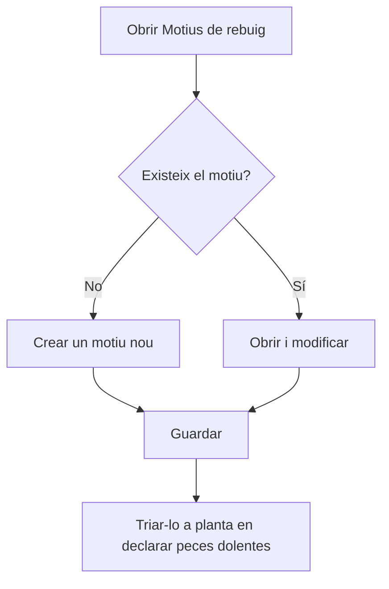

# Motius de rebuig

## Per a que serveix aquesta pantalla

Aquí es manté el catàleg de motius de rebuig: les causes per les quals una peça surt dolenta. A planta, quan l'operari declara peces dolentes amb «Declarar peces» o en finalitzar la fase, les reparteix entre els motius d'aquest catàleg. Així, cada fase de l'ordre de fabricació guarda quantes peces s'han rebutjat i per quin motiu.

## Accions disponibles

- Crear un motiu nou amb el botó «+» («Crear nou») de la capçalera de la taula.
- Obrir un motiu fent clic a la fila per modificar-lo.
- Eliminar un motiu amb la icona de la paperera de la fila, després de confirmar-ho.
- Revisar a la llista el «Codi», el «Nom», la «Descripció» i si el motiu està «Desactivat».

## Flux habitual

1. Obre «Motius de rebuig». La llista surt ordenada per codi.
2. Comprova que el motiu que vols no existeixi ja.
3. Toca «+» per crear-ne un de nou, o fes clic a una fila per modificar-la.
4. Omple el codi i el nom a la fitxa i toca «Guardar». Tornes a la llista.
5. Quan un motiu deixi de fer-se servir, obre'l i marca «Desactivat» en lloc d'eliminar-lo.

## Aspectes importants

- La llista mostra tots els motius, també els desactivats. No té filtres.
- A planta només es poden triar els motius que no estan desactivats.
- L'eliminació és definitiva. Un motiu que ja té peces rebutjades registrades no es pot eliminar: desactiva'l.
- Desactivar un motiu no canvia els rebuigs ja registrats; només evita que es triï en declaracions noves.
- A planta, la llista de motius es carrega una sola vegada. Després de crear o desactivar un motiu, recarrega la pàgina de planta perquè l'operari vegi el canvi.
- Els camps de la fitxa i les seves regles s'expliquen a l'ajuda de «Motiu de rebuig».

## Errors frequents

- Si en eliminar surt «El motiu de rebuig ... no es pot eliminar perquè té unitats rebutjades associades», el motiu ja s'ha fet servir a planta: marca'l «Desactivat».
- Si un motiu no apareix a planta en declarar peces dolentes, comprova que no estigui «Desactivat» i recarrega la pàgina de planta.

## Proces basic

