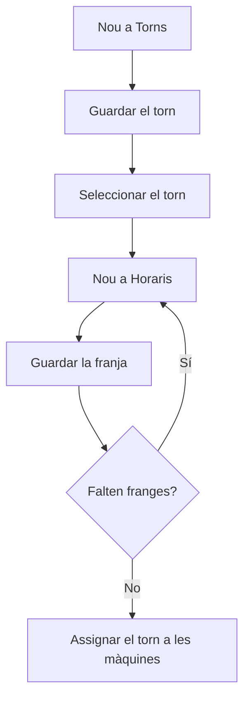

# Gestió de torns

## Per a que serveix aquesta pantalla

Defineix els torns de treball i les franges horàries de cada torn. A l'esquerra hi ha la taula «Torns» i a la dreta la taula «Horaris», amb les franges del torn seleccionat. Cada màquina té un torn assignat al camp «Torn» de «Gestió de màquines», i la planta mostra a la capçalera el torn actual amb la seva franja horària.

## Accions disponibles

- Crear un torn amb el botó «Nou» de la taula «Torns»: s'obre el diàleg «Alta de torns» amb «Nom» i «Deshabilitat».
- Seleccionar un torn fent clic a la seva fila per veure'n les franges a la taula «Horaris».
- Afegir una franja al torn seleccionat amb el botó «Nou» de la taula «Horaris»: s'obre el diàleg «Configuració de torns» amb «Hora d'inici», «Hora de finalització» i «Temps productiu».
- Desar cada diàleg amb «Guardar» o tancar-lo amb «Cancel·lar».

## Flux habitual

1. Toca «Nou» a la taula «Torns», escriu el nom del torn i toca «Guardar».
2. Fes clic a la fila del torn nou per seleccionar-lo.
3. Toca «Nou» a la taula «Horaris».
4. Tria l'hora d'inici i l'hora de finalització, marca o desmarca «Temps productiu» i toca «Guardar».
5. Repeteix el pas anterior per a cada franja del torn.
6. Assigna el torn a les màquines a «Gestió de màquines», al camp «Torn».

## Aspectes importants

- El botó «Nou» de la taula «Horaris» només apareix quan hi ha un torn seleccionat.
- Des d'aquesta pantalla només es poden crear torns i franges: no es poden modificar ni eliminar. Revisa bé les dades abans de desar.
- Una franja nova proposa de 00:00 a 23:59 amb «Temps productiu» marcat: ajusta-la abans de desar. Les hores es desen en hores i minuts.
- El sistema no comprova que les franges d'un torn no se solapin ni que l'hora de finalització sigui posterior a la d'inici.
- Les franges es mostren ordenades per l'hora d'inici.
- No pot haver-hi dos torns amb el mateix nom.
- Cada màquina ha de tenir un torn: a la fitxa de la màquina, el camp «Torn» és obligatori.

## Errors frequents

- Si en crear un torn surt «L'entitat ja existeix», ja hi ha un torn amb aquest nom: canvia'l.
- Si no veus el botó «Nou» a la taula «Horaris», selecciona primer un torn a la taula «Torns».
- Si la franja que acabes de crear no surt a la taula «Horaris», torna a fer clic al torn per actualitzar-ne les franges.
- Si una franja s'ha desat amb una hora equivocada, no es pot corregir des d'aquesta pantalla: tingues-ho en compte abans de desar.

## Proces basic

