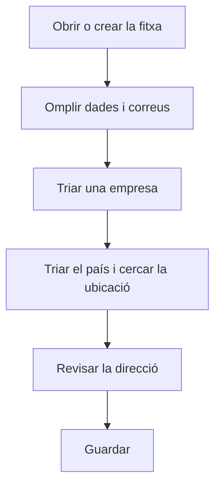

# Centre

## Per a que serveix aquesta pantalla

És la fitxa d'un centre: a quina empresa pertany, les dades fiscals i de contacte i l'adreça. El centre és el segon nivell de l'estructura de planta (empresa -> centre -> àrea -> màquina). Quan és el centre per defecte de l'empresa activa, les seves dades són les que fan servir les comandes, albarans i factures de venda, i surten a la capçalera dels documents impresos.

## Accions disponibles

- Omplir el «Nom», la «Descripció», el «CIF» i el «Telèfon».
- Omplir l'«Email general», l'«Email compres» i l'«Email ventes».
- Triar l'«Empresa» a la qual pertany el centre.
- Marcar o desmarcar «Desactivat».
- Triar el «País» i buscar l'adreça a «Cerca ubicació» per omplir-la automàticament.
- Escriure o corregir a mà la «Direcció», la «Ciutat», la «Província» i el «Codi postal».
- Desplegar «Coordenades» per veure o editar la «Latitud» i la «Longitud», i obrir la ubicació amb «Veure al mapa».
- Desar amb «Guardar», a la capçalera. Després de desar, l'aplicació torna a la pantalla anterior.

## Flux habitual

1. Des de «Gestió de centres», toca «+» o fes clic en un centre.
2. Omple el nom, la descripció, el CIF i el telèfon.
3. Omple els tres correus i tria l'«Empresa».
4. Tria el «País», escriu l'adreça a «Cerca ubicació» i tria el resultat correcte.
5. Revisa la direcció, la ciutat, la província i el codi postal que s'han omplert.
6. Desa amb «Guardar».

## Aspectes importants

- Són obligatoris el «Nom», la «Descripció», l'«Empresa» i els tres correus, que han de tenir un format de correu vàlid.
- Per crear comandes, albarans i factures de venda, el centre per defecte de l'empresa activa ha de tenir «Direcció», «Ciutat», «Província», «Codi postal», «País» i «CIF». La fitxa es pot desar sense aquestes dades, però després el document de venda es rebutja.
- El «Nom» admet fins a 50 caràcters, el «CIF» fins a 12 i el «Telèfon» fins a 25. No es pot crear un centre amb el nom d'un altre que ja existeix.
- «Cerca ubicació» només s'activa quan hi ha un «País». Triar un resultat omple la direcció, la ciutat, la província, el codi postal i les coordenades; esborrar la cerca buida aquests camps.
- En desar, si hi ha direcció, ciutat i país, l'aplicació intenta calcular les coordenades a partir de l'adreça i substitueix les que hi hagi.
- «Veure al mapa» només apareix quan el centre té coordenades.
- Les coordenades del centre serveixen d'origen per calcular la «Distància des de la seu (km)» de les adreces dels clients i dels proveïdors.
- A la capçalera dels documents impresos surten el nom de l'empresa i, del centre, la direcció, el codi postal amb la ciutat i la província, el telèfon, el correu i el CIF. El correu que surt és l'«Email ventes», o l'«Email general» si l'altre és buit.
- Les dades del centre es llegeixen en el moment d'imprimir. Si les canvies, també canvien en tornar a imprimir documents ja creats.
- Per eliminar un centre, fes-ho des de la llista; consulta'n l'ajuda abans, perquè l'eliminació és definitiva.

## Errors frequents

- Si surt «El correu electrònic no és vàlid» o un avís semblant en un dels correus, revisa el format dels tres camps de correu.
- Si surt «L'empresa és obligatòria» i la llista d'empreses és buida, crea primer l'empresa a «Gestió d'empreses».
- Si en crear el centre surt que la seu ja existeix, ja hi ha un centre amb aquest nom: tria'n un altre.
- Si en desar surt un error, comprova primer la llargada del «Nom», del «CIF» i del «Telèfon».
- Si «Cerca ubicació» surt desactivat, tria primer el «País».
- Si un document de venda es rebutja perquè la seu no és vàlida, completa aquí la direcció, la ciutat, la província, el codi postal, el país i el CIF.

## Proces basic

