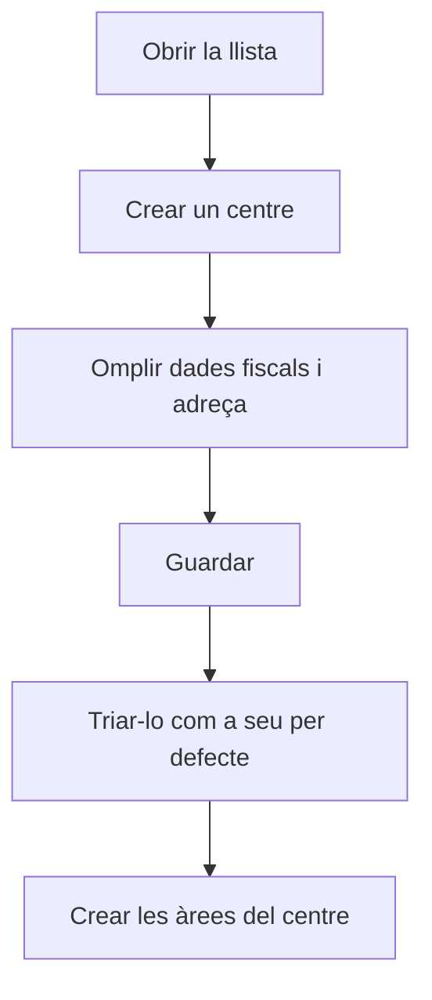

# Gestió de centres

## Per a que serveix aquesta pantalla

Aquí es gestionen els centres de l'empresa, el segon nivell de l'estructura de planta: empresa -> centre -> àrea -> màquina. Un centre és una ubicació física amb les seves dades fiscals i de contacte. Aquestes dades surten a la capçalera dels documents impresos, i les àrees i els magatzems sempre pertanyen a un centre.

## Accions disponibles

- Crear un centre amb el botó «+» («Crear nou») de la capçalera de la llista.
- Obrir un centre fent clic a la fila (al mòbil, tocant-ne la targeta) per modificar-lo.
- Eliminar un centre amb la icona de la paperera («Eliminar») de la fila, després de confirmar-ho.
- Consultar a les columnes el «Nom», la «Descripció», la «Població», l'«Adreça» i si està «Desactivat».

## Flux habitual

1. Comprova a «Gestió d'empreses» que l'empresa ja existeix.
2. Obre «Gestió de centres» i toca «+».
3. Omple el nom, la descripció, l'empresa, el CIF, els correus i l'adreça, i desa.
4. A «Gestió d'empreses», obre l'empresa i tria aquest centre a «Seu per defecte».
5. Crea les àrees del centre a «Gestió d'àrees» i assigna-hi els magatzems a «Gestió de magatzems».

## Aspectes importants

- La llista no té filtres: mostra tots els centres, també els desactivats, ordenats per nom.
- Els camps obligatoris i les dades que necessiten els documents de venda s'expliquen a l'ajuda de la fitxa del centre.
- El centre per defecte de l'empresa activa és el que s'assigna a les comandes, albarans i factures de venda noves.
- Eliminar un centre és definitiu i pot arrossegar les dades que en depenen, com les seves àrees i màquines, els magatzems o els albarans. Si el centre ja s'ha fet servir en documents, l'eliminació pot fallar. Si ja no el fas servir, marca'l com a «Desactivat» en lloc d'eliminar-lo.
- Si elimines el centre per defecte d'una empresa, l'empresa es queda sense centre per defecte i no es poden crear documents de venda fins que no en triïs un altre.

## Errors frequents

- Si en eliminar un centre surt un error, el centre ja està en ús: desactiva'l en lloc d'eliminar-lo.
- Si en crear una comanda, un albarà o una factura de venda surt que la seu no és vàlida, obre el centre per defecte de l'empresa i completa la direcció, la ciutat, la província, el codi postal, el país i el CIF.
- Si un centre no surt per triar-lo com a «Seu per defecte» d'una empresa, obre'l i comprova que al camp «Empresa» hi hagi aquesta empresa.

## Proces basic

