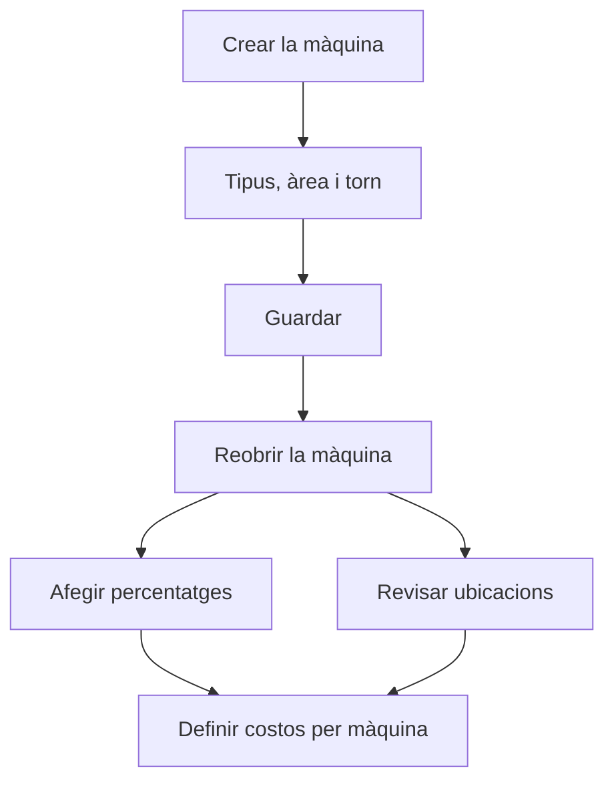

# Màquina

## Per a que serveix aquesta pantalla

És la fitxa d'una màquina. Defineix com s'identifica, a quin tipus, àrea i torn pertany i quin marge de benefici se li aplica. Les pestanyes permeten afegir-hi una imatge, una llista de percentatges de benefici i les ubicacions de magatzem on es deixa el material per treballar-hi. El títol mostra «Alta de màquina» quan la crees i «Màquina: » seguit del nom quan l'edites.

## Accions disponibles

- Omplir el «Nom», la «Descripció», el «Tipus», l'«Area» i el «Torn», que són obligatoris, i si cal el «Marge de benefici».
- Marcar «Desactivat» per retirar la màquina de la planta sense esborrar-la.
- Desar amb «Guardar», a la capçalera. En desar, tornes a la llista.
- Pestanya «Imatge»: pujar un fitxer amb el botó de pujada, i veure'l, descarregar-lo o eliminar-lo. Només n'admet un.
- Pestanya «Percentatges»: afegir un percentatge de benefici amb «+» (diàleg «Nou percentatge de profit») i eliminar-lo amb la «X» de la fila.
- Pestanya «Ubicacions»: vincular una ubicació de magatzem amb «+» (diàleg «Vincular ubicació») i desvincular-la amb la «X» de la fila.

## Flux habitual

1. Des de «Gestió de màquines», prem «+».
2. Omple el nom, la descripció, el tipus, l'àrea i el torn, i prem «Guardar».
3. Torna a obrir la màquina des de la llista.
4. A «Percentatges», afegeix els marges de benefici que es poden aplicar a aquesta màquina.
5. A «Ubicacions», comprova la ubicació d'aprovisionament i vincula'n d'altres si cal.
6. Defineix el preu per hora de cada estat de la màquina a «Costos per màquina».

## Aspectes importants

- En crear la màquina, el sistema crea automàticament una ubicació d'aprovisionament anomenada «APR-» seguit del nom de la màquina en un magatzem actiu, i la vincula a la pestanya «Ubicacions». Si no hi ha cap magatzem actiu, no se'n crea cap.
- Afegeix percentatges i ubicacions després d'haver desat la màquina nova: les pestanyes es veuen des del principi, però necessiten que la màquina ja existeixi.
- Les ubicacions vinculades s'utilitzen a la pantalla de la màquina a planta: un material es considera aprovisionat quan té existències en alguna d'aquestes ubicacions, i el material que es mou cap a la màquina va a la ubicació vinculada. Desvincular una ubicació no l'esborra del magatzem.
- Marcar «Desactivat» treu la màquina de la planta i de la llista de «Màquina preferida» de les fases, i també desactiva la seva ubicació d'aprovisionament. Desmarcar-lo la torna a activar.
- A la planta només hi surten les màquines actives d'àrees que tenen marcat «Visible planta».
- Marge de benefici en una fase d'una ruta de fabricació: en triar aquesta màquina com a «Màquina preferida», si la pestanya «Percentatges» té valors, el marge de la fase es tria d'aquesta llista. Si no en té, es proposa el «Marge de benefici» de la màquina si és més gran que 0 i, si no, el del tipus de màquina.
- En una fase d'una ordre de fabricació es proposa el «Marge de benefici» de la màquina si és més gran que 0 i, si no, el del tipus. Canviar els marges aquí no modifica les fases ja desades.
- Els percentatges han de ser més grans que 0, com a màxim 100, i no es poden repetir.
- El preu per hora de la màquina no es defineix aquí, sinó a «Costos per màquina», un preu per a cada estat de màquina.

## Errors frequents

- Si surt «El tipus és obligatori», «L'àrea és obligatòria» o «El torn és obligatori», tria un valor a cada desplegable. Si un desplegable surt buit, obre la màquina des de «Gestió de màquines» perquè es carreguin les opcions.
- Si surt «Centre de treball ... existent», ja hi ha una màquina amb aquest nom.
- Si en desar un nom llarg surt un error, escurça'l: el nom de la màquina admet com a màxim 50 caràcters.
- Si surt «El percentatge ...% ja existeix» o «Aquesta ubicació ja està assignada a aquesta màquina», el valor ja és a la llista.
- Si a la planta, en moure material a la màquina, surt «No s'ha trobat la ubicació d'aprovisionament per al centre de treball», vincula una ubicació activa a la pestanya «Ubicacions».

## Proces basic

