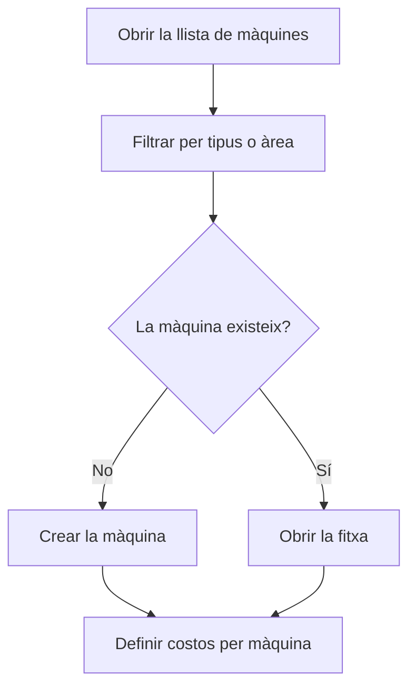

# Gestió de màquines

## Per a que serveix aquesta pantalla

Llista totes les màquines de la planta amb el seu tipus i la seva àrea. Des d'aquí es localitza una màquina per obrir-ne la fitxa o se'n dona d'alta una de nova. Les màquines són la base del treball a planta i del càlcul de costos: tipus de màquina -> màquina -> costos per màquina -> fases de les rutes i ordres de fabricació -> treball a planta.

## Accions disponibles

- Filtrar la llista per «Tipus» i per «Àrea».
- Buidar els filtres amb la icona «Netejar filtres».
- Crear una màquina amb el botó «+» («Crear nou»).
- Obrir una màquina fent clic a la seva fila.
- Eliminar una màquina amb la icona de la paperera («Eliminar»), després de confirmar-ho.
- Consultar el «Nom», la «Descripció», el «Tipus», l'«Àrea» i si està «Desactivat».

## Flux habitual

1. Tria un tipus o una àrea als filtres per reduir la llista.
2. Fes clic a la màquina per obrir-ne la fitxa, o prem «+» per crear-ne una.
3. Omple les dades de la màquina i desa-la.
4. Defineix el preu per hora de cada estat de la màquina a «Costos per màquina».
5. Quan una màquina deixi de treballar, obre-la i marca-la com a «Desactivat» en lloc d'eliminar-la.

## Aspectes importants

- Els filtres s'apliquen a l'instant i es recorden: quan tornis a la pantalla, trobaràs els últims filtres que vas fer servir.
- Els filtres només ofereixen tipus i àrees actius. A la taula, la columna «Tipus» o «Àrea» surt buida si la màquina té assignat un tipus o una àrea desactivats.
- La llista inclou les màquines desactivades. Una màquina desactivada no apareix a la planta ni es pot triar com a «Màquina preferida» a les fases.
- A la planta només hi surten les màquines actives d'àrees que tenen marcat «Visible planta» a «Gestió d'àrees».
- L'eliminació és definitiva i també esborra les dades que depenen de la màquina, com els costos per estat, els percentatges de benefici i la ubicació d'aprovisionament que se li va crear. Si la màquina ja ha treballat, desactiva-la en lloc d'eliminar-la.
- Els camps i les pestanyes de la fitxa s'expliquen a l'ajuda de la pantalla «Màquina».

## Errors frequents

- Si no pots eliminar una màquina, comprova si és la «Màquina preferida» d'alguna fase d'una ruta o d'una ordre de fabricació; en aquest cas, desactiva-la.
- Si no trobes una màquina, revisa els filtres «Tipus» i «Àrea» i buida'ls amb «Netejar filtres».
- Si una màquina no surt a la planta, comprova que no estigui desactivada i que la seva àrea tingui marcat «Visible planta».

## Proces basic

