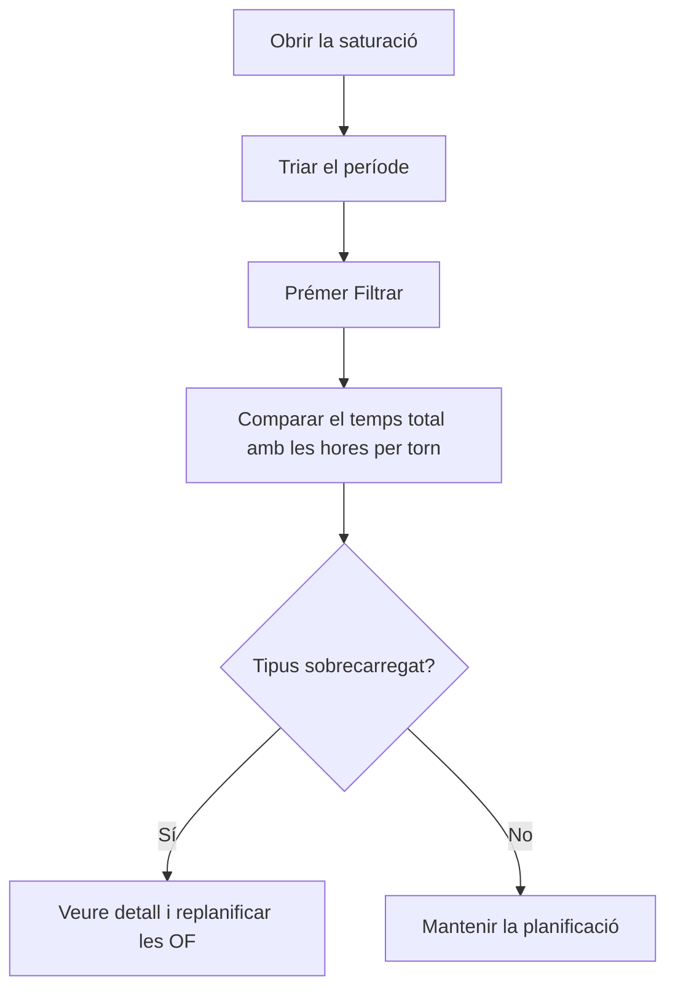

# Saturació dels centres de treball

## Per a que serveix aquesta pantalla

Mostra quanta feina hi ha planificada per a cada tipus de centre de treball en un període: suma el temps estimat de les fases de les ordres de fabricació (OF) previstes per a aquelles dates. Serveix per detectar quins tipus de màquina van sobrecarregats abans de llançar la producció i comparar la càrrega amb les hores disponibles a un, dos o tres torns.

## Accions disponibles

- Triar el «Període» al filtre i prémer el botó «Filtrar» (icona de l'embut) per calcular la càrrega.
- Netejar el filtre amb el botó de netejar filtres: buida el període i el resultat.
- Ordenar la taula per «Tipus de centre de treball» o per «Temps total estimat».
- Obrir el detall d'un tipus amb «Veure detall»: llista les fases que formen aquella càrrega.
- Al detall, ordenar per «Ordre de treball», «Prioritat», «Data planificada», «Codi de fase», «Quantitat» o «Temps estimat».

## Flux habitual

1. Obre la pantalla: el període es posa sol a l'exercici de l'any en curs i la taula es carrega.
2. Canvia el «Període» a les setmanes o el mes que vols planificar i prem «Filtrar».
3. Llegeix el resum de dies laborables i hores per torn que surt al costat dels botons del filtre.
4. Mira els tipus amb més «Temps total estimat» (la taula ja surt ordenada de més a menys).
5. Prem «Veure detall» per veure quines OF i fases hi aporten càrrega, ordenades per prioritat i data planificada.
6. Si un tipus va sobrecarregat, replanifica o canvia la prioritat de les OF des de les pantalles d'ordres de fabricació.

## Aspectes importants

- **Quines OF es compten**: només les OF no desactivades amb la data planificada dins del període i amb un estat que tingui l'etiqueta «Available» a «Cicles de vida». Les OF en altres estats (per exemple, tancades o sense aquesta etiqueta) no carreguen cap màquina.
- **Quines fases es compten**: totes les fases d'aquestes OF que tenen un tipus de centre de treball assignat. Les fases sense tipus no surten enlloc.
- **«Temps estimat» d'una fase**: suma dels temps estimats dels seus passos. Si un pas és per temps de cicle, el seu temps es multiplica per la quantitat planificada de l'OF; si no, compta una sola vegada.
- **«Temps total estimat»**: suma del temps estimat de totes les fases del tipus. Es mostra en hores i minuts.
- La càrrega és el temps estimat sencer de cada fase: no es resta el que ja s'ha fabricat ni es mira l'estat de la fase.
- Al costat del nom del tipus surt entre parèntesis el nombre de centres de treball d'aquest tipus. Per comparar amb la capacitat, multiplica les hores per torn pel nombre de centres.
- El resum de capacitat compta com a laborables tots els dies de dilluns a divendres del període i 8 hores per torn. No té en compte festius, calendaris ni els torns reals de cada màquina.
- La pantalla només consulta: no modifica cap OF ni cap fase.

## Errors frequents

- Si surt «Filtre invàlid» amb «Selecciona un període vàlid», tria tant la data d'inici com la de fi abans de prémer «Filtrar».
- Si en obrir la pantalla la taula surt buida i sense període, no hi ha cap exercici que es digui com l'any en curs (per exemple, «2026»): tria el període a mà.
- Si la taula surt buida amb un període triat, comprova que hi hagi OF amb data planificada en aquestes dates i que el seu estat tingui l'etiqueta «Available» a «Cicles de vida».
- Si una OF que esperaves no surt, revisa'n la data planificada, l'estat i que les fases tinguin un tipus de centre de treball.
- Si una fase surt amb temps 0, els seus passos no tenen temps estimat o la fase no té passos.
- Si el temps d'una fase sembla massa alt, comprova si algun pas està marcat com a temps de cicle: aleshores es multiplica per tota la quantitat planificada.

## Proces basic

