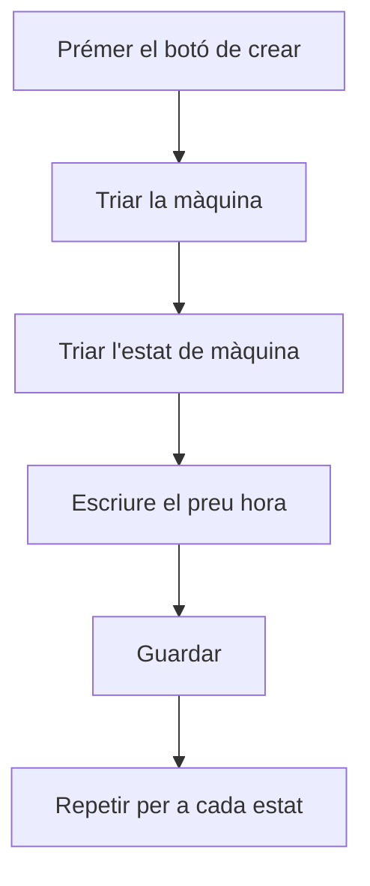

# Cost per màquina

## Per a que serveix aquesta pantalla

És la fitxa d'un preu per hora: quina màquina, en quin estat de màquina i quant costa cada hora de treball en aquest estat. El títol mostra «Alta de cost per màquina» quan el crees i «Editar cost per màquina» quan l'edites. Com s'utilitzen aquests preus a les rutes de fabricació i a planta s'explica a l'ajuda de «Costos per màquina».

## Accions disponibles

- Triar la «Màquina», que és obligatòria.
- Triar l'«Estat de màquina», que és obligatori.
- Escriure el «Preu hora» en euros, que és obligatori.
- Marcar o desmarcar «Desactivat».
- Desar amb «Guardar», a la capçalera. En desar, tornes a la llista.

## Flux habitual

1. Des de «Costos per màquina», prem «+».
2. Tria la màquina.
3. Tria l'estat de màquina.
4. Escriu el preu per hora.
5. Prem «Guardar».
6. Repeteix-ho per a cada estat en què treballa la màquina.

## Aspectes importants

- El preu és per hora: els temps de planta i de les rutes de fabricació es compten en minuts i es converteixen a hores per aplicar-lo.
- Cada màquina només pot tenir un preu per estat de màquina. No es pot crear ni desar una combinació que ja existeix.
- El desplegable «Estat de màquina» mostra tots els estats definits a «Gestió d'estats de màquina», també els desactivats.
- El preu pot ser 0; aquestes combinacions es localitzen a la llista amb el filtre «Cost 0».
- Canviar el preu no recalcula el cost que ja s'ha registrat a planta: només afecta els canvis d'estat posteriors i els càlculs de costos de les rutes que es facin a partir d'ara.
- Marcar «Desactivat» no impedeix que el preu es continuï aplicant als càlculs.

## Errors frequents

- Si surt «La màquina és obligatòria», «L'estat de màquina és obligatori» o «El cost és obligatori», omple el camp indicat abans de desar.
- Si surt «L'entitat ja existeix», aquesta màquina ja té preu per a aquest estat: busca-la a la llista amb el filtre «Màquina» i edita-la.
- Si el desplegable «Màquina» surt buit, obre la fitxa des de «Costos per màquina» perquè es carreguin les màquines.

## Proces basic

