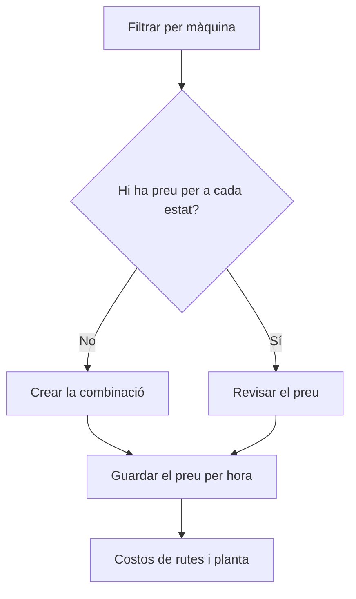

# Costos per màquina

## Per a que serveix aquesta pantalla

Llista el preu per hora de cada màquina en cada estat de màquina. Aquests preus alimenten el cost de màquina estimat de les rutes de fabricació i el cost real que es registra quan la màquina treballa a planta: màquina i estat de màquina -> preu per hora -> cost de la ruta de fabricació i tiquets de producció -> «Quadre de comandament de costos de producció».

## Accions disponibles

- Filtrar la llista per «Màquina».
- Marcar el filtre «Cost 0» per veure només les combinacions amb preu 0.
- Buidar els filtres amb la icona «Netejar filtres».
- Crear una combinació nova amb el botó «+» («Crear nou»).
- Obrir una fila per canviar-ne el preu.
- Eliminar una combinació amb la icona de la paperera («Eliminar»), després de confirmar-ho.
- Consultar la «Màquina», l'«Estat de màquina», el «Cost» i si està «Desactivada».

## Flux habitual

1. Tria la màquina al filtre «Màquina».
2. Comprova que hi hagi una fila per a cada estat de màquina en què treballa.
3. Marca «Cost 0» per trobar preus pendents d'omplir.
4. Prem «+» per afegir la combinació que falti, o obre una fila per canviar-ne el preu.
5. Desa i torna a la llista.

## Aspectes importants

- Cada combinació de màquina i estat de màquina només pot tenir un preu. La llista surt ordenada per màquina i els filtres es recorden quan hi tornes.
- Rutes de fabricació: el cost de màquina estimat es calcula amb el temps de cada pas convertit a hores, multiplicat pel preu de la «Màquina preferida» de la fase en l'estat de màquina del pas.
- En una fase d'una ruta de fabricació no es pot afegir ni modificar un pas si alguna màquina del tipus de la fase, també les desactivades, no té preu per a l'estat de màquina del pas.
- Planta: cada vegada que la màquina canvia d'estat es guarda el preu per hora vigent en aquell moment. Si no hi ha preu per a aquella combinació, es guarda 0.
- En finalitzar una fase, els tiquets de producció agafen el preu mitjà ponderat pel temps. D'aquests tiquets surten el cost de màquina de l'ordre de fabricació i els costos del «Quadre de comandament de costos de producció».
- Canviar un preu no recalcula el cost que ja s'ha registrat: només afecta els canvis d'estat posteriors i els càlculs de costos de les rutes que es facin a partir d'ara.
- La marca «Desactivada» no impedeix que el preu es continuï aplicant als càlculs. Per deixar d'aplicar-lo, canvia'n el valor.
- L'eliminació és definitiva. Després, els canvis d'estat d'aquella combinació es registren amb cost 0 i el càlcul de costos de les rutes que la necessiten no es pot completar.

## Errors frequents

- Si en afegir un pas a una fase d'una ruta surt «No s'ha trobat el cost del centre de treball», falta el preu d'aquest estat de màquina en alguna màquina del tipus de la fase: filtra per cada màquina del tipus i afegeix la combinació.
- Si el càlcul de costos d'una ruta falla amb «No s'ha trobat la combinació de centre de treball i estat de màquina», comprova que cada fase tingui «Màquina preferida» i que aquesta màquina tingui preu per a tots els estats dels passos.
- Si els costos de màquina a planta surten a 0, comprova amb el filtre «Màquina» que la combinació existeixi i amb «Cost 0» que no tingui preu 0.

## Proces basic

