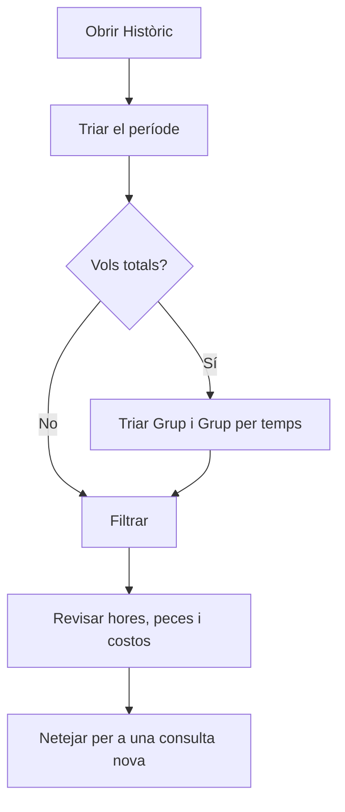

# Històric

## Per a que serveix aquesta pantalla

Consulta l'activitat registrada a les màquines (centres de treball) durant un període. Cada fila és un tram de temps d'una màquina: en quin estat era, quin operari hi estava fitxat, quina ordre de fabricació i fase hi havia carregada, quantes peces bones i dolentes s'hi van declarar, quantes hores va durar i quant va costar. Les dades es generen soles quan els operaris treballen a la planta; aquesta pantalla només serveix per consultar-les, agrupar-les i comparar el cost real amb l'estimat de l'ordre de fabricació.

## Accions disponibles

- Triar el «Període» al calendari del filtre: primer dia i últim dia. És obligatori.
- Agrupar els resultats amb «Grup»: «Operari», «Centre de treball», «Ordre de treball» o «Cap».
- Agrupar per períodes amb «Grup per temps»: «Dia», «Setmana», «Mes», «Any» o «Cap».
- Consultar amb «Filtrar» i buidar el filtre i els resultats amb «Netejar».
- Ordenar per les columnes «Centre de treball», «Operari», «Inici», «Fi», «Ordre de treball» i «Fase», fins i tot per diverses alhora.
- Passar pàgina: es mostren 25 files per pàgina.

## Flux habitual

1. Obre «Històric».
2. Tria el període al calendari.
3. Si vols totals, tria un grup, per exemple «Operari», i un grup per temps, per exemple «Setmana».
4. Toca «Filtrar».
5. Revisa les hores, les quantitats i els costos, i ordena per la columna que t'interessi.
6. Toca «Netejar» per començar una consulta nova.

## Aspectes importants

- Sense període no es consulta res: surt l'avís «Filtre invàlid».
- Un tram nou comença cada vegada que canvia l'estat de la màquina, un operari hi entra o en surt, s'hi carrega una fase o canvia el torn.
- Només surten els trams ja acabats que comencen i acaben dins del període triat. El tram en curs d'una màquina no apareix fins que es tanca.
- «Hores» és la durada del tram. Si l'operari estava fitxat a diverses màquines alhora, el temps es reparteix entre elles.
- «Cost operari» són les hores del tram pel cost/hora del tipus d'operari, guardat en el moment de fitxar. «Cost del centre» són les hores pel cost/hora de la màquina en aquell estat, segons «Costos per màquina». «Cost total» és la suma de tots dos.
- Els trams sense cap operari fitxat tenen la columna «Operari» buida i no tenen cost d'operari.
- «Quantitat prevista», «Cost de l'operari estimat (per OF)» i «Cost del centre estimat (per OF)» són de tota l'ordre de fabricació, no del tram: es repeteixen a cada fila de la mateixa ordre i no s'han de sumar.
- La columna «Ordre de treball» mostra el codi de l'ordre de fabricació.
- En agrupar, les hores, les quantitats i els costos reals se sumen, i «Inici» i «Fi» mostren el primer i l'últim moment del grup. Les columnes que barregen valors diferents mostren «Various», i l'estat i la fase queden buits. Els valors estimats per OF d'una fila agrupada són els de la primera fila del grup.

## Errors frequents

- Si surt «Filtre invàlid» amb «Seleccioni un període», tria al calendari tant el primer com l'últim dia.
- Si falten trams dels últims moments del període, amplia el període un dia més i recorda que els trams en curs no hi surten.
- Si el «Cost operari» surt a zero amb un operari fitxat, revisa el «Cost/hora» del seu tipus a «Gestió de tipus d'operari». El canvi només s'aplica als fitxatges nous.
- Si el «Cost del centre» surt a zero, revisa a «Costos per màquina» que la màquina té cost per a aquell estat.

## Proces basic

