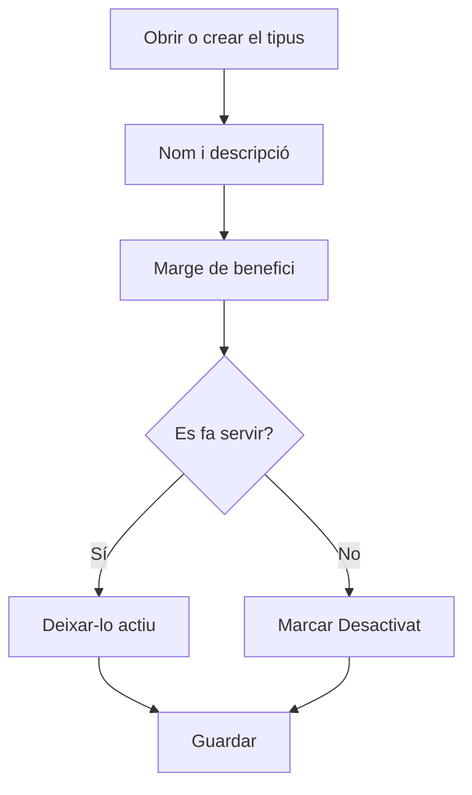

# Tipus de màquina

## Per a que serveix aquesta pantalla

És la fitxa d'un tipus de màquina. Aquí es defineix el nom amb què el tipus apareix a les màquines i a les fases, i el marge de benefici que es proposa per defecte quan una fase d'una ruta o d'una ordre de fabricació es fa en aquest tipus de màquina. El títol mostra «Alta de tipus de màquina» quan el crees i «Tipus de màquina: » seguit del nom quan l'edites.

## Accions disponibles

- Escriure el «Nom» i la «Descripció», que són obligatoris.
- Indicar el «Marge de benefici», en percentatge.
- Marcar o desmarcar «Desactivat».
- Desar amb «Guardar», a la capçalera de la pantalla. En desar, tornes a la pantalla anterior.

## Flux habitual

1. Des de «Gestió de tipus de màquina», prem «+» o obre un tipus existent.
2. Escriu un nom curt i reconeixible i una descripció.
3. Indica el marge de benefici habitual per a la feina d'aquest tipus de màquina.
4. Prem «Guardar».
5. Assigna el tipus a les màquines des de «Gestió de màquines».

## Aspectes importants

- El «Marge de benefici» del tipus és el valor que es proposa quan tries aquest tipus a «Tipus de màquina» en una fase d'una ruta o d'una ordre de fabricació. Si després tries una «Màquina preferida», la fase pot agafar el marge de la màquina. Canviar el marge aquí no modifica les fases ja desades.
- En crear un tipus, no es pot repetir el nom d'un altre tipus.
- Un tipus marcat com a «Desactivat» continua a la llista, però ja no es pot triar en màquines noves ni en fases. Les màquines que ja el tenen assignat no canvien.
- Per eliminar un tipus s'ha de fer des de la llista; mira l'ajuda de «Gestió de tipus de màquina» abans de fer-ho, perquè l'eliminació és definitiva.

## Errors frequents

- Si surt «El nom és obligatori» o «La descripció és obligatòria», omple els dos camps abans de desar.
- Si surt «Tipus de centre de treball ... existent», ja hi ha un tipus amb aquest nom: obre'l des de la llista en lloc de crear-ne un altre.
- Si en desar un nom llarg surt un error, escurça'l: el nom del tipus admet com a màxim 50 caràcters.
- Si el tipus no surt en crear una màquina o una fase, comprova que no tingui marcat «Desactivat».

## Proces basic

