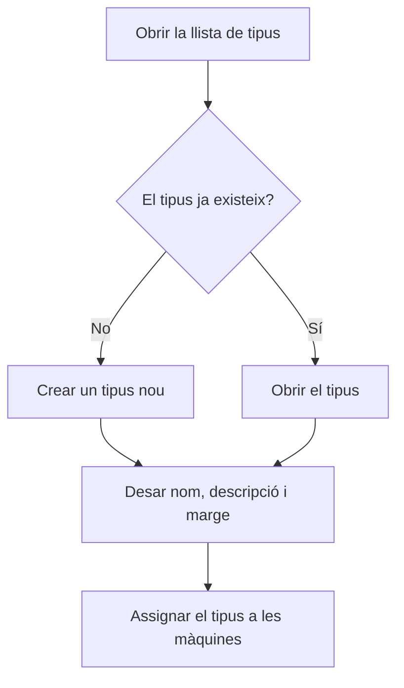

# Gestió de tipus de màquina

## Per a que serveix aquesta pantalla

Llista els tipus de màquina, la classificació que agrupa les màquines que poden fer la mateixa feina. Cada màquina pertany a un tipus, i les fases de les rutes de fabricació i de les ordres de fabricació indiquen en quin tipus de màquina s'han de fer. És el primer pas de la configuració de planta: tipus de màquina -> màquina -> costos per màquina -> fases de les rutes de fabricació.

## Accions disponibles

- Crear un tipus nou amb el botó «+» («Crear nou»).
- Obrir un tipus fent clic a la seva fila per canviar-ne el nom, la descripció, el marge o l'estat.
- Eliminar un tipus amb la icona de la paperera («Eliminar») de la fila, després de confirmar-ho.
- Consultar a la taula el «Nom», la «Descripció», el «% de benefici» i si està «Desactivat».

## Flux habitual

1. Revisa la llista per comprovar si el tipus ja existeix.
2. Prem «+» per donar d'alta un tipus nou.
3. Omple el nom, la descripció i el marge de benefici, i desa'l.
4. Ves a «Gestió de màquines» i assigna aquest tipus a les màquines que corresponguin.
5. Quan un tipus deixi de fer-se servir, obre'l i marca'l com a «Desactivat».

## Aspectes importants

- La llista mostra tots els tipus, també els desactivats; la columna «Desactivat» ho indica. Aquesta pantalla no té filtres i la llista surt ordenada pel nom.
- Els tipus desactivats no es poden triar en crear una màquina des de «Gestió de màquines» ni en el camp «Tipus de màquina» de les fases de rutes i ordres de fabricació.
- L'eliminació és definitiva: el tipus no es desactiva, s'esborra. Les màquines que tenen aquest tipus s'esborren amb ell, per això abans d'eliminar-lo comprova que no en tingui cap.
- Si el tipus ja s'ha fet servir, desactiva'l en lloc d'eliminar-lo.
- Els camps de la fitxa i el paper del marge de benefici s'expliquen a l'ajuda de la pantalla «Tipus de màquina».

## Errors frequents

- Si no pots eliminar un tipus, probablement alguna fase d'una ruta o d'una ordre de fabricació l'utilitza: desactiva'l en lloc d'eliminar-lo.
- Si un tipus no apareix en crear una màquina o una fase, comprova que no estigui marcat com a «Desactivat».
- Si en crear un tipus surt «Tipus de centre de treball ... existent», ja n'hi ha un amb el mateix nom: obre'l des de la llista.

## Proces basic

