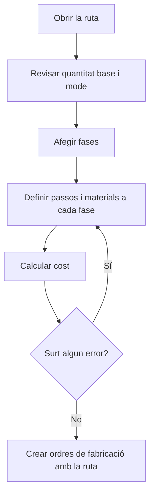

# Ruta de fabricació

## Per a que serveix aquesta pantalla

És la fitxa d'una ruta de fabricació. Aquí es defineixen les dades generals de la ruta (referència, quantitat base, volum i mode), la llista de fases per on passa la peça i els costos teòrics que en resulten. Quan es crea una ordre de fabricació a partir d'aquesta ruta, s'hi copien les fases, els passos i els materials.

Flux: `ruta de fabricació -> fases -> passos i materials -> càlcul de cost -> ordre de fabricació`.

## Accions disponibles

- Modificar «Referència», «Quantitat Base», «Volum mm3», «Mode» i «Desactivat», i desar amb «Guardar», a la capçalera.
- Recalcular els costos amb «Calcular Cost», a la fletxa del botó «Guardar».
- Consultar els costos al bloc «Costos»: «Cost Operari», «Cost Màquina», «Cost Material», «Cost Extern», «Cost Total» i «Pes Total».
- Afegir una fase amb el botó + de «Fases de la ruta»: s'obre el diàleg «Nova fase».
- Obrir una fase fent clic a la fila per definir-ne els passos i els materials.
- Eliminar una fase amb la creu de la fila, després de confirmar-ho.

## Flux habitual

1. Obre la ruta des de «Gestió de rutes de fabricació» o des de la pestanya «Rutes de fabricació» de la referència de venda.
2. Revisa la «Quantitat Base» i el «Mode» i toca «Guardar».
3. Toca + a «Fases de la ruta», revisa el codi proposat, omple el tipus de màquina, la màquina preferida i el tipus d'operari, i toca «Guardar».
4. La fase es crea i s'obre la seva fitxa: afegeix-hi els passos i els materials.
5. Repeteix-ho per a cada fase, tornant a la ruta amb el botó enrere.
6. Toca «Calcular Cost» i revisa el resultat al missatge «Càlcul de cost» i al bloc «Costos».

## Aspectes importants

- En afegir una fase, el codi proposat és la desena següent a la fase més alta (10, 20, 30...). No es pot crear una fase amb un codi que ja existeix a la ruta.
- Els costos queden desats a la ruta. Es recalculen quan toques «Guardar» o «Calcular Cost» en aquesta pantalla; els canvis fets a les fases, passos o materials no els actualitzen fins que tornes a desar o calcular aquí.
- «Guardar» recalcula en silenci: si el càlcul no es pot fer, la ruta es desa igualment però els costos es queden com estaven. Fes servir «Calcular Cost» per veure el motiu.
- «Calcular Cost» primer desa la ruta i després mostra el «Cost Total» en un missatge.
- Els costos es calculen per a la «Quantitat Base»:
  - «Cost Operari»: el «Temps operari (min)» de cada pas, passat a hores, pel «Cost/hora» del «Tipus d'operari» de la fase.
  - «Cost Màquina»: el «Temps màquina (min)» de cada pas, passat a hores, pel cost que la «Màquina preferida» de la fase té per a l'estat del pas a «Costos per màquina».
  - Els passos marcats com a «Temps de cicle» són temps per peça i es multipliquen per la quantitat base. La resta són un temps fix per a tot el lot.
  - «Cost Material»: per a cada material, l'«Últim cost» de la referència de compra pel pes calculat amb les mides i la densitat del seu tipus de material, i per la quantitat. Si el format del material és per unitats, és l'«Últim cost» per la quantitat. Els materials sense format no sumen cost.
  - «Pes Total»: la suma dels pesos calculats dels materials.
  - «Cost Extern»: la suma del «Cost servei» i el «Cost transport» de les fases externes. Les fases externes no sumen cost d'operari, de màquina ni de material.
- En desar la ruta, el «Cost Total» també es copia al camp «Cost Teòric Fabricació» de la referència.
- Una ruta «Desactivat» no s'ofereix per crear ordres de fabricació ni a les línies de pressupostos i comandes, i no surt a la pestanya «Rutes de fabricació» de la referència.
- En crear una ordre de fabricació, es copien les fases, els passos i els materials de la ruta. Les quantitats de material s'ajusten a la quantitat planificada en proporció a la «Quantitat Base». Els canvis posteriors a la ruta no modifiquen les ordres ja creades.
- El «Volum mm3» s'utilitza per calcular el pes de les línies de pressupost que fan servir aquesta ruta.
- Eliminar una fase és definitiu: s'esborren també els seus passos i materials.

## Errors frequents

- Si «Calcular Cost» diu «No s'ha trobat la combinació de centre de treball i estat de màquina», revisa que cada fase interna amb passos tingui «Màquina preferida» i que aquesta màquina tingui cost per a cada estat dels passos a «Costos per màquina».
- Si diu «No s'ha trobat el tipus de material», algun material de les fases és una referència de compra sense «Tipus de material».
- Si surt un missatge que demana mides o densitat superiors a 0 (per exemple, per calcular plaques, format rodó o format tub), completa les mides del material a la pestanya «Materials» de la fase i la densitat del tipus de material.
- Si en afegir una fase surt «Fase invàlida» perquè la fase ja existeix, canvia el codi de la fase.
- Si surt «La quantitat base ha de ser superior a 0», la «Quantitat Base» ha de ser 1 o més.
- Si el «Cost Operari» surt a 0, comprova que les fases tinguin «Tipus d'operari» i que els passos tinguin temps d'operari.

## Proces basic

