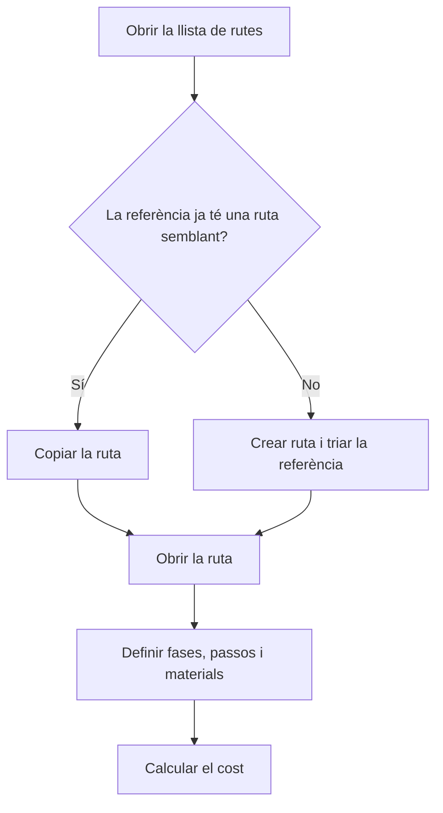

# Gestió de rutes de fabricació

## Per a que serveix aquesta pantalla

Llista totes les rutes de fabricació. Una ruta defineix com es fabrica una referència de venda: les fases, els passos de cada fase amb els seus temps, els materials que es consumeixen i el cost teòric que en resulta. Les ordres de fabricació es creen a partir d'una ruta, i els pressupostos i les comandes de venda també la fan servir.

Flux: `referència de venda -> ruta de fabricació -> ordre de fabricació -> fases -> declaració de peces`.

## Accions disponibles

- Crear una ruta nova amb el botó «Nou» (+): s'obre el diàleg «Crear ruta», on només cal triar la «Referència».
- Obrir una ruta fent clic a la fila per editar-ne les dades, les fases i els costos.
- Copiar una ruta amb la icona de còpia de la fila (o «Copiar» a la vista de targetes del mòbil): s'obre el diàleg «Copiar ruta de fabricació».
- Eliminar una ruta amb la creu de la fila, després de confirmar-ho.
- Filtrar la llista a «Filtres» per «Client», «Referència» i «Última actualització» (rang de dates), i treure els filtres amb «Netejar».

## Flux habitual

1. Filtra per «Client» o «Referència» per trobar la ruta que busques.
2. Si la referència encara no té ruta, toca «Nou», tria la «Referència» i toca «Guardar».
3. La ruta es crea i s'obre directament perquè hi afegeixis les fases.
4. Si una referència nova es fabrica igual que una altra, fes servir la icona de còpia en lloc de començar de zero.
5. Al diàleg de còpia, tria el «Destí de la còpia», el «Mode de fabricació» i toca «Guardar».

## Aspectes importants

- Una ruta nova es crea amb «Quantitat base» 1 i mode «Prototip». Aquests valors i la resta de dades es canvien a la fitxa de la ruta.
- Una mateixa referència pot tenir diverses rutes, per exemple una per mode: «Prototip», «Sèrie curta» i «Sèrie llarga».
- La columna «Cost» és la suma dels costos d'operari, màquina, material i extern calculats a la fitxa de la ruta. No es recalcula des d'aquesta llista.
- La còpia duplica totes les fases, passos i materials de la ruta d'origen, i també els seus costos.
  - Amb «Referència existent», la ruta nova s'assigna a la referència triada.
  - Amb «Crear nova referència», es crea una referència nova amb el «Codi» indicat, que copia totes les dades de la referència d'origen. Si deixes la «Descripció» en blanc, es fa servir la de l'origen.
- En acabar la còpia, la llista es refresca però no s'obre la ruta nova.
- El filtre «Client» també mostra les rutes de referències que no tenen cap client assignat. Quan hi ha un client triat, el desplegable «Referència» només ofereix les seves referències.
- Els filtres es recorden quan surts de la pantalla i hi tornes.
- La columna «Desactivada» indica les rutes que ja no es poden triar per crear ordres de fabricació ni a les línies de pressupostos i comandes. Aquí continuen sortint.
- L'eliminació és definitiva: s'esborra la ruta amb totes les seves fases, passos i materials. No es pot eliminar una ruta que ja s'ha fet servir en ordres de fabricació, pressupostos o comandes: marca-la com a «Desactivat» a la seva fitxa.

## Errors frequents

- Si la còpia a una «Referència existent» diu «Referència amb ruta de fabricació del mode seleccionat. Seleccioni un altre mode», aquella referència ja té una ruta amb el mateix mode: tria un altre «Mode de fabricació».
- Si la còpia no avança i surt «Selecciona una referència de destí» o «Introdueix el codi de la nova referència», falta el camp obligatori de l'opció de destí que has triat.
- Si en crear una ruta surt «La referència és obligatòria», tria una referència abans de guardar.
- Si no trobes una ruta, revisa els filtres actius, sobretot el rang d'«Última actualització», i toca «Netejar».

## Proces basic

