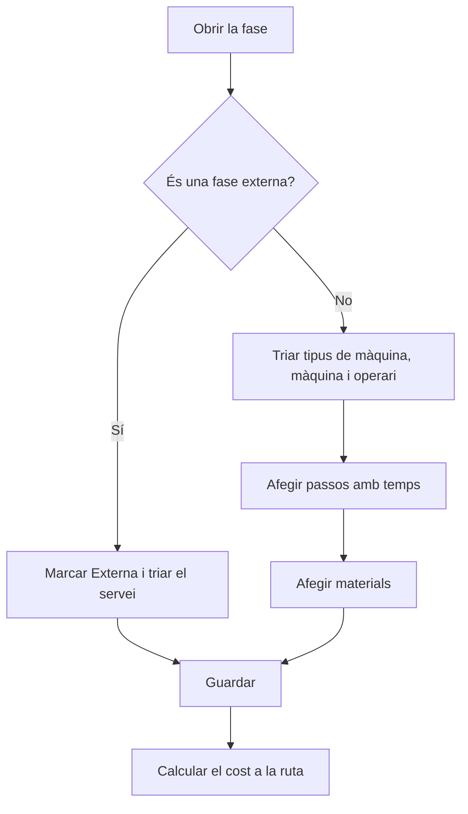

# Ruta de fabricació - Fase

## Per a que serveix aquesta pantalla

És la fitxa d'una fase d'una ruta de fabricació. Defineix on es fa la fase (tipus de màquina i màquina preferida), qui la fa (tipus d'operari), el marge de benefici, si és un treball extern, els passos amb els seus temps i els materials que consumeix. Aquestes dades alimenten el càlcul de cost de la ruta i es copien a les fases de les ordres de fabricació que es creen amb la ruta.

Flux: `ruta de fabricació -> fase -> passos i materials -> ordre de fabricació -> càrrega a la màquina`.

## Accions disponibles

- Modificar la capçalera de la fase: «Codi de la fase», «Descripció», «Tipus de màquina», «Màquina preferida», «Marge de benefici», «Tipus d'operari», «Externa», «Servei», «Cost servei» i «Cost transport», i desar amb «Guardar».
- Gestionar els passos a la pestanya «Passos»: + per afegir-ne un («Afegir pas de fabricació»), clic a la fila per modificar-lo i creu per eliminar-lo.
- Gestionar els materials a la pestanya «Materials»: + per afegir-ne un («Afegir material»), clic a la fila per modificar-lo i creu per eliminar-lo.

## Flux habitual

1. Obre la fase des de «Fases de la ruta» (també s'obre sola just després de crear-la).
2. Tria el «Tipus de màquina», després la «Màquina preferida», revisa el «Marge de benefici», tria el «Tipus d'operari» i toca «Guardar».
3. A «Passos», toca + i omple «Ordre», «Estat», «Temps de cicle», «Temps màquina (min)», «Temps operari (min)» i, si cal, «Comentari fabricació». Repeteix-ho per a cada pas.
4. A «Materials», toca + i tria el «Material», la «Quantitat» i les mides que demana el seu format.
5. Torna a la ruta i toca «Calcular Cost» per actualitzar-ne els costos.

## Aspectes importants

- En canviar el «Tipus de màquina», es buida la «Màquina preferida» i es proposa el marge del tipus de màquina. La «Màquina preferida» només ofereix màquines d'aquest tipus.
- En triar la «Màquina preferida», el «Marge de benefici» es proposa així: si la màquina té percentatges a la seva pestanya «Percentatges», el camp passa a ser un desplegable amb aquests valors; si no, es fa servir el marge de la màquina i, si és 0, el del tipus de màquina. En la resta de casos el camp és només de lectura.
- El «Marge de benefici» és el marge que es proposa per a aquesta fase quan la ruta es fa servir en una línia de pressupost o de comanda.
- En marcar «Externa», es buiden el tipus de màquina, la màquina preferida i el tipus d'operari, i es proposa el marge per a treballs externs de l'exercici vigent. S'activen «Servei», «Cost servei» i «Cost transport». En desmarcar-la, aquests tres camps i el marge tornen a zero.
- «Servei» ofereix les referències de compra de tipus servei. En triar-ne una, «Cost servei» i «Cost transport» s'omplen amb el preu i el transport del servei.
- En una fase externa, el cost de la ruta només compta el «Cost servei» i el «Cost transport»: els passos i els materials de la fase no sumen cost. Si la fase té un «Servei», els pressupostos que fan servir la ruta hi afegeixen aquest servei extern.
- L'ordre d'un pas nou es proposa com la desena següent (10, 20, 30...).
- Cada pas és un estat de màquina amb un temps previst. A planta, els passos de la fase de l'ordre de fabricació són les activitats que l'operari pot carregar a la màquina, i els seus temps es comparen amb els reals.
- Amb «Temps de cicle» marcat, els temps del pas són per peça i es multipliquen per la quantitat. Sense marcar, són un temps fix per a tot el lot.
- En desar un pas, es comprova que totes les màquines del «Tipus de màquina» de la fase tinguin un cost per a l'estat triat a «Costos per màquina».
- El desplegable «Material» ofereix referències de compra. La «Quantitat» correspon a la «Quantitat Base» de la ruta; en crear una ordre de fabricació s'ajusta a la quantitat planificada.
- Les mides que calen depenen del format del material: una placa necessita amplada, alçada i longitud; un rodó, diàmetre i longitud; un tub, diàmetre, gruix i longitud. Un material per unitats no necessita mides. A més, el tipus de material ha de tenir densitat.
- Quan afegeixes, modifiques o elimines un pas o un material, també es desen els canvis pendents de la capçalera de la fase.
- Els canvis d'aquesta pantalla no actualitzen els costos de la ruta fins que tornes a desar o calcular a la ruta.
- En canviar el «Codi de la fase» des d'aquí, no es comprova si ja existeix a la ruta: evita repetir codis.
- Eliminar un pas o un material és definitiu.

## Errors frequents

- Si en desar un pas surt «No s'ha trobat el cost del centre de treball», alguna màquina del tipus de màquina de la fase no té cost per a aquell estat: afegeix-lo a «Costos per màquina» o tria un altre estat.
- Si la «Màquina preferida» surt buida, tria primer el «Tipus de màquina».
- Si «Servei», «Cost servei» i «Cost transport» no es poden editar, marca «Externa».
- Si el pas no es desa, revisa els missatges «L'ordre és obligatori», «L'ordre ha de ser positiu» o «El temps estimat és obligatori».
- Si el material no es desa, revisa «El material de consum és obligatori» o «La quantitat a consumir ha de ser positiva»: la quantitat ha de ser 1 o més.
- Si després el càlcul de cost de la ruta falla per mides o per densitat, completa aquí les mides del material segons el seu format.

## Proces basic

