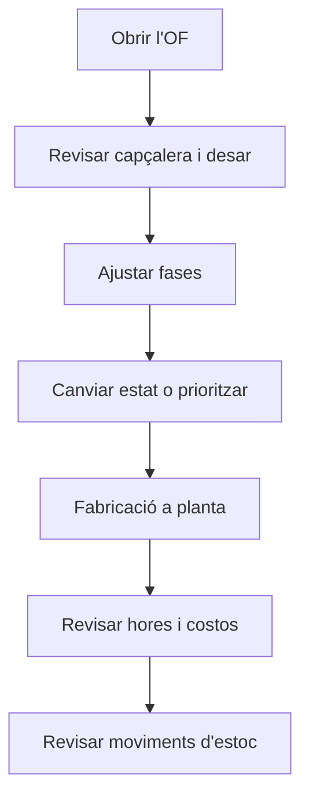

# Ordre de fabricació

## Per a que serveix aquesta pantalla

És la fitxa d'una ordre de fabricació (OF). La capçalera recull la referència, la quantitat i la data previstes, l'estat, la prioritat i el període d'execució. Les pestanyes mostren les fases que s'han de fer, les hores declarades en tiquets de producció, els costos acumulats i els moviments d'estoc de l'OF. Se situa entre la ruta de fabricació (d'on surten les fases) i la planta, on es fabriquen les fases.

## Accions disponibles

- Desar la capçalera amb «Guardar».
- Descarregar el full de l'OF amb la fletxa de «Guardar»: «Descarregar Excel» o «Descarregar PDF».
- Canviar l'estat de l'OF des del camp «Estat».
- Pestanya «Fases»: afegir una fase amb el botó «+» (diàleg «Nova fase»), obrir una fase fent clic a la fila i eliminar-la amb la creu.
- Pestanya «Hores»: consultar els tiquets de producció de l'OF, filtrar-los per operari, màquina, fase o data, afegir-ne un amb «+» (diàleg «Crear tiquet de producció») i eliminar-lo amb la creu.
- Pestanya «Costos»: consultar «Cost operari», «Cost màquina», «Cost de material», «Cost total», «Temps d'operari» i «Temps de màquina».
- Pestanya «Moviments»: consultar els moviments d'estoc de l'OF (data, referència, ubicació, dimensions, tipus, quantitat i descripció).

## Flux habitual

1. Obre l'OF des de «Ordres de fabricació» o des de la línia de la comanda de venda.
2. Revisa la «Data prevista», la «Quantitat prevista» i la «Prioritat», i prem «Guardar».
3. A «Fases», revisa les fases copiades de la ruta; afegeix-ne o obre'n una per ajustar passos i materials.
4. Canvia l'«Estat» quan l'OF estigui a punt per a planta, o prioritza-la des de «Prioritzar ordres de fabricació».
5. Mentre es fabrica, segueix el progrés a «Fases» (peces bones / dolentes) i a «Hores».
6. En acabar, revisa «Costos» i «Moviments» per validar el cost real i l'entrada d'estoc.

## Aspectes importants

- «Codi», «Referència» i «Quantitat total» no es poden editar. La «Quantitat total» suma les peces dels tiquets de producció i, quan es finalitza l'última fase a planta, passa a ser les peces bones d'aquesta fase.
- El desplegable «Estat» només ofereix els estats als quals es pot passar des de l'actual, segons les transicions definides a «Cicles de vida».
- Canviar l'estat des d'aquesta fitxa no genera tiquets ni moviments d'estoc. Aquests efectes es produeixen quan es finalitzen fases a la planta.
- La planta actualitza l'OF automàticament: en començar una fase, l'OF passa a «Producció» i s'anota l'inici del «Període execució»; en finalitzar l'última fase, l'OF pren l'estat triat, s'anota el final i es crea una sola entrada d'estoc de producció amb les peces bones a la ubicació per defecte del magatzem. Si la fase següent és externa, l'OF passa a «Servei Extern».
- Una fase externa es tanca sola quan es rep tota la comanda de compra del seu servei; si no és l'última, l'OF passa a «Pausa», i si ho és, l'OF queda «Tancada» amb la seva entrada d'estoc.
- Els costos d'operari i de màquina s'acumulen amb cada tiquet de producció (temps en minuts × cost per hora / 60). El cost de material es recalcula a partir dels consums d'estoc de les fases quan es finalitza una fase a planta.
- En desar l'OF, el «Cost total» es copia al «Cost Última Fabricació / Compra» de la referència i al darrer cost de les línies de comanda de venda vinculades.
- Si canvies la «Quantitat prevista», les quantitats de materials de les fases no es recalculen: revisa-les a cada fase.
- A «Hores», la creu elimina el tiquet a l'instant, sense confirmació, i descompta les seves hores, peces i costos de l'OF.
- Eliminar una fase (amb confirmació) també n'elimina els passos, els materials, els rebuigs i els tiquets de producció.
- En crear un tiquet des d'aquesta fitxa, primer tries «Ordre Fabricació | Fase | Activitat» i després la «Màquina»: només surten les màquines del tipus de màquina de la fase.
- Una fase nova proposa com a codi la desena següent (10, 20, 30...) i l'estat inicial del cicle de vida. En desar-la s'obre la seva fitxa.

## Errors frequents

- Si no pots desar, revisa els avisos «La data prevista és obligatòria», «La quantitat ha de ser superior a 0» i «L'ordre és obligatori» (camp «Prioritat»).
- Si l'estat que busques no surt al desplegable, comprova les transicions de l'estat actual a «Cicles de vida».
- Si surt «Fase invàlida» en afegir una fase, el codi ja existeix en aquesta OF: canvia'l.
- Si en crear un tiquet surt «Has d'introduir el temps de màquina i ha de ser major que 0», informa el «Temps total centre de treball (minuts)».
- Si en crear un tiquet no hi ha màquines per triar, la fase no té tipus de màquina o no hi ha màquines d'aquest tipus.
- Si un tiquet surt amb cost de màquina 0, comprova a «Costos per màquina» que la màquina tingui cost per a l'estat de màquina del pas.
- Si la descàrrega mostra «No s'ha pogut generar l'informe de l'ordre de fabricació», torna-ho a provar i, si persisteix, avisa l'administrador.

## Proces basic

