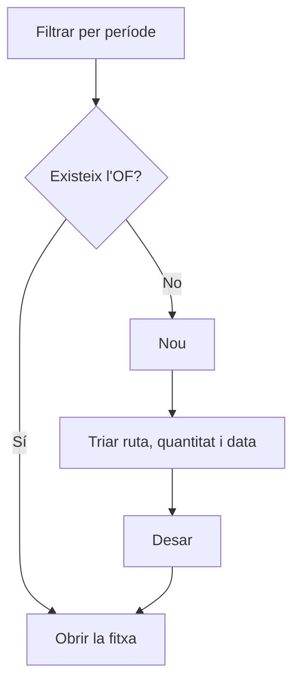

# Ordres de fabricació

## Per a que serveix aquesta pantalla

És la llista de totes les ordres de fabricació (OF). Des d'aquí es busquen les OF d'un període, es crea una OF nova a partir d'una ruta de fabricació i s'obre la fitxa de cada ordre. Encaixa en el flux `ruta de fabricació -> ordre de fabricació -> fases -> tiquets de producció`. Les OF també es poden crear des d'una línia de comanda de venda.

## Accions disponibles

- Filtrar la llista amb «Filtres»: «Període», «Client», «Codi» i «Estat», i aplicar-los amb «Filtrar».
- Tornar als filtres inicials amb «Netejar».
- Crear una OF nova amb «Nou», que obre el diàleg «Crear ordre».
- Obrir la fitxa d'una OF fent clic a la fila.
- Eliminar una OF amb la creu de la fila, després de confirmar-ho.
- Ordenar per «Data prevista» i ajustar la vista amb «Configuració de la vista».

## Flux habitual

1. Revisa el «Període» del filtre: per defecte és l'exercici de l'any en curs.
2. Filtra per «Client», «Codi» o «Estat» si cal, i prem «Filtrar».
3. Per crear una OF, prem «Nou».
4. Tria la «Ruta», informa la «Quantitat», la «Data prevista» i, si vols, el «Comentari de fabricació».
5. Desa: s'obre directament la fitxa de la nova OF.
6. Des de la fitxa revisa fases, materials i prioritat abans de llançar-la a planta.

## Aspectes importants

- El «Període» és obligatori i filtra per la data prevista de l'OF, no per la data de creació.
- Els filtres es guarden per usuari quan surts de la pantalla; «Netejar» els esborra i torna a l'exercici de l'any en curs.
- Al diàleg de creació només surten les rutes de fabricació actives. Cada opció mostra la referència, la quantitat base de la ruta i el mode.
- En crear l'OF, el codi es genera automàticament amb el comptador de l'exercici que correspon a la «Data prevista».
- L'OF neix en l'estat inicial del cicle de vida de les ordres de fabricació («Creada») i copia les fases, els passos i els materials de la ruta. La quantitat de cada material s'escala segons la quantitat de l'OF respecte a la quantitat base de la ruta.
- Els canvis posteriors a la ruta no modifiquen les OF ja creades.
- Si la referència de la ruta treballa amb lots, apareix el camp «Codi de lot». Segons la configuració del sistema, el lot pren automàticament el codi de l'OF (i el camp s'ignora) o bé cal informar-lo.
- Des d'una línia de comanda de venda, el mateix diàleg surt amb la ruta, la quantitat de la línia i la data prevista de la comanda proposades, i la línia queda vinculada a l'OF.
- L'eliminació és definitiva: esborra l'OF amb les seves fases i tiquets de producció, i desvincula la línia de comanda de venda associada.

## Errors frequents

- Si surt «Filtre invàlid», selecciona un període complet (data d'inici i de fi).
- Si no pots desar el diàleg, revisa els avisos: «La ruta de fabricació és obligatòria», «La quantitat ha de ser superior a 0» o «La data prevista és obligatòria».
- Si la creació falla indicant que no s'ha trobat cap exercici, comprova a «Exercicis» que n'hi hagi un que cobreixi la «Data prevista».
- Si demana un codi de lot, informa el «Codi de lot»: la referència treballa amb lots i el sistema no el genera automàticament.
- Si una ruta no surt a la llista, comprova a «Gestió de rutes de fabricació» que estigui activa.
- Si no pots eliminar una OF que ja s'ha treballat a planta, és possible que tingui registres de planta o documents vinculats que ho impedeixin.

## Proces basic

