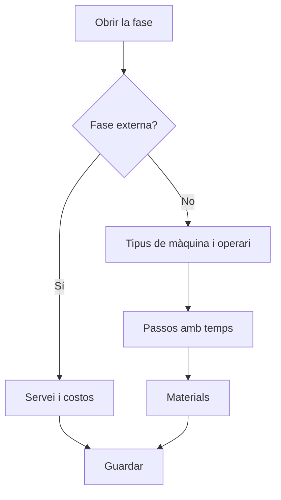

# Ordre de fabricació - Fase

## Per a que serveix aquesta pantalla

És la fitxa d'una fase d'una ordre de fabricació (OF). Defineix on i com es fa la fase (tipus de màquina, màquina preferida, tipus d'operari o servei extern), els passos amb els temps estimats per estat de màquina i els materials que consumeix. També mostra els comentaris i els rebuigs que s'han registrat a planta. Les fases es copien de la ruta de fabricació en crear l'OF i es poden ajustar aquí per a aquesta ordre.

## Accions disponibles

- Desar la capçalera de la fase amb «Guardar».
- Canviar l'estat de la fase des del camp «Estat».
- Pestanya «Passos»: afegir un pas amb «+» («Afegir pas de fabricació»), modificar-lo fent clic a la fila («Modificar pas de fabricació») i eliminar-lo amb la creu.
- Pestanya «Materials»: afegir un material amb «+» («Afegir material»), modificar-lo fent clic a la fila i eliminar-lo amb la creu.
- Pestanya «Comentaris»: llegir el «Comentari de fase» escrit a planta.
- Pestanya «Rebuigs»: consultar les peces rebutjades per motiu, amb el total d'unitats rebutjades.

## Flux habitual

1. Obre la fase des de la pestanya «Fases» de l'OF.
2. Revisa el «Tipus de màquina», la «Màquina preferida», el «Marge de benefici» i el «Tipus d'operari», o marca «Externa» si la fase la fa un proveïdor.
3. A «Passos», comprova que hi hagi un pas per a cada estat de màquina que es farà servir (per exemple preparació i producció) amb els temps estimats.
4. A «Materials», ajusta el material i la quantitat que es consumirà.
5. Prem «Guardar».
6. Durant i després de la fabricació, consulta «Comentaris» i «Rebuigs».

## Aspectes importants

- El «Tipus de màquina» decideix a quines màquines es pot carregar la fase a planta i quines màquines es poden triar en un tiquet de producció.
- En canviar el «Tipus de màquina», la «Màquina preferida» es buida i el «Marge de benefici» pren el del tipus. En triar una màquina preferida, el marge pren el de la màquina si en té; si no, el del tipus.
- Marcar «Externa» buida el tipus de màquina, la màquina preferida i el tipus d'operari, i activa «Servei», «Cost servei» i «Cost transport». En triar el servei es copien el seu preu i el cost de transport. Desmarcar-la posa aquests costos a zero.
- Les fases externes amb servei es poden passar a comanda de compra des de «Generació de comandes de compra». Quan es rep tota la comanda, la fase es tanca automàticament.
- L'estat de la fase segueix el mateix cicle de vida que l'OF, i el desplegable només ofereix les transicions permeses des de l'estat actual. Normalment la planta canvia l'estat en carregar i finalitzar la fase.
- Cada pas correspon a un estat de màquina. Si «Temps de cicle» està marcat, el temps de màquina és per peça i es multiplica per la quantitat de l'OF; si no, és el temps total del pas.
- En finalitzar la fase a planta, el temps treballat es converteix en tiquets de producció per a cada estat de màquina que tingui un pas a la fase. El temps d'estats sense pas no genera tiquet.
- Un pas nou proposa com a ordre la desena següent; l'ordre ha de ser positiu.
- Afegir, modificar o eliminar un pas o un material també desa els canvis que tinguis pendents a la capçalera de la fase.
- «Comentaris» i «Rebuigs» són de només lectura: es registren des de la màquina de planta.

## Errors frequents

- Si no pots desar la capçalera, revisa «El codi és obligatori» i «L'estat és obligatori».
- Si no pots desar un pas, revisa «L'ordre és obligatori», «L'ordre ha de ser positiu» i «El temps estimat és obligatori».
- Si no pots desar un material, revisa «El material de consum és obligatori» i «La quantitat a consumir ha de ser positiva».
- Si «Servei», «Cost servei» o «Cost transport» surten desactivats, marca primer «Externa».
- Si la «Màquina preferida» no té opcions, tria abans un «Tipus de màquina».
- Si la fase no apareix a planta, comprova el «Tipus de màquina» de la fase i l'estat de l'OF.

## Proces basic

