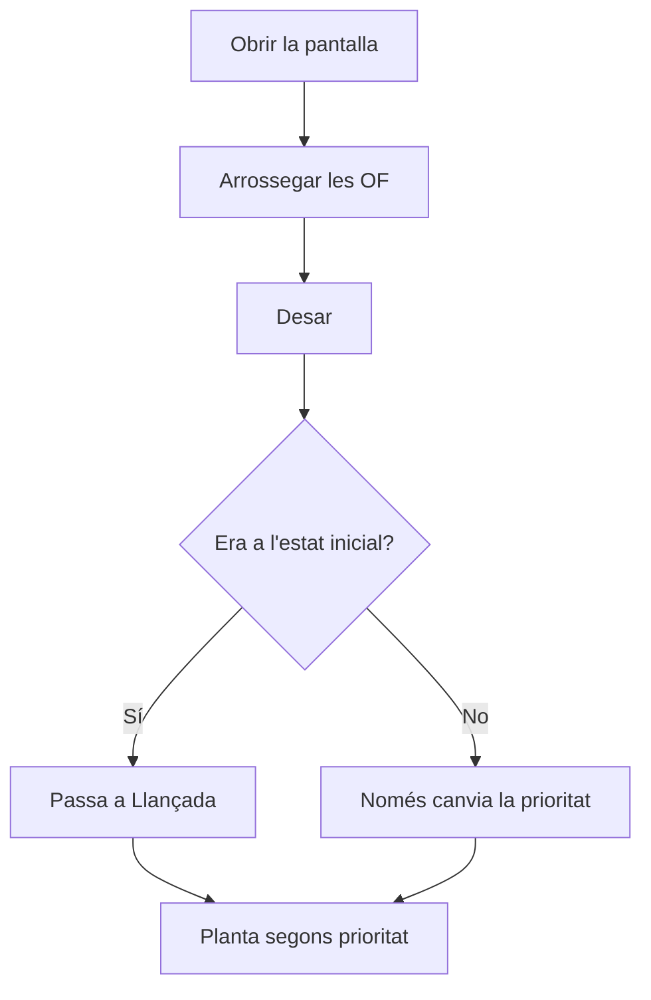

# Prioritzar ordres de fabricació

## Per a que serveix aquesta pantalla

Permet decidir en quin ordre s'han de fabricar les ordres de fabricació (OF) pendents. Arrossegant les files es fixa la «Prioritat» de cada OF, que és l'ordre en què la planta les veu a «Fases disponibles». També serveix per llançar les OF acabades de crear.

## Accions disponibles

- Arrossegar una fila per la nansa de l'esquerra per canviar-ne la posició.
- Desar el nou ordre amb el botó de desar (icona de disquet) de la barra superior de la taula.
- Obrir una OF fent clic al seu «Codi».

## Flux habitual

1. Obre la pantalla: les OF surten ordenades per «Prioritat» i, després, per «Data prevista».
2. Arrossega les OF fins a l'ordre en què s'han de fabricar.
3. Prem el botó de desar.
4. Comprova l'avís «Ordres de fabricació actualitzades».
5. Si cal, obre una OF des del «Codi» per revisar-la.

## Aspectes importants

- Només surten les OF en estats marcats amb l'etiqueta «Available» del cicle de vida de les ordres de fabricació, a «Cicles de vida». Si cap estat té aquesta etiqueta, només surten les OF en l'estat inicial.
- En arrossegar, la «Prioritat» es renumera 1, 2, 3... segons la posició a la llista. No es desa res fins que prems el botó de desar.
- En desar, les OF que eren a l'estat inicial del cicle de vida (normalment «Creada») passen a «Llançada». Les altres només canvien de prioritat.
- La planta mostra les OF a «Fases disponibles» per prioritat i després per data prevista, sempre que l'estat de l'OF tingui l'etiqueta «Plant».
- La prioritat també es pot canviar a mà des del camp «Prioritat» de la fitxa de l'OF.
- Aquesta pantalla no té filtres ni permet crear o eliminar OF: per a això fes servir «Ordres de fabricació».

## Errors frequents

- Si una OF no surt a la llista, comprova el seu estat i que aquest estat tingui l'etiqueta «Available» a «Cicles de vida».
- Si en desar surt un error, torna a carregar la pantalla i repeteix l'ordenació: una de les OF pot haver-se eliminat mentrestant.
- Si una OF prioritzada no apareix a planta, comprova que el seu estat tingui l'etiqueta «Plant».
- Si surts sense desar, l'ordre nou es perd.

## Proces basic

